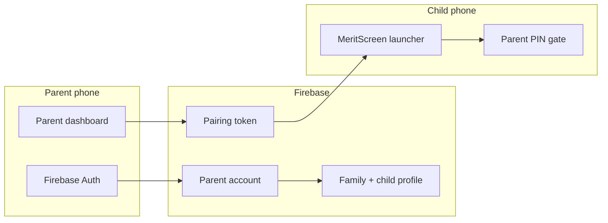
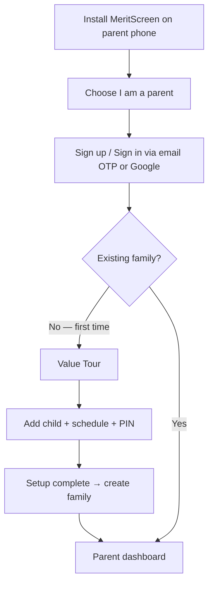
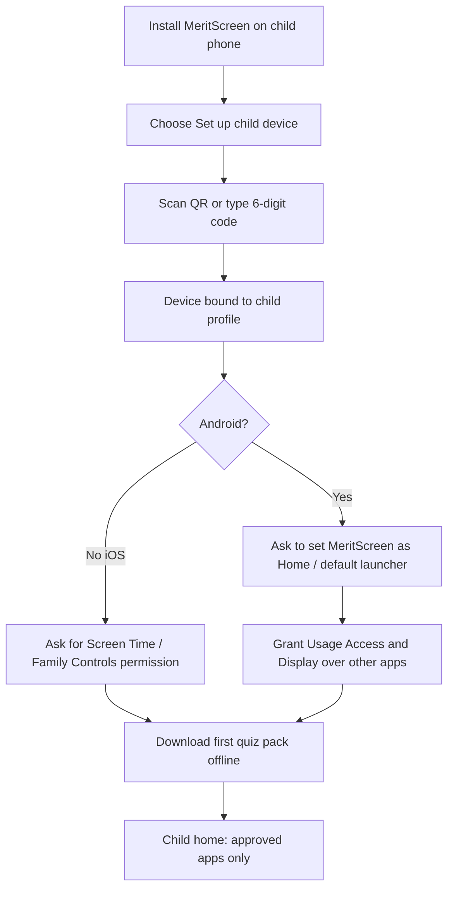
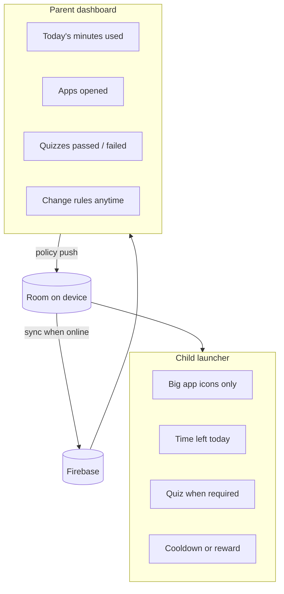

# 02 — Onboarding & authentication

This document explains **how a family starts using MeritScreen** and **who is allowed to do what**.

There is one authenticated adult. The child’s phone is a **paired device**, not a second login.

---

## Roles and access

| Role                   | Authenticates with                    | Can do                                                                         |
| ---------------------- | ------------------------------------- | ------------------------------------------------------------------------------ |
| Parent                 | Email + password, Google              | Create family, add children, pair devices, change rules, view reports, set PIN |
| Child                  | Nothing. Device holds a pairing token | Open approved apps, take quizzes, see remaining time                           |
| Parent-on-child-device | 4–6 digit **Parent PIN**              | Exit launcher, open settings, unpair, change allowed apps on-device            |

The Parent PIN is stored as a **hash** (never plain text). It is synced to the child device so a parent can recover control even when offline.

---

## Parent onboarding (first 5 minutes)

### Step by step

1. **Install** the parent app (same binary can detect role, or a clear first screen: *Parent* / *Set up child device*).
2. **Sign up** with email, Google, or Apple. Firebase creates `uid`.
3. **Create a family**. One parent is the owner. (Invite a second parent can wait for v1.1.)
4. **Add a child profile**: display name, age band (3–6 / 7–9 / 10–12), language, avatar from a preset pack (no camera required).
5. **Set Parent PIN**. This PIN unlocks the child’s launcher settings.
6. **Pairing screen** shows:
  - QR code containing a short-lived pairing token
  - 6-digit code as a fallback
  - Token expires in ~10 minutes; parent can refresh
7. After the child device confirms, parent **picks allowed apps**, **daily minutes**, and **quiz mode**.
8. Dashboard is ready. Push notifications are requested here (usage alerts, quiz summaries).

---

## Child device onboarding

The parent physically has the child’s phone for this part.

### Android launcher setup (required)

1. System prompt: **Set MeritScreen as Home app**.
2. Parent confirms. From now on, Home / unlock opens MeritScreen.
3. Required for automatic app timers and quiz interrupts: grant **Usage Access** and **Display over other apps** in Android Settings. MeritScreen shows a setup card on Child Home if either permission is missing.
4. Parent PIN is required to:
  - switch back to the stock launcher
  - uninstall MeritScreen (we cannot fully block uninstall without Device Owner / MDM; we **discourage** it and detect if the app is no longer default Home)
5. First quiz pack (~20–50 questions for that age band) downloads and is stored in local Room DB.

### iOS setup (controlled environment)

1. Parent authorizes **Family Controls / Screen Time** for the child Apple ID or this device.
2. MeritScreen applies Managed Settings (allowed apps, shield).
3. Same pairing and same cloud family. No custom home screen.

---

## Authentication design

### Parent (cloud)

| Item         | Choice                                                             |
| ------------ | ------------------------------------------------------------------ |
| Provider     | Firebase Authentication                                            |
| Methods      | Email OTP (Resend), Google, Sign in with Apple                     |
| Session      | Firebase ID token, refreshed automatically                         |
| Multi-device | Yes — parent can open the dashboard on another phone after sign-in |
| Sign-out     | Clears local cache of reports; does not unpair child devices       |

**Email OTP:** `sendEmailOtp` / `verifyEmailOtp` Cloud Functions mint a 6-digit code (SHA-256 hash only in Firestore), enforce per-email / per-IP rate limits plus a 42s resend cooldown, and deliver mail through [Resend](https://resend.com). The API key lives in Secret Manager (`RESEND_API_KEY`); the From address defaults to `MeritScreen <noreply@anajyo.com>` (`RESEND_FROM_EMAIL`). Plaintext codes are never logged. Closed-tester allowlisted emails (`functions/src/testerAccounts.ts`, see [TESTER_ACCOUNTS.md](TESTER_ACCOUNTS.md)) plant a fixed OTP and skip Resend.

**OTP autofill (parent device):** The verification screen marks the input with Android Autofill `SmsOtpCode` (the platform OTP hint; Gmail / Google Autofill also use it for email codes). Mail subject/body lead with `{code} is your MeritScreen verification code` so parsers can extract it. While the screen is resumed, a clipboard listener can fill a confidently extracted 6-digit code if the parent copies from Gmail — no notification-listener or Gmail API access. Manual entry and resend remain available; verification still goes through `verifyEmailOtp`.

**Device pairing codes:** Parent Device Handshake calls `createPairingToken` (never a local random number) and shows the returned `qrPayload` as a scannable QR above the 6-digit code. The child device taps **Scan Parent QR** (CameraX + ML Kit) or types the code; both paths call `consumePairingToken`, then show a success state and auto-advance. Parent handshake watches `devices` and advances on the first linked device. If onboarding has not committed a family yet, the handshake bootstraps family + child docs first so the code exists in `pairingCodes/{code}`.

### Child (device pairing)

| Item                                 | Choice                                                               |
| ------------------------------------ | -------------------------------------------------------------------- |
| No email / no password for the child | Required for kids privacy                                            |
| Pairing token                        | Created in Cloud Functions, stored hashed, one-time use              |
| Device record                        | `deviceId` + `childId` + platform in Firestore                       |
| Local secret                         | Encrypted pairing credential in Android Keystore / iOS Keychain      |
| Re-pair                              | Parent can revoke a device from the dashboard; child must scan again |

### Parent PIN (on-device gate)

Used **only on the child device** for adult override.

- 4–6 digits, chosen by parent
- PBKDF2 / Android Keystore-backed verification
- After 5 failures: 5-minute lock (shown in a calm, non-scary way)
- Forgot PIN: parent signs in on **their** phone and resets; the new hash syncs to the child device

---

## After onboarding: who sees what

- **Parent** sees summaries, not a live video of the screen.
- **Child** sees a calm home. They do not see the parent’s email, other children, or billing.
- **Rules** flow parent → cloud → child. **Usage and quiz scores** flow child → cloud → parent.

---

## Failure cases (keep onboarding unstuck)

| Problem                                | What the app does                                                                                          |
| -------------------------------------- | ---------------------------------------------------------------------------------------------------------- |
| QR expired                             | Parent taps Refresh; new code in 1 second                                                                  |
| No internet on child during pair       | Pairing needs one short online check; then the launcher works offline                                      |
| Parent skips “set as default launcher” | Child home still works inside the app, but stock Home is reachable — show a persistent “Finish setup” card |
| Wrong age band                         | Parent can change it later; next quiz pack regenerates                                                     |
| Second child                           | Repeat “Add child” + pair a second device; same parent account                                             |

