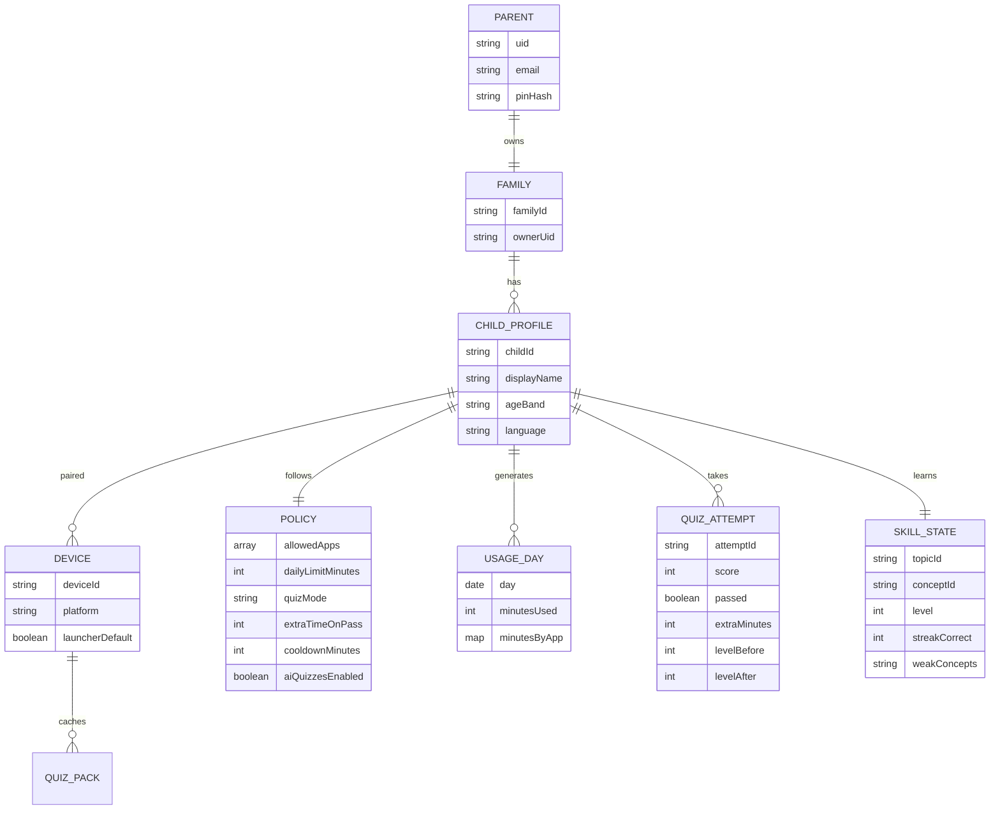
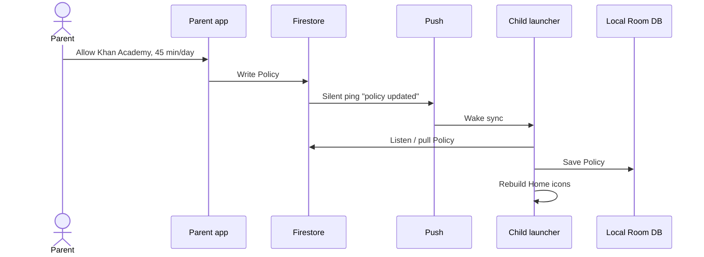
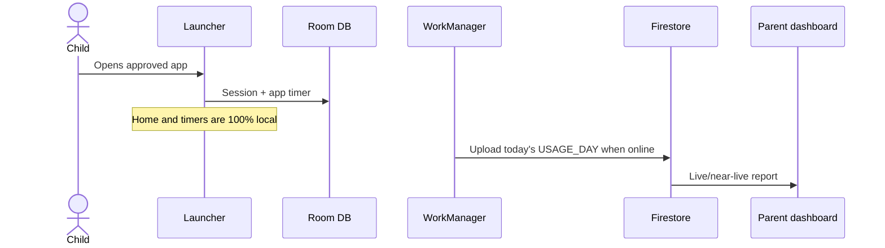

# 03 — Data model & data flow

This document answers three questions:

1. What information do we **store**?
2. How does that information **move** between parent, child, and cloud?
3. What do we **never** collect?

The child launcher is **offline-first**. The phone must stay useful in airplane mode. Cloud sync is a background job, not a requirement to open Home.

---

## Data we collect

### Parent information

| Field | Why | Required |
| --- | --- | --- |
| Email / Google / Apple id | Sign-in | Yes |
| Display name | Dashboard greeting | Optional |
| Firebase `uid` | Account key | Yes (generated) |
| FCM push token | Alerts | Optional until permission |
| Parent PIN hash | Unlock child-device settings | Yes |
| Notification preferences | Quiet hours, daily summary | Optional |

We do **not** need the parent’s contacts, photos, or location.

### Child information (profile — not an account)

| Field | Why | Required |
| --- | --- | --- |
| Display name (can be a nickname) | Show on launcher and reports | Yes |
| Age band (3–6, 7–9, 10–12) | Quiz difficulty | Yes |
| Birth year (optional, not full birthday) | Fine-tune age band | No |
| Language | Quiz language | Yes (default device language) |
| Preset avatar id | Friendly home screen | Yes |
| Device id + platform | Pairing | Yes after setup |

We do **not** collect: school name, real-time location, contacts, photos, microphone, or a child email.

### Productivity & usage data (from the child device)

| Event | What it contains | Used for |
| --- | --- | --- |
| Session start / end | Time, device | Daily minutes |
| App opened | Package name / bundle id, duration | “Which apps today” |
| Minutes remaining | Computed from policy + usage | Child overlay + parent dashboard |
| Quiz attempt | Topic, score, pass/fail, extra minutes granted, level before/after | Learning + adaptive difficulty |
| Launcher still default? | Boolean (Android) | Setup health |
| Device heartbeat (`lastSeenAt`, model, OS, battery %) | Liveness for parent “Connected / Disconnected” | Parent Child Detail + Devices |
| Policy version applied | Number | Confirm child device received new rules |

Usage is **aggregated per app per day**, not a keystroke log and not a screenshot stream.

### Quiz / AI data

| Field | Purpose |
| --- | --- |
| Question id, prompt, choices, correct answer | Show quiz offline |
| `whyCorrect`, `whyWrongByChoice`, `conceptExplainer` | Teach immediately after each tap, still offline |
| Source: `bank` or `ai` | Quality control |
| Topic + `conceptId` + difficulty 1–5 | Pick the next item near current skill |
| Child’s answer + time-to-answer | Score, pacing, skill update |
| `skill_state` per topic (level, streaks, weak concepts) | Next question this session + next AI pack |
| Weak topics / concepts | Next pack practices what they missed |

**AI prompts never include the child’s name, email, or raw usage history.**  
The cloud job receives only: age band, language, skill snapshot (levels + weak concept ids), and “avoid these question ids”.

Full engine: [06 — Adaptive quiz & explanations](06-adaptive-quiz-and-explanations.md).

---

## What we do not collect

- Precise GPS / location history
- SMS, call logs, contacts
- Photos or camera roll
- Full browsing history inside third-party apps
- Advertising IDs for ads (no ads in the child launcher)
- Voice recordings
- Face photos for “child recognition”

This is both a privacy choice and a Play / App Store kids-policy requirement.

---

## Core entities



---

## Policy (the rules object)

One document per child, plus one row per allowed app. The parent dashboard writes them. The child device applies them locally. Full enforcement: [07 — App blocks and fail lock](07-app-blocks-and-fail-lock.md).

### Child-level

| Setting | Example | Effect on child |
| --- | --- | --- |
| `quizMode` | `app_block` (also `every_session`, `daily_ceiling`) | When a quiz appears |
| `failLockScope` | `all_non_emergency` | A fail shields every approved app immediately |
| `allowRetryDuringCooldown` | false | Unused for fail-lock UI — child must wait out cooldown (no mid-lock quiz retry) |
| `dailyCeilingMinutes` | off, or 120 | Stops further blocks when today’s total is used |
| `questionsPerQuiz` | 3–5 | Keep it short for ages 3–6 |
| `passScorePercent` | 70 | Pass / fail |
| `rewardsEnabled` | true | Sticker / weekend bonus |
| `aiQuizzesEnabled` | true | Cloud fills packs; bank is fallback |
| `adaptiveDifficultyEnabled` | true | Rungs move after each answer |
| `showExplanations` | true | Why + concept after each tap |
| `emergencyApps` | Phone | Never shielded |

### Per allowed app

| Setting | Example | Effect |
| --- | --- | --- |
| `packageOrBundleId` | YouTube | Identity on that platform |
| `allowed` | true | Icon / launch allowed |
| `blockMinutes` | 30 | Use this long, then quiz |
| `grantOnPassMinutes` | 30 | Next block after a pass (defaults to `blockMinutes`) |
| `cooldownMinutes` | 15 | On fail, shield **all non-emergency apps** for this long |
| `isEmergency` | false | Skips quiz and cooldown |

Runtime state (device, then synced): `minutesUsedInBlock`, `deviceShieldedUntil`, `blocksGrantedToday`. One device lock, not a per-app shield.

---

## End-to-end data flow

### A. Parent changes a rule



If the child is offline, the **old policy stays in force** until the next successful sync. Home never waits on the network.

### B. Child uses the phone (productivity data)



### C. Quiz with AI (generation in cloud, playback on device)

```mermaid
sequenceDiagram
  participant CF as Cloud Function
  participant AI as AI model
  participant FS as Firestore
  participant Child as Child device
  actor Kid as Child

  Note over CF,AI: Runs when packs run low, not during Home
  CF->>AI: ageBand, language, skill snapshot, weak concepts
  AI-->>CF: Questions JSON including whyWrong and conceptExplainer
  CF->>CF: Safety filter + schema check
  CF->>FS: Quiz pack for childId
  Child->>FS: Download pack
  Child->>Child: Store in Room
  Kid->>Child: Quiz from Room; engine picks by current level
  Child->>Child: Wrong tap shows local explanation then easier check
  Child->>FS: Upload QUIZ_ATTEMPT + skillState
```

If AI is down, the **curated question bank** on the device is used (same explainer fields). The launcher never blocks Home on an AI call. Difficulty still moves locally from the last answers.

---

## Quiz trigger modes (when data is written)

Enforcement detail and the YouTube timeline live in [07](07-app-blocks-and-fail-lock.md). Summary:

### Mode — App block (default, matches the brief)

1. Child uses one approved app until `blockMinutes` (example: YouTube 30).
2. Quiz interrupts that app.
3. Pass → grant `grantOnPassMinutes` on **that app** (example: another 30).
4. Fail → shield **all non-emergency apps immediately**, including the one in use. Only emergency apps stay open. Unlock when `cooldownMinutes` elapse **or** a retry quiz is passed.
5. After unlock, approved apps are available again. The next quiz is at the end of the next block.

### Mode — Every session

1. New session (unlock / after idle) or first open of a gated app requires a quiz.
2. Pass → apps allowed for this session.
3. Fail → same device-wide lock: all non-emergency apps until cooldown or a passed retry.

### Mode — Daily ceiling (optional, can combine)

1. When today’s total minutes hit `dailyCeilingMinutes`, further grants stop.
2. Quiz may still be offered if the parent wants extra time, up to a parent cap.
3. If they fail, the same device-wide lock applies until cooldown or a passed retry. A daily ceiling can still block further grants after unlock.

---

## Sync and conflict rules

| Data | Source of truth | Conflict rule |
| --- | --- | --- |
| Policy | Parent / Firestore | Latest parent write wins |
| Usage | Child device | Child minutes cannot be lowered by the parent (parent can only add bonus) |
| Quiz attempts | Child device | Append-only; never rewrite history |
| Skill state | Child device | Latest local update wins; cloud copy is for parent + next pack |
| Pairing | Cloud | Parent revoke invalidates the device immediately via FCM (`device_revoked` using the pre-delete token) plus a child-process Firestore snapshot on `devices/{deviceId}`; heartbeat WorkManager is the offline fallback. Local PIN still works offline until the device is online again |

---

## Storage map (where bits live)

| Store | What | Why |
| --- | --- | --- |
| Android Room / iOS SQLite | Policy, quiz pack, today’s timers, skill_state | Instant Home, offline adaptive quiz |
| Encrypted SharedPreferences / DataStore + Keystore | Pairing secret, PIN verify | Device security |
| Firestore | Accounts, profiles, policy, usage days, attempts | Parent dashboard + multi-device |
| Cloud Storage (optional) | Large quiz media (audio for 3–6) | Keep APK small |
| Crashlytics | Crashes, non-PII | Stability |
| FCM | Silent policy sync + parent alerts | Fast updates |

---

## Parent vs child views of the same data

| Data | Parent sees | Child sees |
| --- | --- | --- |
| Minutes used | Chart by app, by day | A simple “15 minutes left” bar |
| Quiz | Score, topic, pass/fail, topic levels | One question; after a miss: why + concept |
| Allowed apps | Full picker of installed packages | Icons only, no “blocked apps” list |
| AI packs | Toggle on/off, quality flag | Invisible — just the next quiz |
| Email / billing | Parent account | Never |

---

## Retention (recommended)

| Data | Keep |
| --- | --- |
| Daily usage summaries | 90 days (parent can export) |
| Raw session ticks | 7–14 days then roll up |
| Quiz attempts | 90 days |
| Account | Until parent deletes family |
| Child profile | Parent delete = wipe device pairing + cloud child docs |

Parent-initiated **Delete family** must remove Firestore child data and instruct the device to wipe local Room (except a “unpaired” flag).
