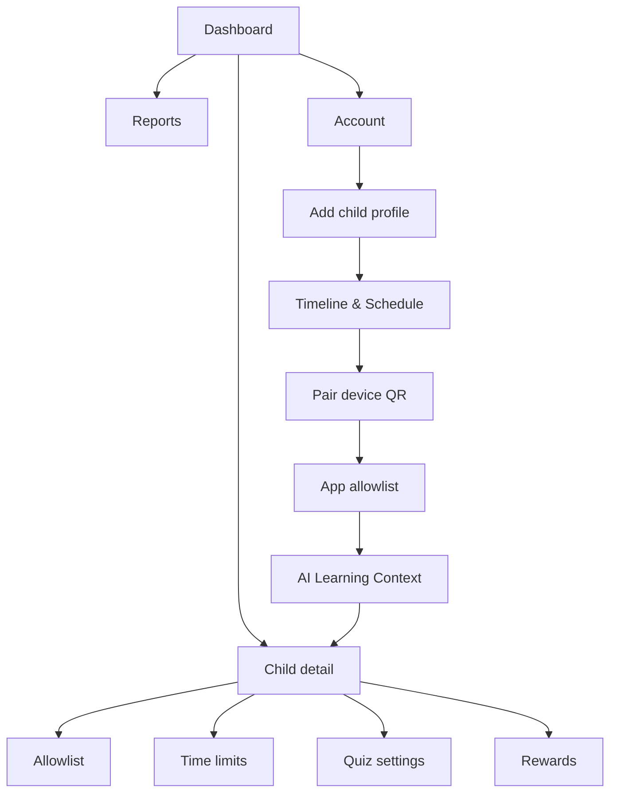
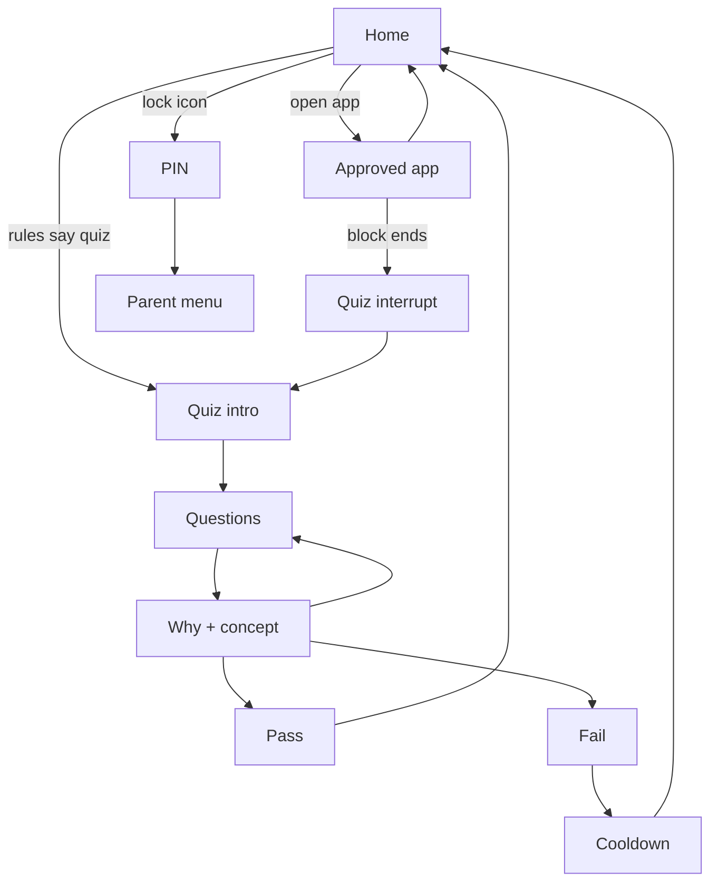

# 04 — Screens & features

Screens are split by **who holds the phone**.  
The Android child experience is a **launcher** (full home). The parent experience is a normal app.

Copy, icons, and tap targets on the child side stay **large and calm**. Ages 3–6 should not need to read paragraphs.

---

## Feature map

| Feature | Parent | Child |
| --- | --- | --- |
| Account sign-in | Yes | No |
| Pair device | Shows QR | Scans QR |
| Set as default launcher (Android) | Reminds if broken | System dialog + PIN to undo |
| Allowed apps | Edit list + per-app block and cooldown | Sees icons only |
| App time block | e.g. YouTube 30 min | Remaining time on that app |
| Fail cooldown | e.g. 15 min | All apps shielded; only Phone works; retry available |
| Quiz mode | App block, session, or daily ceiling | Quiz interrupts when the rule fires |
| Adaptive difficulty | On/off (default on) | Next question easier/harder from last answers |
| Concept explanations | On/off (default on) | After a miss: why + simple concept |
| AI quiz packs | On/off | No setting |
| Rewards | Configure | Celebration / sticker |
| Usage report | Charts | Not shown as a report |
| Parent PIN | Create / reset | Gate on settings |
| Crash-free lightweight Home | — | Primary job of the app |

---

## Shared / first-run screens

| ID | Screen | Purpose |
| --- | --- | --- |
| S00 | Splash | Fast brand, no network wait |
| S01 | Welcome / role select | Primary welcome: value props + **Get Started as Parent** / **Set Up Child Device** (replaces the old standalone P01 welcome) |
| S02 | Legal & kids privacy | Short COPPA-style notice; parent consent |

---

## Parent screens

| ID | Screen | What happens |
| --- | --- | --- |
| P01 | _(merged into S01)_ | Former standalone welcome removed; Role Select is the only first-run welcome |
| P02 | Sign up | Email, Google, Apple |
| P03 | Sign in | Returning parent |
| P04 | Forgot password | Firebase reset |
| P05 | Create family | Family name optional |
| P06 | Add child | Name, age band, language, avatar, **age-banded curriculum focus** → Timeline → Device handshake (QR) → App allowlist → AI |
| P07 | Set Parent PIN | 4–6 digits, confirm |
| P08 | Pairing | QR + 6-digit code, expiry, refresh |
| P09 | Waiting for device | Spinner until child confirms |
| P10 | First policy setup | Timeline + AI during add-child / onboarding; allowlist & quiz settings editable later |
| P11 | Dashboard home | Today’s minutes, last quiz, device online |
| P12 | Child detail | One child: usage, quizzes, device health |
| P13 | App allowlist | Per app: allow, block minutes, pass grant, cooldown, emergency |
| P14 | Time limits | Daily ceiling, fail cooldown. Fail lock is always all non-emergency apps |
| P15 | Quiz settings | Mode (app block / session / daily), length, pass %, adaptive, explanations, AI |
| P16 | Rewards | Extra minutes, stickers, weekend bonus |
| P17 | Reports | Today / 7 / 30 day usage, quiz accuracy, topic levels, weak concepts |
| P18 | Notifications | Daily summary, “time up”, “quiz failed 3 times” |
| P19 | Account | Email, PIN reset, add another child, sign out |
| P20 | Delete family | Confirm wipe |

**Allowlist note:** On Android the child device sends the list of launchable apps (name + package + icon hash). The parent picks from that list so we never guess the wrong package.

---

## Child screens (Android launcher)

These replace the system home. Back / Home returns here.

| ID | Screen | What happens |
| --- | --- | --- |
| C01 | Pairing | Camera QR or number pad for 6-digit code |
| C02 | Launcher setup | “Set as Home app” checklist |
| C03 | Permissions | Usage Access (if we use it), notifications optional |
| C04 | Downloading quizzes | First pack; skip continues with built-in bank |
| C05 | Child Home | Approved app grid only. Shielded icons show a countdown. No stock drawer, no widgets |
| C06 | App not allowed | Calm “Ask a parent”. Also used if they reach a shielded app via Recents |
| C07 | Time remaining | Minutes left in **this app’s block** |
| C07b | Quiz interrupt | Block ended while the app was open — quiz comes to the front |
| C08 | Quiz intro | “3 short questions to keep using YouTube” |
| C09 | Quiz question | One question, large choices, audio optional (3–6) |
| C09b | Answer + teach | Correct: one-line why. Wrong: why this choice, then the concept |
| C10 | Quiz result pass | Short reward. Returns them to **that app** for another block |
| C11 | Quiz result fail | Usage stops now. Countdown + Retry quiz. Phone remains |
| C12 | Fail lock | Full-screen lock. Every approved icon disabled. Only emergency apps |
| C13 | Daily ceiling | Only if a daily cap is on and used up |
| C14 | Parent PIN | Numpad overlay |
| C15 | On-device parent menu | After PIN: refresh rules, **switch child profile**, unpair, switch launcher |
| C15b | Switch child profile | List of paired kids on this device (max 5); timers/rules switch with selection |
| C16 | Bedtime lock (if enabled) | “Sleep time” illustration, PIN override |

### Child Home (C05) layout — keep it tiny

1. Grid of approved icons only (about 8–20). During a fail lock this grid is replaced by the lock screen — the child cannot pick another app.
2. No search, no stock drawer, no widget wall.
3. Small parent-lock control (opens PIN).
4. Remaining time is about the **app they open**, not a confusing single bar for the whole phone — unless a daily ceiling is also on.

---

## iOS screens (SwiftUI, not a launcher)

Same pairing, quiz, pass/fail, and cooldown rules (C01, C07b–C12). SpringBoard stays. SwiftUI draws every MeritScreen screen. Family Controls draws the system shield.

| ID | Screen | Purpose |
| --- | --- | --- |
| I01 | Screen Time authorization | `FamilyControls` authorization (parent-managed child) |
| I02 | Shield | On fail, shield the full allowed set except emergency. Copy: countdown only — child waits until cooldown ends (no mid-lock quiz retry) |
| I03 | Shield action → quiz | Opens the SwiftUI retry. Pass clears **every** shield and starts the next block |
| I04 | Parent dashboard | Same jobs as P11–P17, SwiftUI on the parent’s iPhone |

---

## Quiz UX rules (all ages)

1. **3–5 questions**, never a long test.
2. Ages 3–6: pictures, 2–3 choices, optional spoken prompt **and spoken explainer**.
3. Ages 7–12: text + numbers; still one question per screen.
4. **Adaptive:** first item near saved skill; after a miss, next item is usually an easier check of the **same concept**. After two hits in a row, step up one rung. Never leave the parent’s age band. Details: [06](06-adaptive-quiz-and-explanations.md).
5. **After every tap (C09b):** if wrong, show why *that* choice fails, then the concept in plain words; if right, one short “yes because”. Copy is already on the device — no spinner.
6. No public leaderboard.
7. Fail is **neutral** (“Let’s rest and try again”), never shame.
8. Questions come from **local pack**. Spinner is only if pack is empty and download is in progress — then fall back to built-in bank immediately.

---

## Navigation (parent)

## Navigation (child Android)

---

## Notifications (parent device)

Full FCM design (control plane vs parent alerts, triggers, receivers, phases): [11 — Firebase push notifications](11-firebase-push-notifications.md).

| Event | Notification |
| --- | --- |
| Child paired | Success |
| App block ended / quiz due | “Quiz on [child]’s [app]” |
| Fail cooldown started | “[App] resting for [n] min” |
| Quiz passed / failed | Optional, batched |
| Launcher no longer default | “Finish setup” / security |
| Weekly summary | Minutes + quizzes |

Child device: **no marketing notifications**. At most a local notification if the parent enabled “time almost up”.

**Today:** child silent FCM (`policy_sync`, `device_revoked`, …) is live. Parent tray alerts and cloud prefs are **designed in 11**, not fully shipped yet (Account → Notifications is local DataStore only until Phase B/C).
