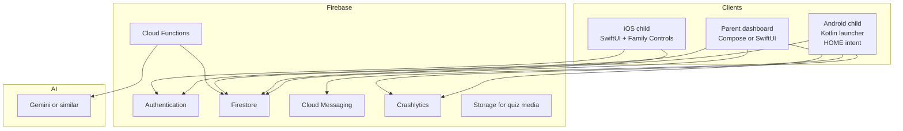
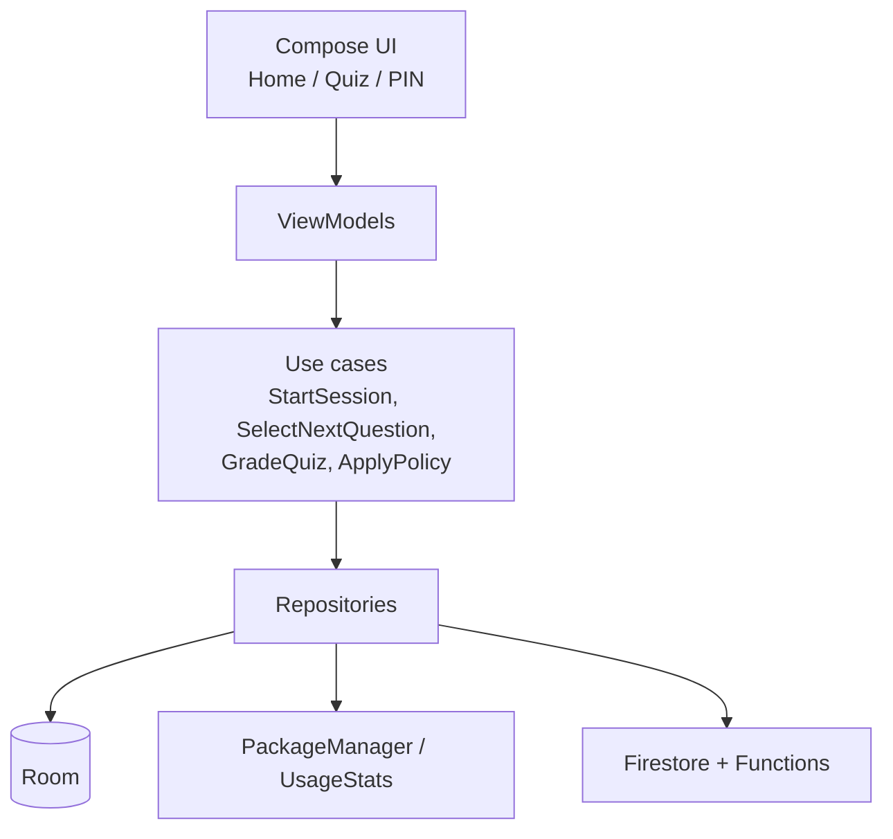

# 05 — Architecture & performance

MeritScreen is two native clients and one backend.

- **Android child:** Kotlin + Jetpack Compose **launcher**. It replaces the stock Home app.
- **iOS child and parent:** **SwiftUI**. Restrictions use Family Controls. There is no custom Home on iOS.
- **Parent on Android:** the same Kotlin app, a normal (non-launcher) navigation graph.
- **Backend:** Firebase. Policy JSON is shared so an iPhone parent can manage an Android child phone.

AI never runs on the path that paints Home or interrupts an app. Timers and shields are local.

---

## System context



---

## Android child app — why Kotlin native

The process that answers **HOME** must be:

| Requirement | Implication |
| --- | --- |
| Cold start in tens of ms after first install | Kotlin, Compose, no WebView home |
| Works with radio off | Room + local policy |
| Small APK | One launcher module; quiz media on demand |
| Predictable memory on low-end phones | No on-device LLM |
| Play Families policy | Minimal permissions, no ads SDK on child |

Recommended stack:

| Layer | Technology |
| --- | --- |
| Language | Kotlin |
| UI | Jetpack Compose |
| Home | Activity with `HOME` / `DEFAULT` launcher intent filters; `ROLE_HOME` |
| App list | `PackageManager.queryIntentActivities` |
| Local DB | Room |
| Prefs | DataStore |
| Secrets | Android Keystore |
| Background sync | WorkManager (exponential backoff, idle + connected) |
| Async | Coroutines + Flow |
| DI | Hilt |
| Images | Coil (app icons from PackageManager, not the network) |
| Analytics (optional) | Firebase Analytics with child-safe events only, or none in v1 |
| Crashes | Crashlytics |
| Backend | Firebase Auth (parent only), Firestore, Functions, FCM |

Parent app on Android can share a Gradle module for models/sync, with a **different UI graph** (no launcher intent).

---

## Architecture layers (Android)



**Rule:** `HomeViewModel` reads **only Room + PackageManager**.  
It does not call Firestore or AI on the main path.

---

## Becoming the launcher (Android)

1. Manifest: `android.intent.action.MAIN` + `android.intent.category.HOME` + `DEFAULT`.
2. After pairing, open the system **Role / default Home** picker.
3. Observe `RoleManager` / default launcher package. If it is no longer us, show C02 again and notify the parent.
4. Do **not** rely on Accessibility or Device Admin to trap the user in v1 — that fights Play policy. PIN + default Home + parent alert is the consumer approach.
5. Always-allowed packages: `dialer`, emergency, maybe settings behind PIN.

---

## Shared session engine (both platforms)

The product rule in [07](07-app-blocks-and-fail-lock.md) is implemented as one state machine. Kotlin and Swift each own a copy. They do not share code; they share the **policy JSON** and the same transitions.

States per app: `idle` → `in_block` → `quiz_due` → `granted` or `shielded` → `idle`.

| Event | Transition |
| --- | --- |
| Launch allowed app | Start block timer if not shielded |
| Block minutes elapsed | `quiz_due`. Interrupt the app |
| Quiz pass | Clear shield. Start a new block of `grantOnPassMinutes` |
| Quiz fail | Device lock. Shield every non-emergency app until `now + cooldownMinutes` or a passed retry |
| Retry pass (if allowed) | Same as pass. Cooldown ends early |
| Cooldown elapsed | App may launch. Next quiz is at the end of the new block |

Emergency apps never enter `quiz_due` or `shielded`.

---

## Android — interrupting the app

Home replacement alone is not enough. The quiz must appear **when the block ends**, even if YouTube is in front.

1. Child opens the app **from our Home**. We record `packageName` + `blockStartedAt`.
2. A launcher-owned timer (in-process, persisted to Room every 30–60s) counts foreground time. Cross-check with Usage Stats if the permission is granted.
3. At block end, start the quiz Activity (our task). Leaving the quiz without a pass does not restore apps.
4. On fail, disable **every non-emergency icon** and show the lock until cooldown or a passed retry. Recents cannot reopen a blocked app. Phone stays launchable.
5. We do **not** use Accessibility or Device Admin to trap the user. That fights Play policy. Default Home + our Activity + a disabled icon is the consumer approach.
6. If the child (or someone) clears the default Home role, the parent is notified. Until they set us as Home again, we cannot hide the stock drawer — say that plainly in the parent report.

---

## iOS — SwiftUI + Family Controls

Launcher replacement is impossible. Professional equivalent:

| Piece | Choice |
| --- | --- |
| UI | **SwiftUI** for parent dashboard, pairing, quiz, explanations, cooldown, account. No UIKit-only screens unless an API requires it |
| Architecture | SwiftUI + `@Observable` models, a small session store (SwiftData or SQLite), Firebase iOS SDK |
| Auth | Firebase Auth. Same custom-token pairing as Android |
| Pick apps | `FamilyControls` `FamilyActivityPicker` (tokens, not raw bundle ids in the parent UI) |
| Shield | `ManagedSettingsStore` — on fail, shield the full allowed selection except emergency tokens |
| Threshold | `DeviceActivity` schedule / event so the monitor fires when block minutes elapse, including if MeritScreen is not in front |
| Shield copy | `ShieldConfigurationDataSource` — app name, quiz or countdown. No shame |
| Shield button | `ShieldAction` opens the SwiftUI quiz |
| Pass | Clear shields. Record the next block locally and in the monitor |
| Fail | Shield the whole allowed set except Phone until cooldown or a passed retry |
| Reports | `DeviceActivityReport` where it helps; our own Firestore usage is what the parent dashboard shows so Android and iOS reports match |
| Extensions | Device Activity Monitor, Shield Configuration, Shield Action — keep them thin. They write a flag; the SwiftUI app runs the quiz |

Limits to design around (do not hide them):

- Cannot replace the iOS Home Screen or hide SpringBoard.
- Family Controls tokens are opaque. The parent picker is the Apple picker, not a custom grid of every bundle id.
- Some timing is extension-driven. Persist shield deadlines so a reboot does not clear a cooldown early.
- Parent and child may be the same Apple family. Authorization is a setup step (I01), not something the child can dismiss to escape.

SwiftUI stays light: no live AI, no large animations on the shield path, quiz text from the local store.

---

## Parent apps

| Phone | UI | Notes |
| --- | --- | --- |
| Android | Jetpack Compose | Shares models with the launcher module. No `HOME` intent on the parent graph |
| iOS | SwiftUI | Same screens as P11–P20. Writes the same Firestore policy |

A parent signed in on iPhone can pair and manage an Android child device, and the reverse.

---

## Backend

| Job | Where |
| --- | --- |
| Sign-in | Firebase Auth |
| Family, child, policy, usage, attempts | Firestore |
| Pairing token create/consume | Cloud Functions (callable) |
| Generate AI quiz pack | Cloud Functions, scheduled or on “pack low”; input is skill snapshot |
| Safety filter on AI JSON | Cloud Functions: schema, reading level, every choice has whyWrong |
| Push “policy updated” | FCM data message |
| Parent email summary | Cloud Function + FCM |
| Delete family | Callable + recursive delete |

### Firestore (logical)

```
users/{uid}
families/{familyId}
  members/{uid}
  children/{childId}
    policy
    appRules/{appId}
    devices/{deviceId}
    usageDays/{yyyy-mm-dd}
    quizAttempts/{attemptId}
    skillState
    quizPacks/{packId}
```

Security rules: only the parent `uid` linked to `familyId` may read/write that family. Child devices use a **restricted custom token** or a dedicated Firebase Auth anonymous/custom account created at pairing — **not** the parent password on the child phone.

Recommended pairing auth: Cloud Function verifies the one-time code and mints a **custom token** scoped to that `deviceId` / `childId`. The child SDK signs in with that token. Rules allow the device to write `usageDays` and `quizAttempts` only for its `childId`, and read only its `policy` and `quizPacks`.

---

## AI quiz pipeline

```mermaid
flowchart LR
  Trigger[Pack low or parent enabled AI] --> FN[Cloud Function]
  FN --> Prompt[Age band + language + skill levels + weak concepts]
  Prompt --> Model[AI model]
  Model --> Filter[Schema + safety + explainers present]
  Filter --> FS[quizPacks]
  FS --> Device[WorkManager download]
  Device --> Room[Room questions]
  Room --> Eng[Adaptive engine]
  Eng --> UI[Quiz + C09b teach]
```



**Performance rule:** generation is **asynchronous and off-device**.  
The quiz UI and the “why this is wrong” screen read **only Room**.

Fallback order:

1. Current downloaded pack (engine picks by current rung)
2. Built-in bank shipped in APK (same explainer JSON, per age band)
3. Only then: wait for network (with a friendly illustration, never a blocking spinner on Home)

**Adaptive engine (Kotlin, local):**

- Five rungs (L1–L5) inside the parent’s age band; new topics start at L2
- Two consecutive correct → +1 rung; one wrong → −1 rung and mark `conceptId` weak
- Next item: after a miss, same concept one rung easier; otherwise current rung ± 1
- After each tap show pre-written `whyWrongByChoice` + `conceptExplainer` (or `whyCorrect`)
- Sync `skillState` in WorkManager for the parent report and the next AI pack

Full product rules: [06 — Adaptive quiz & explanations](06-adaptive-quiz-and-explanations.md).

Do **not** call the model when the child taps a wrong answer. Live tutoring would add latency, cost, and extra child data in the prompt.

---

## Performance budget (child launcher)

Treat this as a product requirement, not a later optimization.

| Metric | Target |
| --- | --- |
| Home first paint after process start | Under ~300 ms on a mid-range phone (warm), under ~800 ms cold |
| Scroll of app grid | 60 fps, icons from memory / launcher cache |
| Quiz question / explainer change | Instant; copy from Room, images pre-decoded |
| APK size (child features) | Keep lean; no Play ML Kit / no ads / no huge Lottie on Home |
| Memory | Avoid loading all quiz media at once |
| Network on Home | Zero |
| Main thread | No Firestore listeners on Home; sync in WorkManager |

Practical tactics:

- Baseline profiles (`app/src/main/baseline-prof.txt` + ProfileInstaller) + R8 full mode
- Compose stability (`@Immutable` Home/Dashboard models, `LazyVerticalGrid` + keys) & avoid heavy blur
- Cache launcher apps list in Room; refresh on `PACKAGE_ADDED` / `REMOVED` — Home install checks
  read the Room package set, never PackageManager on the 1 Hz tick
- Count time with `elapsedRealtime` locally; flush session/usage to Room every 30–60 s
  (`AppConfig.SESSION_PERSIST_INTERVAL_SECONDS` / `USAGE_FLUSH_INTERVAL_SECONDS`), not every second
- FCM high-priority only for policy; usage upload can be opportunistic
- Image-heavy AI questions stored as compressed WebP in Storage, downloaded in the pack, not at question time
- No child-device Firestore snapshot listeners for policy (removed Phase 10); parent dashboard
  keeps a single children listener with debounce before fan-out one-shots

---

## Permissions (Android child) — keep the list short

| Permission | Why |
| --- | --- |
| Default Home role | Core product |
| PACKAGE_USAGE_STATS (optional) | Cross-check time if apps leave our launcher |
| CAMERA | QR pairing only; can skip if parent types the code |
| INTERNET | Sync, not Home |
| POST_NOTIFICATIONS | Optional parent-driven local alerts |
| QUERY_ALL_PACKAGES | Only if Play allows for launcher; otherwise query launcher intents |

Do not request location, contacts, SMS, or microphone.

---

## Store compliance (from the original brief)

- **Google Play Families / Designed for Families** if the child APK is aimed at under-13
- **COPPA / GDPR-K**: parental consent at P02/S02, minimal data, delete family
- **App Store** kids category + Screen Time entitlements for iOS
- No third-party ads on the child experience
- Privacy policy must list exactly the tables in [03 — Data model](03-data-model-and-flow.md)

---

## Build sequence (recommended)

Both clients are in scope. Build the shared rule first, then each shell.

1. Shared policy JSON + session states (app block, pass grant, fail shield, cooldown, retry).
2. Android: pairing, Kotlin Home, allowlist, PIN, **quiz interrupt when the block ends**.
3. Local quiz bank, adaptive engine, explainers (works offline on both later).
4. Firebase parent dashboard (Compose) writing per-app rules.
5. iOS: SwiftUI parent + child, Family Controls picker, DeviceActivity threshold, ManagedSettings shield, same quiz JSON.
6. AI packs that follow `skillState`.
7. Play Families + App Store kids submission.

Do not ship a per-app-only fail. A failed quiz must stop all further usage except emergency apps until cooldown or a passed retry.
