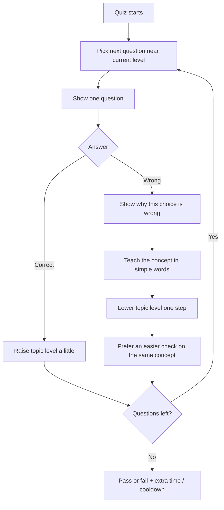
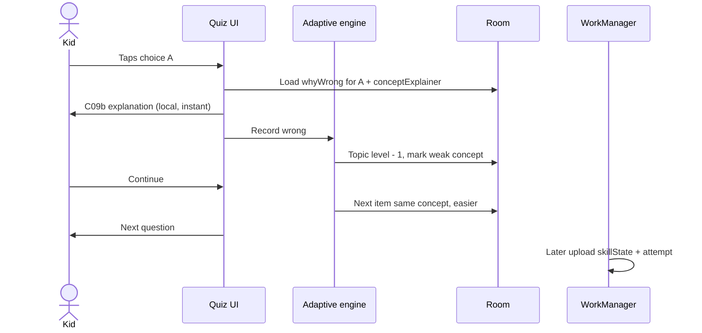
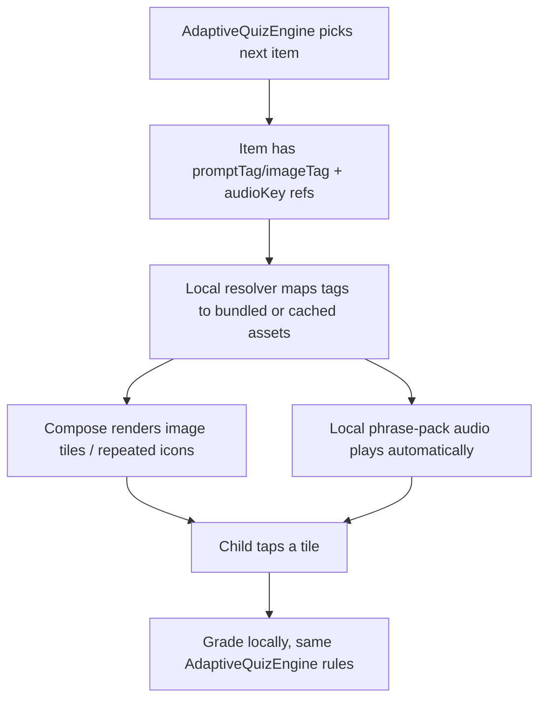
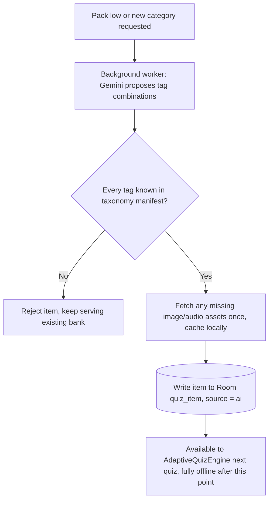

# 06 — AI adaptive difficulty and concept explanations

Every quiz **learns from the last answers**.  
If the child is wrong, the app **does not only say “incorrect”** — it explains *why*, then teaches the **concept** in short, age-fit language. The next question gets easier or harder from that result.

This still respects the launcher rule: **no AI call while the child is looking at Home or a question**. Adaptation on the phone is a small local engine. AI only **pre-writes** the next pack (questions + explanations) in the background — see [08](08-ai-personalized-learning-and-lockout.md).

---

## What the child experiences



1. First question in a session uses the child’s **saved skill** (or a mid level for that age band if they are new).
2. After **correct**: a short confirm, then a slightly harder or same-level question.
3. After **wrong** (or a question timeout with no answer):
   - Calm line: this one is not right.
   - **Why this answer is wrong** (tied to the choice they tapped).
   - **What the idea is** (the concept, not a lecture).
   - The correct answer, shown explicitly.
   - Continue. The next question is usually an **easier check of the same concept**.
   - When the teaching lock ships ([08](08-ai-personalized-learning-and-lockout.md)), this is screen **C09c**: a 30-second mandatory pause with countdown and speaker. Correct answers stay on the short, un-locked **C09b**.
4. End of quiz still decides extra screen time. Teaching happens **during** the quiz, not only on the fail screen. The device-wide fail lock in [07](07-app-blocks-and-fail-lock.md) is a separate, later event.

Ages 3–6 get pictures, spoken guidance, and no reliance on reading at all — see [Early-learner visual mode](#early-learner-visual-mode-ages-36-pre-reader) below. The full **nursery curriculum plan** — **teach-first** (auto video + images + audio for ~3–4; picture checks only later for ~5–6) — lives in [09 — Nursery early-learner curriculum](09-nursery-early-learner-curriculum.md). Ages 7–12 can read a few lines. Never shame, never a wall of text.

---

## Two layers (so the phone stays fast)

| Layer | When it runs | What it does |
| --- | --- | --- |
| **On-device engine** (Kotlin) | Every answer, instantly | Updates skill, picks the next local question, shows the pre-written explanation |
| **Background AI pack** | When packs run low, never on Home/quiz | Writes new questions **and** explanations aimed at current level and weak concepts |

The child never waits on a model to hear “why this is wrong”. That text was generated **with the question**, stored in Room, and shown offline.

---

## Skill model (simple, stable)

Age band is the **range**, not a fixed difficulty. Inside each band we use five rungs:

| Rung | Meaning inside that age band |
| --- | --- |
| L1 | Easiest items for this age |
| L2 | Default start for a new child |
| L3 | On track |
| L4 | Stretch |
| L5 | Hardest we allow for this age (never jump to the next age band automatically) |

Each **topic** (and each **concept** under it) has its own rung, plus a short streak.

| Signal | Engine does |
| --- | --- |
| Two correct in a row at this rung | Topic +1 (max L5) |
| One wrong | Topic −1 (min L1); that concept is marked weak |
| Correct but slow (parent-optional) | Keep rung; do not punish |
| New child / new topic | Start at L2 for the age band |

Never jump more than **one rung per question**.  
Never auto-promote a 6-year-old into the 7–9 bank. The parent can change age band; the engine does not.

**Session difficulty** = typical (median) rung of topics used in the last few quizzes. The first question of a new quiz sits near that value.

---

## How the next question is chosen (local)

From the unused questions already on the device:

1. If the last answer was **wrong**, prefer same `conceptId`, **one rung easier**, not shown in this quiz.
2. Else prefer a question whose difficulty is **current topic rung ± 1**.
3. Mix topics so a quiz is not five of the same item.
4. Skip question ids already used recently (repeat window, e.g. 20 questions).
5. If the pack has no match, take the closest remaining item, then the built-in bank.

This is ordinary filtering in Kotlin over a small list. No on-device neural net.

---

## Wrong-answer explanation (product copy rules)

Show **immediately after the tap**, on the same quiz flow (new screen **C09b**), before the next question.

| Block | Purpose | Length |
| --- | --- | --- |
| Result | “Not this one” / “That’s it” | 1 line |
| Why this choice | Why *their* tap does not fit | 1–2 sentences |
| Concept | The idea in plain words | 1–3 sentences (3–6: one sentence + picture) |
| Continue | Next question | One button |

**Correct answers:** a short “Yes — because …” (one sentence from `whyCorrect`). Do not skip teaching on a lucky guess.

Tone:

- Professional and kind. No “wrong, silly”, no sarcasm, no scores shouted at ages 3–6.
- Same language as the quiz (`language` on the profile).
- No extra facts that were not needed to understand this item.

Example (age 7–9, math):

- Question: 8 + 5  
- Child taps 12  
- Why: 8 + 5 is not 12. 8 + 4 is 12, so we still need one more.  
- Concept: Adding means joining two groups. Count on from 8: 9, 10, 11, 12, 13.

---

## What AI generates (each question in a pack)

AI does **not** receive the child’s name, apps, or raw usage. It receives a **skill snapshot**:

```json
{
  "ageBand": "7-9",
  "language": "en",
  "globalLevel": 3,
  "topics": [
    { "id": "addition", "level": 2, "weakConcepts": ["add-within-20"] },
    { "id": "spelling", "level": 4, "weakConcepts": [] }
  ],
  "avoidQuestionIds": ["q_1021", "q_0888"],
  "needCount": 24
}
```

Each returned item **must** include explanations (pack is rejected if they are missing):

```json
{
  "id": "q_2044",
  "topic": "addition",
  "conceptId": "add-within-20",
  "conceptTitle": "Adding by counting on",
  "difficulty": 2,
  "prompt": "What is 8 + 5?",
  "choices": [
    { "id": "a", "text": "12", "correct": false },
    { "id": "b", "text": "13", "correct": true },
    { "id": "c", "text": "14", "correct": false }
  ],
  "whyCorrect": "8 + 5 is 13. Count on five from eight.",
  "whyWrongByChoice": {
    "a": "12 is 8 + 4. We need one more than that.",
    "c": "14 is 8 + 6. That is one too many."
  },
  "conceptExplainer": "Adding joins two groups. Start at the bigger number and count up."
}
```

For `AGE_3_TO_6`, the same pack must use tag-based fields (`interactionType`, `imageTag`, `audioKey`, …) from [Early-learner visual mode](#early-learner-visual-mode-ages-36-pre-reader) instead of text-only choices. Generation, local validation, and Room write now run on the device in the background — see [08](08-ai-personalized-learning-and-lockout.md).

Cloud / local validation then:

1. Schema check (every wrong choice has a why; visual items only reference known taxonomy tags).
2. Safety / age filter (no scare, no personal data, reading level).
3. Dedup against `avoidQuestionIds`.
4. Write valid items to Room (`source = ai`); optionally upload a copy to `quizPacks/{packId}` for audit.

Built-in APK bank uses the **same JSON shape**, written by us, so offline explanations always work even if AI is off.

---

## Data stored for adaptation

### On device (Room) — source of truth for the next tap

| Store | Fields |
| --- | --- |
| `skill_state` | `topicId`, `conceptId`, `level` 1–5, `streakCorrect`, `streakWrong`, `seenCount`, `correctCount`, `updatedAt` |
| `recent_question_ids` | Last N ids, to avoid repeats |
| `quiz_item` | Full question + explainers |

### Uploaded (Firestore) — parent report + next AI pack

| Store | Fields |
| --- | --- |
| `skillState` (one doc per child) | Per-topic levels, weak concepts, `globalLevel` |
| `quizAttempts` | Per question: chosen choice, correct?, `levelBefore`, `levelAfter`, time-to-answer; plus session pass/fail |

Parent sees **topics getting easier/harder** and **concepts to practice**, not every word of the explainer unless they open a detail row.

---

## Parent controls (P15)

| Setting | Default | Effect |
| --- | --- | --- |
| Adaptive difficulty | On | Engine moves rungs; next AI pack uses skill snapshot |
| Show explanations | On | C09b after each answer |
| AI new packs | On | Cloud fills packs; bank always remains fallback |
| Age band | Set at profile | Hard ceiling / floor for rungs |

If adaptive is **off**, every question stays at L2 for the age band. Explanations can stay on.

---

## Sequence (one wrong answer, then a better-fit question)



---

## Performance and privacy

- Grading and explainers are **Room reads**. Target: explanation screen in one frame, no spinner.
- Do not call Cloud Functions from C09 / C09b.
- Prompt payload is skill numbers and topic ids only.
- Ages 3–6: cap explainer length in generation (e.g. 12 words) so the UI stays large and calm.
- TTS is a **cached file or on-device** `TextToSpeech` fallback — never a live speech API on the quiz path. Ages 3–6 use a phrase library (below); ages 7–12 use pre-generated explanation audio ([08](08-ai-personalized-learning-and-lockout.md)).

---

## Failure behaviour

| Case | What happens |
| --- | --- |
| AI pack delayed | Use bank + last skill; still adapt rungs locally |
| Missing `whyWrong` on an item | Show conceptExplainer only; do not block the quiz |
| Skill doc missing | Start L2; create skill rows as questions are answered |
| Parent turns adaptive off | Keep showing explainers if that toggle stays on |

---

## Early-learner visual mode (ages 3–6, pre-reader)

Scoped entirely to the existing `AgeBand.AGE_3_TO_6` band (`core/common/domain/AgeBand.kt`) — there is no separate age band for this. Today's `AGE_3_TO_6` bank entries (`quiz_bank_builtin.json`, e.g. `q_shape_01`) are still plain text choices ("Square" / "Circle" / "Triangle"). A 3–5 year old cannot read those. This section is what actually makes that band usable: **image-based questions, spoken guidance in the family's language, and no requirement to read anything**, while staying inside the same offline-first, on-device engine as the rest of this document.

### Five decisions that keep this safe, cheap, and offline-robust

1. **Tag-driven content, never freeform generated images.** Gemini's job for this band (when it contributes at all — see point 4) is to pick and combine items from a fixed, vetted illustration **taxonomy** — animals, shapes, colors, fruits, numerals 1–10, opposites — and decide *which concept, which correct tag, which distractor tags, what count*. It never generates raw pixels per question. A small local resolver turns a tag into its bundled or cached asset. An AI item that references a tag outside the known taxonomy is rejected, the same way a missing `whyWrong` is rejected today.
2. **Counting is rendered, not pre-rendered.** One illustration per object tag (e.g. `apple`) is enough. The Compose UI repeats that single icon N times in a simple grid for "how many apples?" — there is no `(tag × count)` image set to generate, ship, or cache.
3. **Audio is a phrase library, not per-question sentences.** Digits 1–10, taxonomy object/category names, and a handful of instruction templates ("Tap the {noun}", "How many {noun}s do you see?") are the only spoken content this band strictly needs, per language. That is a small, finite, cacheable set that can largely be produced once per language ahead of time, not regenerated per generated question. Full-sentence TTS is only a fallback for content that doesn't fit a template (e.g. a richer explanation line). Asset sourcing (art style, vendor, or a vetted-then-bundled pipeline) is a later task — this document only fixes the tag/schema contract.
4. **Difficulty progression stays local.** The same `AdaptiveQuizEngine` (rungs, streaks, weak concepts, one-rung-at-a-time movement) already described above is reused unchanged. AI's role here is optional background variety expansion (new tag combinations or categories), never a requirement for the core adaptive loop — making this the most offline-robust of the three bands.
5. **Audio-first on every screen, not just the explanation.** A pre-reader cannot fall back to reading the prompt. Prompt audio auto-plays when a question appears, and a persistent speaker/replay control sits on the question, C09b, and C09c alike. Ages 7+ keep the speaker mainly on the teaching lock ([08](08-ai-personalized-learning-and-lockout.md)).

Everything else in this document — one rung at a time, two-correct-to-advance, one-wrong-to-drop, session start at the median rung, never auto-promoting age band — applies identically here. Only the *presentation* changes.

### Interaction types

| `interactionType` | What the child does | Example |
| --- | --- | --- |
| `TAP_TEXT` (existing, default) | Reads and taps a text choice | 7–12 bands, unchanged |
| `TAP_IMAGE` | Taps the image tile that matches the spoken prompt | "Which one is the dog?" → 3 animal tiles |
| `COUNT_AND_TAP` | Counts repeated icons, taps the matching numeral tile | "How many apples?" → 4 apple icons shown, numeral tiles 3/4/5 |
| `MATCH_COLOR_SHAPE` | Taps the tile matching a shown color/shape | Shown a red circle → tap the other red tile |

Existing bank/pack items simply omit `interactionType` and default to `TAP_TEXT`; nothing about the 7–9 / 10–12 bands changes.

### Schema additions (additive, backward compatible)

Extends the `QuizQuestion` / bank-JSON / AI-pack-JSON shape from [What AI generates](#what-ai-generates-each-question-in-a-pack) above:

| Field | On | Meaning |
| --- | --- | --- |
| `interactionType` | Question | One of the table above. Default `"TAP_TEXT"`. |
| `promptTag` | Question | Object tag for a counting prompt, e.g. `"apple"`. Doubles as the illustration lookup key. |
| `promptCount` | Question | How many of `promptTag` to render (Compose repeats the icon; not a separate image). |
| `promptAudioKey` | Question | A key into the phrase-template library (see below) — **not** a raw sentence — for this band's spoken prompt. |
| `imageTag` | Choice | Illustration lookup key for that choice tile (replaces `text` as the primary content a non-reader needs). |
| `audioKey` | Choice | Phrase-library key for that choice's spoken label. |

`text` stays on each choice as an optional caption (helps an emerging reader or a parent glancing at the screen) but is never required to complete the question.

Tap-the-animal example:

```json
{
  "id": "q_visual_animal_01",
  "ageBand": "AGE_3_TO_6",
  "topic": "animals",
  "conceptId": "farm-animals",
  "conceptTitle": "Farm animals",
  "difficulty": 1,
  "interactionType": "TAP_IMAGE",
  "prompt": "Which one is the dog?",
  "promptAudioKey": "instr.tap_the_noun|noun=dog",
  "choices": [
    { "id": "a", "text": "Cow", "imageTag": "cow", "audioKey": "noun.cow", "correct": false },
    { "id": "b", "text": "Dog", "imageTag": "dog", "audioKey": "noun.dog", "correct": true },
    { "id": "c", "text": "Cat", "imageTag": "cat", "audioKey": "noun.cat", "correct": false }
  ],
  "whyCorrect": "That is the dog! Dogs say woof.",
  "whyWrongByChoice": {
    "a": "That is a cow. Cows say moo.",
    "c": "That is a cat. Cats say meow."
  },
  "conceptExplainer": "Dogs are furry animals that bark.",
  "language": "en"
}
```

Count-the-objects example:

```json
{
  "id": "q_visual_count_01",
  "ageBand": "AGE_3_TO_6",
  "topic": "counting",
  "conceptId": "count-to-5",
  "conceptTitle": "Counting to 5",
  "difficulty": 2,
  "interactionType": "COUNT_AND_TAP",
  "promptTag": "apple",
  "promptCount": 4,
  "promptAudioKey": "instr.how_many_noun|noun=apple",
  "choices": [
    { "id": "a", "imageTag": "numeral_3", "audioKey": "number.3", "correct": false },
    { "id": "b", "imageTag": "numeral_4", "audioKey": "number.4", "correct": true },
    { "id": "c", "imageTag": "numeral_5", "audioKey": "number.5", "correct": false }
  ],
  "whyCorrect": "Four apples! One, two, three, four.",
  "whyWrongByChoice": {
    "a": "Let's count again: one, two, three, four. That is four, not three.",
    "c": "Let's count again: one, two, three, four. That is four, not five."
  },
  "conceptExplainer": "Count each apple one time, in order, and stop on the last one.",
  "language": "en"
}
```

AI-generated items for this band are rejected (same failure path as a missing `whyWrong`) if `promptTag`, `imageTag`, or `audioKey` references anything outside the shipped taxonomy manifest — the AI proposes *combinations*, never new pixels or new audio words on the fly.

Match-color / shape example:

```json
{
  "id": "q_visual_match_01",
  "ageBand": "AGE_3_TO_6",
  "topic": "colors",
  "conceptId": "primary-colors",
  "conceptTitle": "Red",
  "difficulty": 1,
  "interactionType": "MATCH_COLOR_SHAPE",
  "promptTag": "color_red",
  "promptAudioKey": "instr.tap_the_same_color",
  "choices": [
    { "id": "a", "imageTag": "color_blue", "audioKey": "noun.blue", "correct": false },
    { "id": "b", "imageTag": "color_red", "audioKey": "noun.red", "correct": true },
    { "id": "c", "imageTag": "color_yellow", "audioKey": "noun.yellow", "correct": false }
  ],
  "whyCorrect": "Yes — that one is red too.",
  "whyWrongByChoice": {
    "a": "That one is blue. We wanted red.",
    "c": "That one is yellow. We wanted red."
  },
  "conceptExplainer": "Red is the color of a strawberry.",
  "language": "en"
}
```

### Illustration taxonomy & asset packaging

Bundled manifest `features/child/src/main/assets/quiz_visual_taxonomy.json` maps `tag → category → asset path`. Core set ships in the APK so day-one offline play needs zero network.

```json
{
  "version": 1,
  "tags": [
    { "tag": "dog", "category": "animals", "asset": "visual/animals/dog.webp" },
    { "tag": "cat", "category": "animals", "asset": "visual/animals/cat.webp" },
    { "tag": "cow", "category": "animals", "asset": "visual/animals/cow.webp" },
    { "tag": "apple", "category": "fruits", "asset": "visual/fruits/apple.webp" },
    { "tag": "circle", "category": "shapes", "asset": "visual/shapes/circle.webp" },
    { "tag": "color_red", "category": "colors", "asset": "visual/colors/red.webp" },
    { "tag": "numeral_4", "category": "numerals", "asset": "visual/numerals/4.webp" }
  ]
}
```

Local resolver (pure Kotlin, used by Compose and the pack validator):

```kotlin
object VisualTaxonomy {
    fun assetPath(tag: String): String?
    fun isKnown(tag: String): Boolean
    fun allTags(): Set<String>
}
```

Unknown tag → validator rejects the AI item, or the picker skips a corrupt bank row rather than showing a broken tile.

Background/AI-expanded categories download additional tagged WebP into the unified `quiz_media_asset` table from [08](08-ai-personalized-learning-and-lockout.md) (`mediaType = IMAGE`), LRU-evicted by `AppConfig.MEDIA_CACHE_MAX_MB`. Art sourcing (style, vendor, or a vetted-then-bundled pipeline) is a separate later task.

### Regional-language audio phrase library

Per child-profile `language` (already on the profile — "English (US)", "Español (Latin America)", "Français", regional Indian languages, etc.), a fixed phrase pack:

```json
{
  "language": "en",
  "templates": {
    "instr.tap_the_noun": "Tap the {noun}.",
    "instr.how_many_noun": "How many {noun}s do you see?",
    "instr.tap_the_same_color": "Tap the same color."
  },
  "nouns": { "dog": "dog", "apple": "apple", "red": "red" },
  "numbers": { "1": "one", "2": "two", "3": "three", "4": "four" }
}
```

English ships in the APK (`assets/quiz_phrases/en.json` plus matching audio under `assets/quiz_phrases/en/`). Other languages download once into `quiz_media_asset` (`mediaType = AUDIO`) and are reused across **every** child and **every** generated question in that language — never regenerated per pack.

If a phrase or language pack isn't cached, on-device `TextToSpeech` in that locale speaks it. If that locale voice isn't installed, fall back to the family's default language. The speaker control never silently fails.

This is intentionally simpler than the full-sentence Cloud TTS pipeline in [08](08-ai-personalized-learning-and-lockout.md) — a toddler's need here is a few hundred fixed words, not open-ended sentences.

### UI flow (Compose)

Screen C09 for this band is a large-tile image grid, not text buttons:

- `LazyVerticalGrid` / `Row` of 3–4 tiles, generous touch targets, `:core:ui` tokens only (no hard-coded colors).
- Prompt audio auto-plays on first composition; a persistent speaker/replay `IconButton` (`contentDescription` = "Hear again") stays visible.
- `COUNT_AND_TAP` lays out `promptCount` copies of the `promptTag` drawable in a `FlowRow`, then numeral tiles below.
- `MATCH_COLOR_SHAPE` shows the prompt swatch/shape at the top (from `promptTag`) and matching tiles as choices.
- Wrong / timeout uses **C09c** from [08](08-ai-personalized-learning-and-lockout.md): one illustration, one spoken line ("That is a cat. Cats say meow."), 30-second countdown, Continue disabled until zero. No paragraph stack.

`ChildQuizViewModel` still grades through `AdaptiveQuizEngine`; only the renderer branches on `interactionType`.





### Failure behaviour additions

| Case | What happens |
| --- | --- |
| AI proposes a tag outside the taxonomy manifest | Item rejected; bundled/cached taxonomy items keep serving |
| Requested language's phrase pack not yet downloaded | On-device `TextToSpeech` in that locale speaks it; if the locale voice is missing too, fall back to the family's default language |
| Taxonomy manifest is missing an asset for a known tag | Skip that question rather than show a broken image tile |
| Device fully offline, no phrase pack ever downloaded for a newly-added language | Bundled default-language taxonomy/phrase set is used until the requested language syncs |

---

## Build note

Ship the **local engine + bank explainers** with the first quiz.  
Turn on **AI packs that follow `skillState`** when Firebase is live.  
Do not wait for a live “chat tutor” — that would make the launcher slow and would send too much child data to the model.

For the 3–6 band specifically, ship the **bundled taxonomy + phrase library first** — it works fully offline on day one with zero AI dependency. AI-proposed tag combinations are a variety enhancement, added once Firebase is live, never a requirement for this band to function.
