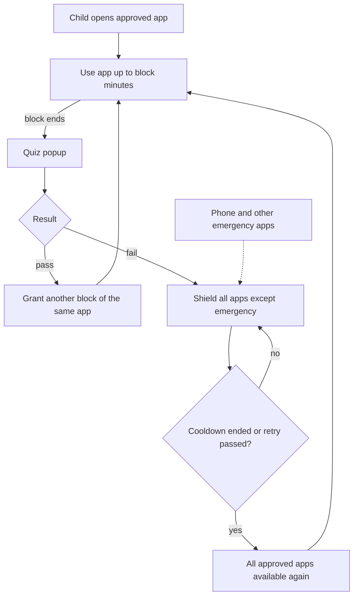

# 07 — App blocks, quiz gate, and fail lock

This is the **enforcement rule** the product must match. It is the same on Android and iOS. Only the shield mechanism differs.

## Canonical example (must match)

Parent sets **YouTube = 30 minutes per block**, **cooldown on fail = 15 minutes**.

1. Child opens YouTube from the approved home (Android) or from the allowed set (iOS).
2. They can watch for **30 minutes**.
3. At 30 minutes a **quiz pops up**. YouTube is paused / shielded until the quiz ends.
4. **Pass** → they may continue YouTube for **another 30 minutes**. Stickers / extra reward if the parent enabled them.
5. **Fail** → **every non-emergency app is shielded immediately**, including YouTube and any other approved app. Only Phone (and other parent-marked emergency apps) stay open. Further usage stops until the rules allow access again.
6. The shield ends only when **either** the parent’s cooldown finishes (example: 15 minutes) **or** the child **passes a retry quiz**. A failed retry does not unlock anything. After unlock, approved apps are available again and the next quiz is at the end of the next block.

---

## What is limited

| Limit | Meaning | Default |
| --- | --- | --- |
| **App block** | Minutes of one app before a quiz | 30 per approved app (parent can override per app) |
| **Pass grant** | Minutes added to **that app** after a pass | Same as the app block (example: +30), unless parent sets a different grant |
| **Fail cooldown** | How long **all non-emergency apps** stay shielded after a fail | 15 minutes (parent-set) |
| **Daily ceiling** | Optional cap on all apps combined | Off by default; parent can turn on (e.g. 120 min/day) |
| **Always allowed** | Never blocked by quiz or cooldown | Phone / emergency. Parent can add one or two more |

A fail is a **device-wide stop**. It is not “only YouTube rests while Khan Academy keeps working.”

---

## Quiz trigger modes

The parent picks one primary mode. App-block is the mode that matches the YouTube example.

| Mode | When the quiz appears | Pass | Fail |
| --- | --- | --- | --- |
| **App block** (recommended on phones) | When that app’s block minutes are used | Another block of that app | Shield **all non-emergency apps** until cooldown or a passed retry |
| **Device interval** (proposed desktop default) | Every N minutes of **device** active use (e.g. 15) | New interval starts | Same fail lock: all non-emergency apps |
| **Every session** | Before a new session (unlock / after idle), or before opening a gated app | Session / open allowed | Same fail lock: all non-emergency apps |
| **Daily ceiling** | When today’s total minutes hit the cap | Extra minutes (parent cap) | Same fail lock until cooldown or retry, and no further grants past the ceiling |

App block (or device interval) and daily ceiling **can both be on**. The tighter rule wins. Example: YouTube block is 30, daily ceiling is 90. After three passed YouTube blocks, the daily ceiling stops further grants even if they would pass another quiz.

Desktop shell, guardian process, and no-skip overlay details: [15 — Desktop native production](15-desktop-native-production.md).

---

## Fail lock (required)

A failed quiz **immediately stops further usage**. This is the v1 rule on Android and iOS. There is no per-app-only fail mode.

### What gets shielded

- The app they were using.
- Every other approved app.
- Recents, the stock drawer (Android has none, because MeritScreen is Home), and any second way back into a blocked app.

### What stays open

- Emergency apps only. Default: **Phone**. Parent may mark one or two more (for example a parent-contact shortcut). Nothing else.

The child sees one calm full-screen lock: countdown, and a **Retry quiz** button. Copy is neutral (“Let’s rest, or try the quiz again”). No shame.

### Unlock paths (either one ends the lock)

| Path | What happens |
| --- | --- |
| **Cooldown ends** | Parent-set timer hits zero. All approved apps unlock. The next quiz is at the end of the next block, not immediately. |
| **Retry passed** | Child takes the quiz again during cooldown. Pass clears the shield now and grants the next block on the app they were using. Fail keeps the shield. Cooldown **restarts** from the same length so a child cannot hammer retries. |

There is no third path. Closing the quiz, pressing Home, or force-stopping an app does not unlock usage.

---

## Where the quiz appears

The quiz must interrupt the app, not wait until the child happens to press Home.

| Platform | How the popup is shown |
| --- | --- |
| **Android** | Launcher-owned timer. When the block ends, MeritScreen brings the quiz Activity to the front. On fail, **every non-emergency icon is disabled** and Home shows the cooldown lock. Recents cannot reopen a shielded app. |
| **iOS** | `DeviceActivity` threshold fires. On fail, `ManagedSettings` shields **the full allowed set** except emergency apps. Shield action opens the SwiftUI retry quiz. Pass or cooldown clears the whole shield. |
| **Desktop (Windows / macOS / Linux)** | Guardian monotonic active-use clock. When the block or device interval ends, Session Agent raises a **topmost quiz overlay with no skip**. On fail, overlay + process/window gating covers or terminates all non-emergency apps. Killing the UI respawns it; persisted `quiz_due` / `shielded` does not clear. See [15](15-desktop-native-production.md). |

Offline: timers, shield state, and quiz content are local. Cloud sync of the result can wait.

---

## Worked timeline

| Clock | What the child can do |
| --- | --- |
| 0:00 | Opens YouTube. Block = 30. |
| 0:30 | Quiz. Answers correctly. |
| 0:30–1:00 | YouTube again (second block). |
| 1:00 | Quiz. Answers incorrectly. |
| 1:00–1:15 | **All apps shielded.** Only Phone works. Child may retry the quiz. |
| 1:15 | Cooldown ends (or retry already passed). Approved apps unlock. New blocks can start. |
| 1:45 | Quiz again. Cycle continues until a daily ceiling (if set) or bedtime. |

---

## What the parent configures (per child, per app)

| Field | Example |
| --- | --- |
| Allowed | Yes / no |
| Block minutes | 30 |
| Minutes granted on pass | 30 (defaults to block minutes) |
| Cooldown on fail | 15 (applies to **all** non-emergency apps) |
| Emergency | No (Phone = yes) |

Global:

| Field | Example |
| --- | --- |
| Quiz mode | App block |
| Retry during cooldown | On (required unlock path) |
| Fail lock scope | All non-emergency apps (not optional) |
| Daily ceiling | Off, or 120 |
| Questions per quiz / pass % | 3–5 / 70 |
| Rewards | Stickers, weekend bonus |

---

## Reports the parent sees

- Minutes today, **by app**
- How many blocks were granted vs failed
- Current lock: cooldown remaining, or retry in progress
- Quiz score, weak topics (from the adaptive engine)

The child does not see this report. During a fail they see one lock screen: countdown, Retry, and Phone. They do not get a grid of other apps.
