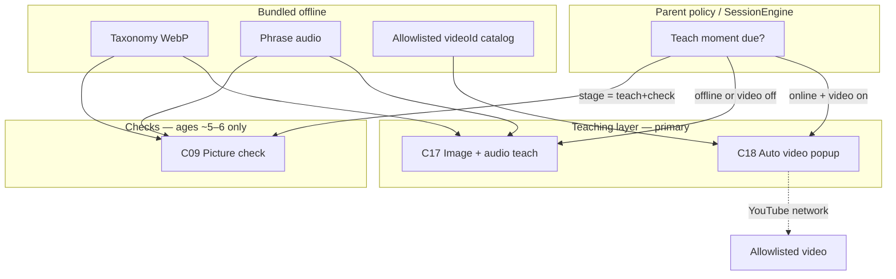

# 09 — Nursery early-learner curriculum (ages 3–6)

**Status:** Planning / build-ready specification. Implementation comes after this document is agreed.  
**Audience:** Product + Android. Extends — does not replace — [06 — Early-learner visual mode](06-adaptive-quiz-and-explanations.md#early-learner-visual-mode-ages-36-pre-reader) and [08](08-ai-personalized-learning-and-lockout.md).

---

## 0. Goal, aim, and focus

### Goal

Help **nursery-age children learn** letters, numbers, words, and everyday things the way a nursery teacher would: by **showing**, **speaking**, and **singing** — not by reading quiz text.

### Aim

Make MeritScreen’s ages **3–6** path a **teaching system** first:

1. **Teach** with auto-played educational videos (ABC songs, counting songs, nursery GK), plus local **images** and **audio**.
2. Only later, for children who are ready (~**5–6**), introduce gentle **picture checks** (“A for…?”, “Find the dog”).
3. Keep younger children (~**3–4**) in a **teach-only** experience: watch / listen / look — **not** “pass this quiz to continue.”

### Focus (what we optimize for)

| Focus | Meaning |
| --- | --- |
| **Teach, don’t test (ages ~3–4)** | No start/stop quiz UI as the main experience. Learning moments are videos, picture cards, and spoken words. |
| **Auto-play, no ceremony** | When a nursery learning moment is due, a **popup appears and the video starts by itself with sound** — no Start button, no End button the child must find. |
| **Images + audio always available offline** | Bundled WebP + phrase audio so teaching still works when YouTube cannot. |
| **Questions are a later stage** | Ages ~5–6 may get short image-based checks; ages ~3–4 do not rely on Q&A to “earn” learning. |
| **Safety product unchanged** | Device-wide fail lock, Room-only Home path, parent allowlists, no open YouTube search. |

### One-line product statement

> For nursery learners, MeritScreen **teaches** with video + picture + sound first; **questions are optional later**, not the definition of the feature.

---

## 1. Problem we are solving

Children in **`AgeBand.AGE_3_TO_6`** are mostly **pre-readers**. A “quiz-first” product (text questions, tap Start, pass to unlock) fails them:

- They cannot read prompts.
- A wrong answer feels like punishment, not learning.
- What they need is **exposure and repetition** (A–Z songs, “this is a cat”, counting aloud).

What nursery children *can* do well:

- Watch a short song / lesson video
- Look at large pictures
- Hear a word or letter spoken
- (Later) tap a picture that matches what they heard

**Wrong framing (reject):** “Nursery = special question type.”  
**Right framing (this doc):** “Nursery = teaching media + spoken picture learning; questions are a maturity step inside the same age band.”

---

## 2. Age split inside `AGE_3_TO_6`

We keep **one** product age band (`AGE_3_TO_6`) so parents do not juggle extra settings. Behavior splits by **nursery stage** (derived from age band + optional parent “readiness” toggle later):

| Stage | Typical age | Primary experience | Questions? |
| --- | --- | --- | --- |
| **Teach-only** | ~3–4 | Auto video popup + image/audio teach cards | **No** (or never required) |
| **Teach + gentle check** | ~5–6 | Same teaching library, plus short picture checks | **Yes**, image/audio only (“A for?”, “Find kiwi”) |

Default for the whole band until a parent opts into checks: **teach-first**.  
Parent copy: “Younger children learn by watching and listening. Picture questions can turn on when they are ready.”

---

## 3. Non‑negotiable invariants (must not break)

| Rule | How nursery teaching obeys it |
| --- | --- |
| Child Home path reads **Room / local policy only** | Whether a teach moment is due is decided locally from policy + timers. Video fetch is separate and must not block painting Home. |
| Fail lock stays **device-wide** | Unchanged ([07](07-app-blocks-and-fail-lock.md)). Teaching moments do not invent a per-app-only fail. |
| No child email, GPS, contacts, photos | Stock art + curated video IDs only. |
| `AppConfig` holds tunables | Cadence, max video seconds, media MB caps. |
| Honest limits | If offline / YouTube blocked: fall back to **local image + audio teach**; never fake a playing video. |

**Critical separation:**

```text
Teach moment (video)     →  may need network; auto popup; with sound; allowlisted IDs only
Teach moment (local)     →  images + audio in APK; always works offline
Picture check (5–6 only) →  Room only; never depends on YouTube to answer
```

---

## 4. What “teaching” looks like (core UX)

### 4.1 Auto nursery video popup (primary for ~3–4)

When policy says a learning moment is due (e.g. every `N` minutes of granted time, or at block boundary):

1. A **full-screen (or near full-screen) popup** appears automatically.
2. The allowlisted YouTube lesson (**ABC song, counting song, nursery GK**, etc.) **starts playing by itself**.
3. **Sound is on** (autoplay **with audio**). There is **no Start button** and **no End button** the child must press to begin or finish.
4. Playback ends when the curated clip finishes (or hits `maxSeconds`). The popup then **dismisses itself** (or holds a calm “All done!” beat) and returns to Child Home / next flow.
5. Parent PIN (or a discreet long-press parent affordance) can interrupt if needed — not a child-facing End control.

**Android note:** True unmuted autoplay can be constrained by WebView / player policies. Implementation must use the supported YouTube / IFrame player path, user-gesture fallbacks only when the OS blocks unmuted autoplay, and document any OS limitation honestly. Product intent remains: **auto start with sound, no child Start/End chrome.**

### 4.2 Local image + audio teach (always-on fallback)

Even without network:

- Large picture of the concept (apple, cat, bus…)
- Spoken label (“A for Apple”, “This is a cow”)
- Optional short auto-advance carousel (“Play all” for a category) — still **teaching**, not scoring

### 4.3 Picture checks (only ~5–6, later)

Same visual language as the reference apps (2×2 tiles, dashed prompt, speaker), used as a **gentle check after teaching**, not as the only mode:

- “B for ?”
- “Find the buffalo”
- “How many apples?”

Wrong answer → calm teach with picture + audio ([08](08-ai-personalized-learning-and-lockout.md) lock when enabled). Never shame.

---

## 5. Architecture overview



| Layer | Responsibility |
| --- | --- |
| Session / policy | Decide **when** a teach moment fires (cadence, after block, parent toggles) |
| **C18** Nursery video popup | Auto-play allowlisted video **with sound**; no Start/End; self-dismiss |
| **C17** Image/audio teach | Offline carousel / word cards |
| **C09** Picture check | Only when stage allows checks (~5–6) |
| Assets | Taxonomy, phrases, video allowlist metadata in APK |

AI may later **recommend which allowlisted clip or topic** to show next; it never streams freeform YouTube search and never runs on the Home paint path.

---

## 6. Curriculum inventory (teach library)

Content is organized as a **teaching library**, not a “question bank” first.

### 6.1 Phase A — Must teach offline + via video catalog

| Track | Teach with | Examples |
| --- | --- | --- |
| `alphabet` | Video (ABC song) + letter/object cards | A for Apple, B for Ball |
| `numbers` | Counting song video + count cards | 1–5, then 1–10 |
| `animals_domestic` | Song/clip + picture cards | Cat, cow, dog, goat… |
| `fruits` | Picture + audio (+ optional clip) | Apple, banana, kiwi… |
| `colors` / `shapes` | Picture + audio | Red, circle… |

### 6.2 Phase B — Everyday English / nursery GK

Transport, home objects, body, nature, simple opposites — same teach media pattern.

### 6.3 Phase C — Picture checks for ~5–6

Only after teach library exists: author `TAP_IMAGE` / `COUNT_AND_TAP` items (schema already in [06](06-adaptive-quiz-and-explanations.md)) keyed to the same taxonomy. These are **checks after teaching**, not the definition of nursery mode.

---

## 7. YouTube / video design (primary teach channel)

### 7.1 Product rules

| Do | Do not |
| --- | --- |
| Auto popup when due | Make the child press Start |
| Auto-play **with sound** | Default to muted “silent” lessons as the happy path |
| No child Start / End buttons | Rely on a kid finding End to finish the lesson |
| Hard **allowlist** of `videoId`s | Open YouTube Search or free URLs |
| Cap length (`maxSeconds`) then auto-dismiss | Endless related-video rabbit holes |
| Fall back to local image+audio if offline | Block the device / fail the whole session for no network |
| Parent can disable or change cadence | Force video when parent turned it off |

### 7.2 Parent policy fields (later schema)

```text
nurseryTeachMode: TEACH_ONLY | TEACH_AND_CHECK   // default TEACH_ONLY for new 3–6 profiles
nurseryVideoEnabled: Boolean = true              // teaching channel; parent can turn off
nurseryVideoCadenceMinutes: Int = 30             // AppConfig default
nurseryVideoPlayWithSound: Boolean = true        // product default ON
nurseryPlaylistId: String                        // key into bundled allowlist
nurseryCheckEnabled: Boolean = false             // picture questions; for ~5–6 readiness
```

Cadence examples: every 30 minutes of granted time; or at each app-block boundary before the next grant — exact trigger wired to [07](07-app-blocks-and-fail-lock.md) session phases without putting network on the Home compose path.

### 7.3 Allowlist asset (IDs only — legal review before ship)

```json
{
  "playlists": [
    {
      "id": "abc_english_v1",
      "title": "ABC songs (English)",
      "videos": [
        { "videoId": "REPLACE_WITH_VETTED_ID", "title": "ABC Song", "maxSeconds": 180 }
      ]
    },
    {
      "id": "counting_v1",
      "title": "Counting songs",
      "videos": [
        { "videoId": "REPLACE_WITH_VETTED_ID", "title": "Count to 10", "maxSeconds": 150 }
      ]
    }
  ]
}
```

Legal / safety before production: YouTube ToS, kid-directed / COPPA constraints, no comments UI, controlled player (no related feed), human review of every ID.

### 7.4 How this differs from “quiz enrichment”

| Old framing | This framing |
| --- | --- |
| Video is optional after a quiz | Video **is** the main teach moment for ~3–4 |
| Questions define nursery | Teaching media defines nursery; questions are later |
| Child presses play | System auto-plays with sound |

---

## 8. Session integration (screen time + teaching)

MeritScreen still gates apps with blocks and unlocks ([07](07-app-blocks-and-fail-lock.md)). Nursery changes **what happens at the learning boundary**:

| Stage | At learning boundary |
| --- | --- |
| Teach-only (~3–4) | Auto teach popup (video if online, else local image/audio). Completing the teach moment can satisfy the “learning gate” without a scored quiz — **product decision to confirm in implementation**: treat teach completion as the unlock check for this stage. |
| Teach + check (~5–6) | Short picture check (3 items) after or instead of video, per parent settings. Pass/fail uses existing SessionEngine. |

Fail lock remains device-wide when a **check** is failed. Teach-only stage should not invent a “fail because they didn’t watch” punishment if the video could not load — fall back to local teach, then continue calmly.

---

## 9. Asset & APK size plan

| Asset | Role |
| --- | --- |
| Taxonomy WebP | Offline picture teaching |
| Phrase audio | Offline spoken labels |
| Video allowlist JSON | Tiny; actual video streams from YouTube when online |

**Budget:** nursery **local** media ~**8–12 MB** compressed in APK. Videos are **not** bundled as full MP4s in v1 (size); they stream via allowlisted IDs. Optional later: download a few short offline clips over Wi‑Fi into `QuizMediaAssetEntity`.

---

## 10. Parent experience

| Surface | Copy / control |
| --- | --- |
| Add Child (3–6) | “We’ll teach with songs, pictures, and sounds — not reading tests.” |
| Nursery teaching | Video on/off, sound on, cadence, playlist |
| Readiness | “Picture questions” toggle for when the child is ready (~5–6) |
| Reports | Minutes taught, tracks shown (Alphabet, Numbers…); checks only if enabled |

---

## 11. Implementation roadmap

Order protects **teach-first** and auto-play intent:

| Phase | Deliverable | Done when |
| --- | --- | --- |
| **A0** | Spec freeze (this doc) + vetted video allowlist candidates | Product + legal sign-off path clear |
| **A1** | C18 auto popup player: allowlisted ID, **auto-play with sound**, no Start/End, auto-dismiss, soft offline fallback | Device QA on phone + tablet |
| **A2** | C17 local image + audio teach library (alphabet, numbers, animals, fruits) | Airplane-mode teaching works |
| **A3** | Wire teach moment into session cadence (`AppConfig` + policy) | Fires on schedule without blocking Home |
| **B1** | Parent toggles: video, cadence, teach-only vs teach+check | Clear parental control |
| **B2** | Picture checks for teach+check stage only | ~5–6 path uses C09 visual items |
| **C1** | Expand tracks + reports | Nursery library feels complete |

**Non-goals for v1**

- Open YouTube search on the child device  
- Child-facing Start / End as the normal path  
- Defining nursery solely as “more quiz question types”  
- Requiring network to teach (local fallback required)  
- Per-app-only fail  

---

## 12. Testing plan (production bar)

1. Teach-only + online: popup appears on cadence, video **auto-plays with sound**, no Start tap required, dismisses after cap.
2. Teach-only + airplane mode: local image/audio teach runs; no crash; calm messaging.
3. Parent disables video: only local teach (or silence per policy); no surprise YouTube.
4. Teach+check enabled: picture checks work offline; never call YouTube on answer path.
5. Fail lock still device-wide when a check fails.
6. No related-video navigation escapes the allowlisted player.

---

## 13. Relation to current code

Reuse:

- `AgeBand.AGE_3_TO_6`, `VisualTaxonomy`, visual quiz fields, `QuizTtsNarrator`
- SessionEngine / fail lock ([07](07-app-blocks-and-fail-lock.md))
- Docs/06 visual **presentation** (for the later check stage only)

**Gap this document closes:** nursery is a **teaching-first** product (auto video + images + audio), with picture **questions only for older / ready children** — not “quiz UX with prettier tiles.”

---

## 14. Decision summary

| Decision | Choice |
| --- | --- |
| Primary goal | **Teach** nursery children (video + image + sound) |
| Ages ~3–4 | Teach-only; **no** question-centric flow |
| Ages ~5–6 | Teaching + optional picture checks |
| YouTube UX | Auto popup, **auto-play with sound**, **no Start/End** buttons |
| Offline | Local image + audio always |
| Questions | Later stage / parent readiness — not the definition of nursery |
| Next step | Agree auto-play + cadence policy, then implement C18 (A1) and local teach library (A2) |

When implementation starts, update [04](04-screens-and-features.md) (C17/C18), [03](03-data-model-and-flow.md) (policy fields), and `AppConfig` nursery tunables.
