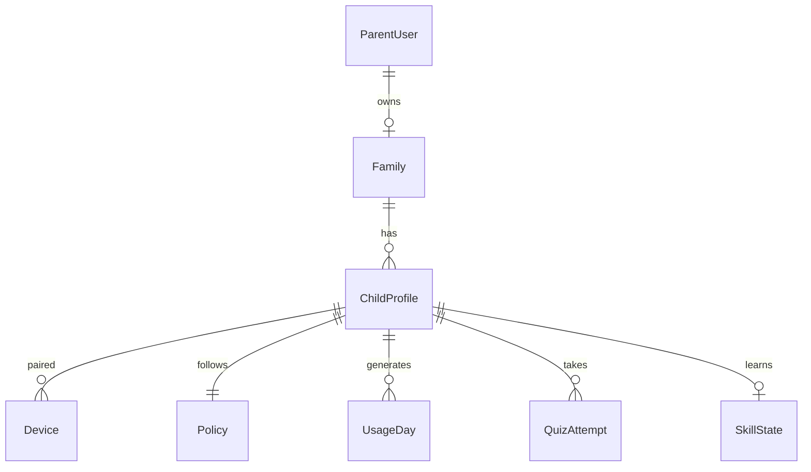
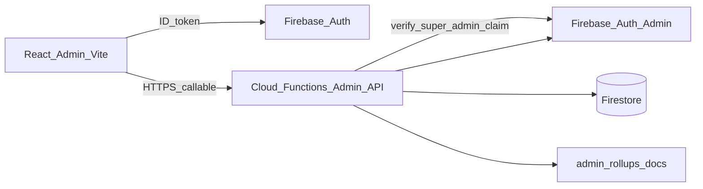

# 10 — Super Admin Panel (build specification)

**Status:** Specification only — no React app or admin Cloud Functions in this document’s scope.  
**Audience:** Engineers implementing an internal ops console for MeritScreen.  
**Related:** [03 — Data model](03-data-model-and-flow.md), [SECURITY.md](../SECURITY.md), [ARCHITECTURE.md](../ARCHITECTURE.md), `firestore.rules`, `functions/src/index.ts`.

---

## 1. Purpose

MeritScreen is a parental-control launcher for children aged **3–12**. Parents own a **family**, configure **children** and **policy**, pair **devices**, and review usage / quiz learning. All production access today is **family-scoped** (Android + Firestore rules).

The **Super Admin Panel** is an internal **React** web console so operators can:

- See global counts (parents/users, families, children, devices)
- List, search, filter, **disable / activate**, and soft/hard-**delete** entities
- View product **analytics** (signups, active families, quiz pass rates, screen-time aggregates)
- **Export** CSV/JSON for users, families, children, devices
- Manage **operator** profiles (who holds `super_admin`)
- Send **campaign / release push notifications** (parents only, children only, or both) with
  title/body, optional image, and intent **`product`** (new features / non-promo) or **`promo`**
  — server-side fan-out only; never expose FCM tokens in the SPA (see
  [11 — Firebase push](11-firebase-push-notifications.md) §17 and
  [FIREBASE_ARCHITECTURE.md](../FIREBASE_ARCHITECTURE.md))

It must stay **lightweight, high-performance, and privacy-safe**. It is **not** a second parent app. It must **never** expose secrets (PINs, pairing codes, custom tokens, FCM tokens).

---

## 2. Product context (entities the admin operates on)



| Entity | Firestore path (approx.) | Admin cares about |
| --- | --- | --- |
| Parent / user | `users/{uid}` | email, displayName, familyId, createdAt, status |
| Family | `families/{familyId}` | ownerUid, name, member count, status |
| Members | `families/{id}/members/{uid}` | membership |
| Child | `families/{id}/children/{childId}` | displayName, ageBand, avatarId, language |
| Policy | `.../policy/current` | quiz mode, ceilings, AI flags (read-only summary) |
| Devices | `.../devices/{deviceId}` | model, lastSeenAt, revoked, launcherDefault, appVersion |
| Usage | `.../usageDays/{day}` | minutesUsed, minutesByApp (**aggregates** only) |
| Learning | `quizAttempts`, `skillState` | pass rate, levels (**aggregates**) |

### Privacy hard limits

From [03](03-data-model-and-flow.md) and [SECURITY.md](../SECURITY.md) — the admin UI **must** obey:

- No GPS, contacts, SMS, photos, voice, **child email** (we do not collect it)
- Never show or export: raw Parent PIN, `parentPinHash`, pairing secrets, custom tokens, FCM tokens
- Child display names may be nicknames — treat as **sensitive PII** in exports (access-logged via audit)

---

## 3. Why the admin cannot use client Firestore alone

Current [firestore.rules](../firestore.rules):

- `users/{uid}` — **`list: false`**; get only own uid
- Families — member / owner / child-device claims only

A browser signed in as a normal parent **cannot** list all users or families. Super Admin must use:

1. Firebase Auth **custom claim** `{ "role": "super_admin" }`
2. **Cloud Functions (Admin SDK)** as the only data plane for list / search / mutate / export
3. **Pre-aggregated rollup docs** for dashboard KPIs (cheap reads)

**Do not** open Firestore `list` on `users` / `families` to the web client—even for admins. Keep pagination, redaction, and audit on the server.

---

## 4. Architecture



| Layer | Locked choice |
| --- | --- |
| App location | `apps/admin` (Vite + React + TypeScript) at repo root |
| UI | **shadcn/ui** + Tailwind; **light + dark** (class-based theme toggle) |
| Charts | **Recharts** (line, bar, pie, area) |
| Data fetching | TanStack Query |
| Tables | TanStack Table + shadcn DataTable |
| Routing | React Router |
| Auth | Firebase Auth (email/password and/or Google) + claim gate |
| Backend | Callables under `functions/src/admin/*.ts` |
| Hosting | Firebase Hosting (`admin.` subdomain or `/admin` path) |

### Performance rules

- Dashboard KPIs from **`adminStats/global`** (scheduled refresh every 15–60 min)—not N+1 family scans on every load
- Lists: **cursor pagination** (page size 25–50), server-side search on indexed fields
- Detail: load one family tree lazily (children → devices on expand)
- Exports: async job → Storage download URL (or streamed CSV for &lt;10k rows)
- Code-split routes; **no** global Firestore snapshot listeners in the admin SPA

---

## 5. Auth and operator model

### 5.1 Super admin identity

- Operators are Firebase Auth users with claim `{ "role": "super_admin" }`
- Bootstrap first admins via Firebase CLI / script (`auth.setCustomUserClaims`) — **no** self-serve signup in production
- Optional `adminUsers/{uid}` for display metadata (`displayName`, `lastLoginAt`, `disabled`) — **claim is source of truth for authorization**

### 5.2 Client and server gates

- **Web:** after login, force-refresh ID token; if `role !== "super_admin"`, show Access denied and sign out
- **Every admin Function:** `assertSuperAdmin(request.auth)` before Admin SDK use
- **App Check:** enable for admin Hosting + Functions when production-ready (same philosophy as [SECURITY.md](../SECURITY.md))

### 5.3 Audit log

On every destructive or status-changing action, write `adminAuditLogs/{id}`:

| Field | Type | Notes |
| --- | --- | --- |
| `actorUid` | string | Operator uid |
| `action` | string | e.g. `user.disable`, `family.delete`, `export.start` |
| `targetType` | string | `user` \| `family` \| `child` \| `device` \| `export` \| `operator` |
| `targetId` | string | Primary id |
| `metadata` | map | Redacted extras (no secrets) |
| `createdAt` | timestamp | Server time |

UI: read-only **Audit** page (paginated).

---

## 6. Information architecture (screens)

### 6.1 Shell

- **Sidebar:** Dashboard, Users, Families, Children, Devices, Analytics, Exports, Audit, Operators, Settings
- **Top bar:** theme toggle (light/dark), operator avatar, sign out
- **Global search:** uid / email / familyId / childId

### 6.2 Dashboard

KPI cards (from rollups):

- Total parents (users), families, children, paired devices
- Active devices (heartbeat within configurable N hours, default 24)
- New signups (7d / 30d)
- Quiz attempts + pass rate (7d)
- Families with ≥1 child paired

Charts:

- **Line:** daily new parents / new families (30–90d)
- **Bar:** children by age band (`AGE_3_TO_6` / `AGE_7_TO_9` / `AGE_10_TO_12`)
- **Pie:** device status (online / offline / revoked)
- **Area:** aggregate screen minutes (rollup only—not per-app PII dump)

### 6.3 Users (parents)

**Table columns:** uid, email, displayName, familyId, createdAt, status (`active` \| `disabled` \| `inactive`), lastSignInAt

**Actions:**

- View profile / linked family
- **Disable / Enable** Auth (`auth.updateUser({ disabled })`) + mirror `users/{uid}.status`
- Soft-delete flag vs hard-delete (hard-delete wraps family wipe carefully)
- Download filtered CSV / single-user JSON (**redacted**)

### 6.4 Families

**Table columns:** familyId, name, ownerUid, ownerEmail, childCount, deviceCount, status, createdAt

**Actions:**

- Open detail (tree)
- Suspend / activate (`families/{id}.status`: `active` \| `suspended`) — **new field**; Android must later honor suspension (follow-on work)
- Delete via Admin wrapper around existing `deleteFamily`

### 6.5 Children

Cross-family list via Admin API: childId, displayName, ageBand, familyId, deviceCount, lastQuizAt

**Actions:** view; delete via Admin wrapper around existing `deleteChild`

Never show PIN, pairing codes, or raw quiz answer payloads beyond parent-report-level aggregates.

### 6.6 Devices

deviceId, childId, familyId, model, osVersion, appVersion, lastSeenAt, revoked, launcherDefault

**Actions:** force revoke (`revoked: true`), clear FCM token (admin), export

### 6.7 Analytics (deep)

Time range: 7d / 30d / 90d

- Acquisition: signups → family created → first child → first pair
- Learning: attempts, pass %, AI vs bank source ratio (when field exists)
- Engagement: DAU/WAU families with heartbeat
- Retention: cohort by signup week (rollup-based)

### 6.8 Exports

Wizard: entity → filters → format (CSV / JSON) → generate → download

**Always strip:** `parentPinHash`, pairing secrets, `fcmToken`, custom tokens, `iconBase64` (icons off by default)

### 6.9 Operators and Settings

- List operators; invite (set claim); revoke claim
- Optional `adminConfig/global` for maintenance banner / feature flags

---

## 7. Schema additions (minimal)

| Path | Fields |
| --- | --- |
| `users/{uid}` | `status`, `createdAt`, `updatedAt`, `familyId` (if missing), `disabledAt?` |
| `families/{familyId}` | `status` (`active`\|`suspended`), `createdAt`, `childCount?`, `deviceCount?` |
| `adminStats/global` | KPI numbers + `updatedAt` |
| `adminStats/daily/{yyyyMMdd}` | time-series points |
| `adminAuditLogs/{id}` | audit entries |
| `adminUsers/{uid}` | operator profile |
| `adminExports/{jobId}` | `status`, `downloadUrl`, `expiresAt`, `entity`, `format` |

Android clients should **ignore unknown fields**. Enforcing `suspended` on the parent/child apps is a **separate Android follow-up**.

### Example `adminStats/global`

```json
{
  "totalUsers": 1204,
  "totalFamilies": 980,
  "totalChildren": 1420,
  "totalDevices": 1510,
  "activeDevices24h": 612,
  "signups7d": 48,
  "signups30d": 190,
  "quizAttempts7d": 8200,
  "quizPassRate7d": 0.71,
  "familiesWithPairedDevice": 870,
  "updatedAt": "2026-09-25T02:00:00.000Z"
}
```

### Example `adminStats/daily/{yyyyMMdd}`

```json
{
  "day": "20260924",
  "newUsers": 12,
  "newFamilies": 10,
  "newChildren": 14,
  "newDevices": 11,
  "quizAttempts": 1100,
  "quizPasses": 780,
  "aggregateScreenMinutes": 54000
}
```

---

## 8. Backend API surface

Namespace: callable functions named `admin*`. All require Auth + `role === "super_admin"`.

Reuse wipe logic from existing [`deleteChild`](../functions/src/index.ts) / [`deleteFamily`](../functions/src/index.ts)—wrap with `assertSuperAdmin` rather than reimplementing recursion.

**Scheduled:** `adminRollupStats` (Cloud Scheduler) refreshes `adminStats/*`.

### 8.1 Common conventions

**Errors (Functions `HttpsError`):**

| Code | When |
| --- | --- |
| `unauthenticated` | No Auth |
| `permission-denied` | Missing `super_admin` claim |
| `invalid-argument` | Bad payload |
| `not-found` | Unknown id |
| `failed-precondition` | Illegal state (e.g. export not ready) |
| `resource-exhausted` | Rate limit |

**Pagination request (lists):**

```json
{
  "pageSize": 50,
  "cursor": "opaque-string-or-null",
  "query": "optional search string",
  "status": "active"
}
```

**Pagination response:**

```json
{
  "items": [],
  "nextCursor": "opaque-or-null",
  "totalHint": null
}
```

`totalHint` is optional (expensive); prefer rollups for totals.

---

### 8.2 `adminGetDashboardStats`

**Request:** `{}` or `{ "activeDeviceWindowHours": 24 }`

**Response:**

```json
{
  "global": { "...": "adminStats/global fields" },
  "sparklines": {
    "newUsers": [{ "day": "20260918", "value": 8 }, { "day": "20260919", "value": 11 }],
    "newFamilies": [{ "day": "20260918", "value": 7 }],
    "quizPassRate": [{ "day": "20260918", "value": 0.69 }]
  }
}
```

---

### 8.3 `adminListUsers` / `adminGetUser`

**List request:** pagination + optional `status`, `query` (email / uid)

**List item:**

```json
{
  "uid": "QxIR…",
  "email": "parent@example.com",
  "displayName": "Alex",
  "familyId": "a58e7888-…",
  "status": "active",
  "createdAt": "2026-01-10T12:00:00.000Z",
  "lastSignInAt": "2026-09-24T18:00:00.000Z"
}
```

**Get response:** list item + `{ "authDisabled": false, "providerIds": ["password", "google.com"] }`  
Never include PIN hash or tokens.

---

### 8.4 `adminSetUserStatus`

**Request:**

```json
{
  "uid": "QxIR…",
  "status": "disabled"
}
```

`status`: `active` \| `disabled` \| `inactive`

**Behavior:**

- `disabled` → `auth.updateUser({ disabled: true })`, set `users/{uid}.status`, `disabledAt`
- `active` → re-enable Auth + clear `disabledAt`
- `inactive` → soft flag only (Auth may stay enabled)—document product meaning (e.g. dormant)

**Response:** `{ "ok": true }` + audit write

---

### 8.5 `adminListFamilies` / `adminGetFamilyTree`

**List item:**

```json
{
  "familyId": "a58e7888-…",
  "name": "The Patels",
  "ownerUid": "QxIR…",
  "ownerEmail": "parent@example.com",
  "childCount": 2,
  "deviceCount": 2,
  "status": "active",
  "createdAt": "2026-01-10T12:05:00.000Z"
}
```

**Tree response:**

```json
{
  "family": { "...": "list item" },
  "members": [{ "uid": "…", "role": "owner" }],
  "children": [
    {
      "childId": "92d72b33-…",
      "displayName": "Mira",
      "ageBand": "AGE_7_TO_9",
      "language": "en",
      "avatarId": "RABBIT",
      "devices": [
        {
          "deviceId": "d7b684dc…",
          "model": "sdk_gphone64_arm64",
          "lastSeenAt": "2026-09-25T02:00:00.000Z",
          "revoked": false,
          "launcherDefault": true,
          "appVersion": "1.0.0"
        }
      ],
      "policySummary": {
        "quizMode": "app_block",
        "dailyCeilingMinutes": 120,
        "aiQuizzesEnabled": true
      }
    }
  ]
}
```

Omit `parentPinHash`, `fcmToken`, `installedApps[].iconBase64`.

---

### 8.6 `adminSetFamilyStatus`

**Request:** `{ "familyId": "…", "status": "suspended" }`  
**Response:** `{ "ok": true }`

---

### 8.7 `adminDeleteFamily` / `adminDeleteChild`

**Request:** `{ "familyId": "…" }` or `{ "familyId": "…", "childId": "…" }`  
**Confirm:** client must send `{ "confirm": "DELETE" }` for hard delete.

Wrap existing wipe helpers; push `family_deleted` / device notifications as today. Always audit.

---

### 8.8 `adminListChildren` / `adminListDevices` / `adminRevokeDevice`

**Children list item:** childId, displayName, ageBand, familyId, deviceCount, lastQuizAt  
**Devices list item:** deviceId, childId, familyId, model, osVersion, appVersion, lastSeenAt, revoked, launcherDefault  

**Revoke request:** `{ "familyId", "childId", "deviceId" }` → set `revoked: true` (Admin SDK), optional FCM `device_revoked`

---

### 8.9 `adminGetAnalyticsSeries`

**Request:**

```json
{
  "rangeDays": 30,
  "series": ["newUsers", "newFamilies", "quizAttempts", "quizPassRate", "aggregateScreenMinutes", "ageBandBreakdown", "deviceStatusBreakdown"]
}
```

**Response (sketch):**

```json
{
  "rangeDays": 30,
  "line": {
    "newUsers": [{ "day": "20260901", "value": 5 }],
    "newFamilies": [{ "day": "20260901", "value": 4 }]
  },
  "bar": {
    "ageBandBreakdown": [
      { "key": "AGE_3_TO_6", "value": 210 },
      { "key": "AGE_7_TO_9", "value": 640 },
      { "key": "AGE_10_TO_12", "value": 570 }
    ]
  },
  "pie": {
    "deviceStatusBreakdown": [
      { "key": "online", "value": 612 },
      { "key": "offline", "value": 700 },
      { "key": "revoked", "value": 198 }
    ]
  },
  "funnel": {
    "signups": 190,
    "familiesCreated": 175,
    "firstChild": 160,
    "firstPair": 140
  }
}
```

---

### 8.10 `adminStartExport` / `adminGetExport`

**Start request:**

```json
{
  "entity": "users",
  "format": "csv",
  "filters": { "status": "active" }
}
```

`entity`: `users` \| `families` \| `children` \| `devices`  
`format`: `csv` \| `json`

**Start response:** `{ "jobId": "…", "status": "pending" }`

**Get response:**

```json
{
  "jobId": "…",
  "status": "ready",
  "downloadUrl": "https://storage.googleapis.com/…",
  "expiresAt": "2026-09-25T06:00:00.000Z",
  "rowCount": 1204
}
```

`status`: `pending` \| `running` \| `ready` \| `failed`

---

### 8.11 Operators and audit

| Function | Request | Response |
| --- | --- | --- |
| `adminListAuditLogs` | pagination + optional `actorUid`, `action` | `{ items, nextCursor }` |
| `adminListOperators` | `{}` | `{ items: [{ uid, email, displayName, disabled }] }` |
| `adminSetOperator` | `{ "uid", "grant": true \| false }` | `{ "ok": true }` — sets/clears `role: super_admin` claim |
| `adminRebuildStats` | `{ "confirm": "REBUILD" }` | `{ "ok": true }` — ops-only rollup refresh |

---

## 9. UI / UX standards (shadcn)

- Dense ops console (not Calm Horizon child UI): Sidebar, Card, Table, Dialog, Dropdown, Badge, Tabs, chart wrappers
- Light / dark tokens; persist preference in `localStorage`
- Every list: loading skeleton, empty, error + retry
- Confirm dialogs for disable/delete; hard delete requires typing `DELETE`
- Desktop-first (1280+); tablet usable; phone secondary

---

## 10. Security and compliance checklist

- [ ] `super_admin` claim on every mutating API
- [ ] Rate-limit admin callables
- [ ] Audit deletes, disables, revokes, exports, operator grants
- [ ] Redact secrets in API responses and CSV/JSON
- [ ] Do not grant admin claims to Android debug / child custom tokens
- [ ] No new sensitive collection categories (kids-policy alignment)
- [ ] App Check for admin Hosting + Functions before enforcement in prod
- [ ] Optional later: org SSO in front of Hosting

---

## 11. Implementation phases (when building the app)

1. **Foundation** — `apps/admin` scaffold, shadcn, auth gate, Hosting  
2. **Admin Functions + claims** — `assertSuperAdmin`, list users/families, audit  
3. **Dashboard rollups** — scheduled stats + Recharts  
4. **Entity actions** — disable/activate, revoke device, delete wrappers  
5. **Analytics + exports** — series APIs, CSV/JSON jobs  
6. **Operators** — claim management UI  
7. **Hardening** — App Check, indexes, load tests  

**Android follow-on (not this doc’s build):** honor `families/{id}.status === "suspended"` (block parent writes / force sign-out).

---

## 12. Explicit non-goals (v1)

- Not a parent-facing web dashboard  
- Not deep quiz-bank / AI prompt editing  
- Not real-time maps of child location (**forbidden**)  
- Not replacing Firebase Console for IAM / billing  
- Not opening broad Firestore client `list` rules  

---

## 13. Repo layout (when implementing)

```text
apps/admin/                 # Vite React SPA
  src/
    routes/
    components/ui/          # shadcn
    lib/firebase.ts
    features/dashboard|users|families|…
functions/src/admin/        # assertSuperAdmin + callables
docs/10-super-admin-panel.md
```

Bootstrap claim (ops, one-time):

```bash
# Example — run with Firebase Admin credentials; never commit service account keys
npx firebase auth:export /tmp/users.json --project <project>
# Then set claims via a small Admin SDK script:
# auth.setCustomUserClaims(uid, { role: 'super_admin' })
```

---

## 14. Definition of done (for a future implementation PR)

- Operator with claim can open Dashboard and see rollup KPIs without full collection scans  
- Users / Families / Children / Devices lists paginate and support status filters  
- Disable user and revoke device work end-to-end with audit entries  
- Export downloads redacted CSV/JSON  
- Non-admin Auth user is denied at UI and Functions  
- Light and dark themes work; routes are code-split  

This document is the build contract. Implementation starts only when product asks to build `apps/admin` and `functions/src/admin`.
