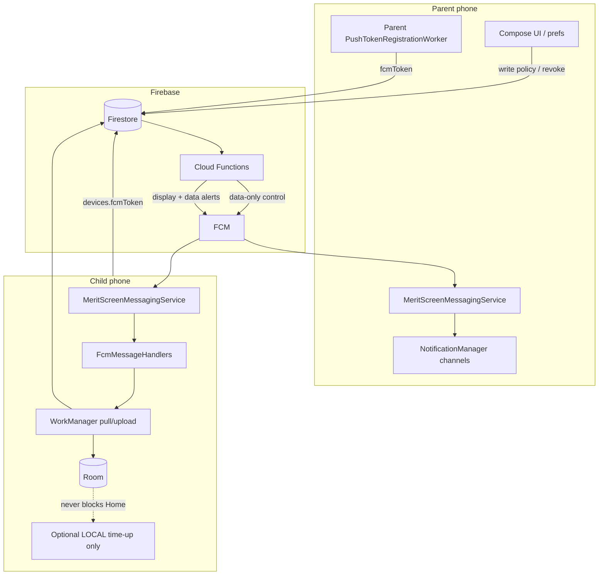

# 11 — Firebase push notification system design

**Status:** Implemented & Deployed to Production.  
**Scope:** Android Watching (parent + child roles), Firebase Cloud Messaging, Cloud Functions (2nd Gen).  
**Related:** [FIREBASE_ARCHITECTURE.md](../FIREBASE_ARCHITECTURE.md), [ARCHITECTURE.md](../ARCHITECTURE.md) (Phase 7 sync), [03 — Data model](03-data-model-and-flow.md), [04 — Screens](04-screens-and-features.md) § Notifications, [07 — Fail lock](07-app-blocks-and-fail-lock.md), [08 — AI / policy_sync](08-ai-personalized-learning-and-lockout.md).

This document is the **single source of truth** for where push belongs, what triggers it, who receives it, and what must never be pushed. Implement against this doc; do not invent ad-hoc FCM types in feature PRs.

---

## 1. Goals

| Goal | Meaning |
| --- | --- |
| Fast control plane | Parent policy / revoke / PIN / family-delete reach the child in seconds without a live Firestore listener on Home |
| Parent awareness | Parent phone gets **user-visible** alerts for supervision events they opted into |
| Child calm | Child device gets **no marketing**, no quiz spam, no tray noise that undermines fail-lock calm UI |
| Offline-safe | FCM is best-effort; Room + WorkManager remain the source of truth and fallback |
| Privacy | Never put PIN, pairing codes, emails, tokens, or child names beyond what the parent already owns into FCM payloads |
| Cost / battery | Data-only wake-ups; short handlers; prune dead tokens; batch noisy events |

**Non-goals for the parent-product v1 path:** iOS APNs detail, in-app chat, client-sent marketing.

**Planned ops capability (not “parent product”):** Super Admin **campaign / release** push —
parents and/or children, `product` vs `promo`, optional image — see §17 and
[FIREBASE_ARCHITECTURE.md](../FIREBASE_ARCHITECTURE.md).

---

## 2. What already exists (do not reinvent)

### 2.1 Child control plane (implemented)

| Message `type` | Trigger (Cloud Function) | Child receiver | Action |
| --- | --- | --- | --- |
| `policy_sync` | `onPolicyChanged`, `onAppRuleChanged` | `PolicySyncFcmHandler` → expedited `PolicySyncWorker` + in-process `refreshNow` | Pull policy/`appRules` → Room |
| `device_revoked` | `onDeviceRevoked` (uses **pre-delete** `fcmToken`) | `DeviceRevokedFcmHandler` → unpair + expedited heartbeat | Clear pairing / leave child role |
| `pin_sync` | `onParentPinChanged` | Handler must refresh offline PIN hash (verify present) | Update Keystore-backed PIN verify material |
| `family_deleted` | `deleteFamily` | Handler must wipe local child session | Unpair + clear Room family data |

**Plumbing already in place:**

- `MeritScreenMessagingService` — sole `FirebaseMessagingService`; Hilt-multibound handlers/registrars
- `PushTokenProvider` + `PushTokenRegistrationWorker` → `devices/{deviceId}.fcmToken`
- `pushToChildDevices` — data-only, `android.priority: high`, prune invalid tokens
- Periodic fallbacks: policy 6 h, heartbeat 30 min, usage 2 h; reconnect pull

### 2.2 Parent preferences UI (partial — local only)

Account → Notifications toggles:

| Pref key | Default | Wired to FCM today? |
| --- | --- | --- |
| Daily summary | on | **No** — DataStore only |
| Time up alerts | on | **No** |
| Quiz failed 3 times | on | **No** |

Parent devices **do not yet register** an FCM token under a parent-owned Firestore path. Until that lands, **no display push can reach the parent phone**.

### 2.3 Product rules already written

From [04](04-screens-and-features.md):

- Parent device: paired / quiz due / fail cooldown / pass-fail (batched) / launcher not default / weekly summary.
- Child device: **no marketing notifications**. At most a **local** notification if the parent enabled “time almost up”.

From workspace invariants:

- Child Home / quiz UI: **Room only** — no FCM work on the compose path.
- Fail lock is **device-wide**; mid-cooldown quiz retry is removed — do not add push that invites mid-lock “try again” on the child tray.

---

## 3. Architecture overview



### 3.1 Two planes

| Plane | Payload style | Who | Purpose |
| --- | --- | --- | --- |
| **Control** | **Data-only** (no `notification` key) | Child (and parent only if needed for silent sync) | Wake → WorkManager → re-fetch Firestore |
| **Awareness** | `notification` + small `data` | Parent | Tray alert + deep link |

Never put source-of-truth policy/quiz bodies in FCM. Payloads are **hints** (`type`, ids, coarse timestamps). Clients always re-read Firestore / Room.

### 3.2 Module ownership (matches Phase 7)

| Concern | Module |
| --- | --- |
| `FirebaseMessagingService`, `PushTokenProvider` | `:core:firebase` |
| `FcmMessageHandler` / `FcmTokenRegistrar` contracts | `:core:common` |
| Child policy / quiz sync handlers | `:features:child` |
| Device revoke / child token register | `:features:devices` |
| Parent token register + display notification builder | `:features:parent` (new) |
| Send / fan-out / prune | `functions/` only |

UI / ViewModels enqueue work or read prefs — they never call FCM send APIs.

---

## 4. Token registry design

### 4.1 Child device (existing)

```
families/{familyId}/children/{childId}/devices/{deviceId}
  fcmToken: string
  fcmTokenUpdatedAt: timestamp
  revoked: boolean
  ...
```

- One token per paired child device.
- Refresh via `onNewToken` → `DevicePushTokenRegistrar` → WorkManager.
- Clear on revoke / unpair / family delete.

### 4.2 Parent device (to implement)

Parents may have **multiple phones**. Store tokens separately from child devices:

```
families/{familyId}/parentDevices/{installationId}
  uid: string                 # Firebase Auth uid of this parent
  fcmToken: string
  fcmTokenUpdatedAt: timestamp
  platform: "android"
  appVersion: string
  model: string               # optional, non-PII
  notificationPrefs: {        # mirrored from device for Functions to read
    dailySummary: bool
    timeUp: bool
    quizFailedRepeatedly: bool
    quizPassedOptional: bool  # default false
    deviceOffline: bool       # default true
    pairingEvents: bool       # default true
    launcherLost: bool        # default true
  }
  updatedAt: timestamp
```

**Rules:**

- Only `uid` that is a family member may write their own `parentDevices/{installationId}`.
- Functions (Admin SDK) read tokens for multicast; clients cannot read other members’ tokens.
- Admin console **never** exports `fcmToken` (same strip list as [10](10-super-admin-panel.md)).

**Installation id:** stable UUID in parent DataStore (created once per app install), not Android ID / advertising ID.

---

## 5. Message catalog (production)

### 5.1 Control plane → child (data-only)

| `type` | When triggered | Where triggered | Where received | Client action | Fallback if FCM dropped |
| --- | --- | --- | --- | --- | --- |
| `policy_sync` | Policy or app rule write | CF `onPolicyChanged` / `onAppRuleChanged` | Child `PolicySyncFcmHandler` | Expedited policy pull → Room | 6 h periodic + reconnect |
| `device_revoked` | `revoked` false→true | CF `onDeviceRevoked` | Child `DeviceRevokedFcmHandler` | Unpair immediately | Heartbeat 30 m + device doc snapshot in lifecycle coordinator |
| `pin_sync` | Family `parentPinHash` change | CF `onParentPinChanged` | Child PIN sync handler | Refresh offline PIN material | Next successful policy/heartbeat path |
| `family_deleted` | Owner deletes family | CF `deleteFamily` | Child family-deleted handler | Wipe pairing + local family caches | Auth/custom-token failure on next call |
| `paused_sync` *(optional alias)* | Prefer folding into `policy_sync` | — | — | — | Do **not** add a second type; `policy.paused` already rides `policy_sync` ([08](08-ai-personalized-learning-and-lockout.md)) |

**Payload shape (control):**

```json
{
  "type": "policy_sync",
  "familyId": "<id>",
  "childId": "<id>",
  "v": "1"
}
```

No policy fields, no names, no minutes.

### 5.2 Awareness plane → parent (display + data)

| `type` | When triggered | Where triggered | Pref gate | Title / body (examples) | Deep link |
| --- | --- | --- | --- | --- | --- |
| `parent_child_paired` | `consumePairingToken` success | CF after device doc create | `pairingEvents` | “Device paired” / “[Child] is ready on [model]” | Parent → Devices / child detail |
| `parent_time_up` | Child uploads usage or session event that crosses block end / quiz due | CF on `usageDays` threshold **or** callable from child after local quiz-due (prefer server-side to avoid spoof) | `timeUp` | “Quiz time” / “[Child] finished a block on [app]” | Child detail / Reports |
| `parent_fail_lock` | Child quiz fail recorded (`quizAttempts` with `passed: false`) that starts device shield | CF on quiz attempt create **or** dedicated `sessionEvents` write | `timeUp` or dedicated `failLock` (recommend reuse `timeUp` for v1) | “Rest window started” / “Non-emergency apps resting for [n] min” | Child detail |
| `parent_quiz_fail_streak` | N consecutive fails in window (default 3) | CF aggregates recent `quizAttempts` | `quizFailedRepeatedly` | “Needs help” / “[Child] missed 3 quizzes in a row” | Child detail / AI coach |
| `parent_quiz_passed` | Optional pass event | CF on attempt `passed: true` | opt-in (`quizPassedOptional`, default off) | “Quiz passed” / “+Xm unlocked” | Child detail |
| `parent_daily_summary` | Scheduled 19:00 local **family timezone** (store `timezone` on family) | CF scheduled / Cloud Scheduler | `dailySummary` | “Today’s summary” / “Xm used · N quizzes” | Reports |
| `parent_device_offline` | Heartbeat stale > threshold (e.g. 24 h) | CF scheduled scan of `lastSeenAt` | `deviceOffline` | “Device quiet” / “[Child]’s device hasn’t checked in” | Devices |
| `parent_launcher_lost` | Child heartbeat reports `launcherDefault: false` | CF on device heartbeat field transition | `launcherLost` | “Finish setup” / “MeritScreen is not the Home app” | Setup / Devices |
| `parent_remote_pause` | Parent toggles `policy.paused` from another device | Optional confirmation to **other** parent devices only | always soft / or skip | Usually **no push** (parent already acted); skip v1 |

**Payload shape (awareness):**

```json
{
  "type": "parent_fail_lock",
  "familyId": "<id>",
  "childId": "<id>",
  "route": "child_detail",
  "v": "1"
}
```

Display title/body are set in the FCM `notification` block (or Android `notification` channel config) **server-side**, using child **display name already on the family doc** — never echo free-text parent prompts or custom guidelines into the tray.

### 5.3 Local-only → child (not FCM)

| Event | When | Where | Pref | Notes |
| --- | --- | --- | --- | --- |
| Time almost up | Local session engine: remaining block minutes ≤ threshold (e.g. 2) | `:features:child` `ChildTimeLimitService` / session ticker | Parent policy flag `localTimeAlmostUpEnabled` (default off) | `NotificationManager` local channel `child_time_local`. No network. Cancel on quiz start / grant / fail lock. |
| Fail lock countdown | **Do not** push or local-spam | Calm Cooldown UI already on screen | — | Timer is in-app only |

---

## 6. Trigger matrix (implementation checklist)

| # | Functionality | Trigger location | Send API | Receive location | Status |
| --- | --- | --- | --- | --- | --- |
| 1 | Policy / rules sync | Firestore write → CF | `pushToChildDevices(..., policy_sync)` | Child FCM handler → WM | **Done** |
| 2 | Device revoke | Firestore revoke → CF | `device_revoked` (pre-token) | Child handler | **Done** |
| 3 | PIN sync | Family PIN hash change → CF | `pin_sync` | Child handler | **Verify end-to-end** |
| 4 | Family delete | `deleteFamily` | `family_deleted` | Child handler | **Verify wipe** |
| 5 | Parent token register | Parent signed-in / `onNewToken` | Client write `parentDevices` | — | **To build** |
| 6 | Prefs sync to cloud | Parent toggles Notifications | Merge into `parentDevices.notificationPrefs` | CF reads prefs before send | **To build** |
| 7 | Child paired alert | `consumePairingToken` | `pushToParentDevices` | Parent `MeritScreenMessagingService` → tray | **To build** |
| 8 | Time up / quiz due | Prefer CF on trusted child write (`quizDue` session event or attempt) | `parent_time_up` | Parent tray | **To build** |
| 9 | Fail lock started | CF on failed attempt + cooldown | `parent_fail_lock` | Parent tray | **To build** |
| 10 | Fail streak ×3 | CF aggregate | `parent_quiz_fail_streak` | Parent tray | **To build** |
| 11 | Daily summary | Cloud Scheduler → CF | `parent_daily_summary` | Parent tray | **To build** |
| 12 | Device offline | Scheduler on `lastSeenAt` | `parent_device_offline` | Parent tray | **To build** |
| 13 | Launcher lost | Heartbeat field change → CF | `parent_launcher_lost` | Parent tray | **To build** |
| 14 | Child local time-up | Local `SessionEngine` | Local NotificationManager | Child tray | **To build** |

---

## 7. Android channels & UX

### 7.1 Parent channels

| Channel id | Importance | Used for |
| --- | --- | --- |
| `parent_supervision` | HIGH | Time up, fail lock, streak, launcher lost, pairing |
| `parent_summary` | DEFAULT | Daily / weekly summary |
| `parent_device_health` | DEFAULT | Offline / heartbeat |

Create channels once in `:features:parent` `ParentNotificationChannels` on first launch after login.

### 7.2 Child channels

| Channel id | Importance | Used for |
| --- | --- | --- |
| `child_time_local` | DEFAULT | Optional local “a few minutes left” |

**Forbidden on child:** marketing, tips spam, “open YouTube”, mid-cooldown “retry quiz” pushes.

### 7.3 Click routing

Parent `data.route` values:

| `route` | Opens |
| --- | --- |
| `dashboard` | Parent home |
| `child_detail` | Child detail (`childId`) |
| `devices` | Devices list |
| `reports` | Reports |
| `notifications_settings` | Prefs |

Use PendingIntent → `MainActivity` with nav deep link; ignore if `familyId` does not match current session.

---

## 8. Permission & OS behavior

| Role | POST_NOTIFICATIONS (API 33+) | When to ask |
| --- | --- | --- |
| Parent | Required for awareness plane | After first successful family load / first Notifications screen open — not on cold splash |
| Child | Only if local time-up enabled | On enabling the policy flag, with clear copy |

Control-plane **data-only** messages still arrive without notification permission; display alerts do not.

Battery: keep handlers &lt; hundreds of ms; always hand off to WorkManager for network.

---

## 9. Cloud Functions helpers (to add)

```
pushToChildDevices(familyId, childId, type, data?)      // exists
pushToParentDevices(familyId, type, data, prefKey)       // new
  - load parentDevices where prefs[prefKey] !== false
  - sendEachForMulticast with notification + data
  - prune invalid tokens
```

**Rate limits / anti-spam:**

| Event | Limit |
| --- | --- |
| `parent_time_up` / `parent_fail_lock` | Max 1 per child per 5 minutes |
| `parent_quiz_fail_streak` | Max 1 per child per 6 hours |
| `parent_device_offline` | Max 1 per device per 24 hours |
| `parent_daily_summary` | 1 per family per local day |

Collapse bursts: if three apps end blocks in one minute, send one “Several apps need a quiz” style summary (v1.1).

---

## 10. Security & privacy

- FCM payloads: ids + `type` + `route` only.
- No PIN, pairing secrets, custom tokens, emails, GPS, contacts.
- Child custom Auth token stays scoped to `childId`; cannot register parent tokens.
- Prefer **server-side** derivation of parent alerts from Firestore writes the child is already allowed to make (`quizAttempts`, `usageDays`, device heartbeat). Do not trust a raw child “send my parent a push” callable without App Check + authz.
- Log sanitizer: never log full FCM tokens (`LogSanitizer`).

---

## 11. Failure & offline matrix

| Situation | Expected behavior |
| --- | --- |
| Child offline during policy change | Old Room policy stays (fail closed). Push queued by FCM; on reconnect, push and/or reconnect pull updates Room |
| Parent offline | Tray delivers when device is back; deep link still works |
| Invalid token | Function deletes `fcmToken` / parentDevices token field |
| App force-stopped (OEM) | Data messages may be delayed; periodic WM is mandatory fallback for control plane |
| Notification permission denied (parent) | Prefs UI shows banner; control plane unaffected |

---

## 12. Testing plan

| Layer | Tests |
| --- | --- |
| Unit | Each `FcmMessageHandler` returns true only for its `type`; enqueue schedulers (existing pattern in `ChildFcmHandlersTest` / `DevicesFcmHandlersTest`) |
| Unit | Pref gating: `pushToParentDevices` skips disabled prefs |
| Instrumented | Channels created; notification posted with mocked `FirebaseMessagingService` injection seam if needed |
| Functions | Emulator: policy write → child token mocked → message shape; revoke uses before-token |
| Manual | Pairing → parent tray; fail quiz → parent fail-lock alert; revoke → child unpairs without tray spam on child |

---

## 13. Implementation phases

### Phase A — Harden control plane (short)

1. Audit `pin_sync` / `family_deleted` handlers end-to-end.
2. Document message types in `FcmContracts` / shared Kotlin+TS constants (`type` string enum).
3. Confirm revoke pre-token path in staging.

### Phase B — Parent token + prefs cloud mirror

1. `parentDevices/{installationId}` schema + rules.
2. Parent `PushTokenRegistrationWorker` + `FcmTokenRegistrar` binding.
3. Sync Notifications toggles → `notificationPrefs`.
4. `POST_NOTIFICATIONS` UX + channels.

### Phase C — Parent awareness pushes

1. `pushToParentDevices` helper + rate limits.
2. Pairing, fail lock, fail streak, time-up (from trusted writes).
3. Deep links into parent nav.
4. Wire Account prefs so disabling stops sends within one prefs sync.

### Phase D — Schedulers

1. Daily summary (Cloud Scheduler + family timezone).
2. Device offline scan.
3. Launcher-lost on heartbeat transition.

### Phase E — Optional child local time-up

1. Policy flag + local notification only.
2. No FCM; cancel correctly on phase changes.

**Do not start Phase C until Phase B tokens exist.** Prefs UI without tokens is misleading.

---

## 14. Explicit non-features

| Idea | Decision |
| --- | --- |
| Push full quiz questions / AI text | Never — Room / packs only |
| Child tray “Try quiz again” during cooldown | Never — contradicts fail-lock product |
| Live Firestore listener on child for “faster push” | Never — Phase 7 invariant |
| Per-app fail lock push | Never — fail is device-wide |
| Admin panel push to families | **Ops in scope:** Super Admin campaigns (`product` / `promo`, parents and/or children, optional image, audit) — see §17. Not part of the parent-app v1 path |
| `memory_updated` FCM type | Never — rides `policy_sync` ([08](08-ai-personalized-learning-and-lockout.md)) |

---

## 15. Open decisions (resolve before Phase C)

1. **Time-up source of truth:** child-written `sessionEvents/{id}` vs inferring only from `usageDays` / quiz attempts. Recommendation: small append-only `sessionEvents` with types `quiz_due`, `fail_lock_started`, written by child under existing authz, Functions fan out to parents.
2. **Family timezone** for daily summary: store `families/{id}.timezone` (IANA) set at onboarding; default device zone is wrong for multi-device.
3. **Second parent / co-parent:** all `parentDevices` under the family get alerts; prefs are per installation.
4. **Collapse copy:** exact strings for batched time-up (product/design).

---

## 16. Doc maintenance

When implementing:

- Update this file’s Status line and the checklist in §6.
- Keep [FIREBASE_ARCHITECTURE.md](../FIREBASE_ARCHITECTURE.md) service table in sync with new `parentDevices` + awareness types + admin campaigns.
- Keep [04](04-screens-and-features.md) notification table aligned with shipped types only.
- Keep [10](10-super-admin-panel.md) campaign screen in sync when the SPA ships.

---

## 17. Super Admin campaigns (product + promo)

Operators need a **Notifications / Campaigns** screen in the Super Admin SPA
([docs/10](10-super-admin-panel.md)) so release notes and carefully scoped promotions are not
sent from the raw Firebase Console. Detail also lives in
[FIREBASE_ARCHITECTURE.md](../FIREBASE_ARCHITECTURE.md) § Super Admin broadcast.

| Field | Spec |
| --- | --- |
| Audience | `parents` · `children` · `both` (server resolves tokens; SPA sees **counts only**, never tokens) |
| Intent | `product` — new functionality / release / safety tip (non-promotional). `promo` — optional commercial or seasonal creative (prefer parents; child only if educational) |
| Creative | Title, body, optional HTTPS/Storage **image**, optional deep link |
| Guardrails | Rate limits, dry-run, scheduled send, required audit (`adminUid`, timestamp, audience size, intent). Never force child into quiz mid-fail-lock |
| Client types | `admin_product`, `admin_promo` on channels separate from `parent_supervision` |
| Opt-out | Parent prefs `productUpdates` / `promotions`. Child ignores `admin_promo` by default |

Wire after Phase B parent tokens exist; child campaign delivery may use `devices/{deviceId}.fcmToken` but must stay sparse and calm.

---

## Summary

MeritScreen already has a **production-shaped control-plane FCM** path for the child (silent `policy_sync` / `device_revoked` / etc.). What is missing for a full “notification system” is the **parent awareness plane**: parent FCM tokens, cloud-mirrored prefs, Cloud Functions that emit **display** notifications from trusted Firestore events, Android channels + deep links, an optional **local-only** child “time almost up” alert, and (ops) **Super Admin product/promo campaigns** with images and audience targeting.

Implement in phases A→E above so release APKs stay optimized: data-only on the child control path, opt-in tray alerts on the parent phone, audited admin broadcasts, and no new listeners on Child Home.
