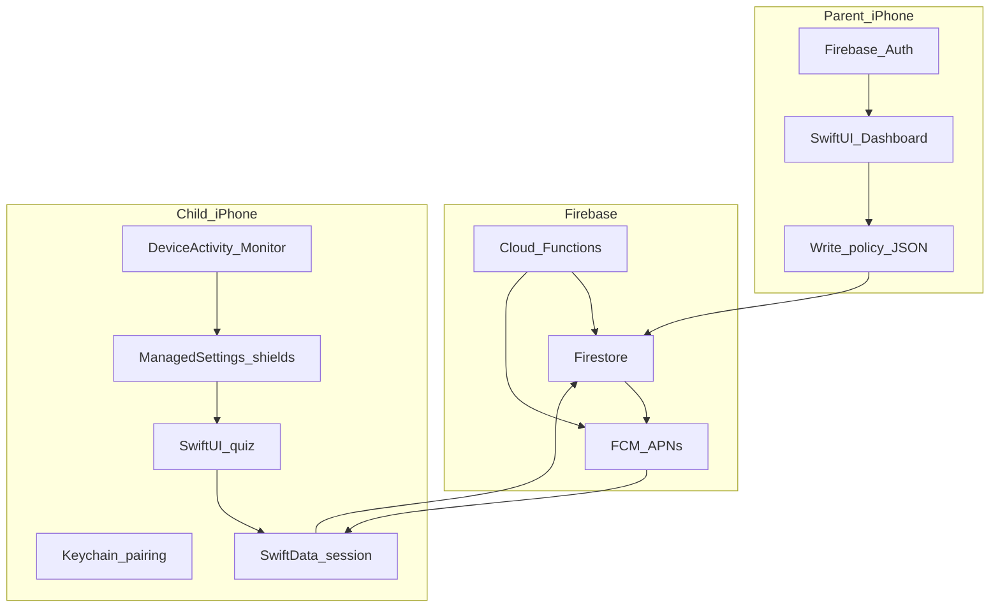
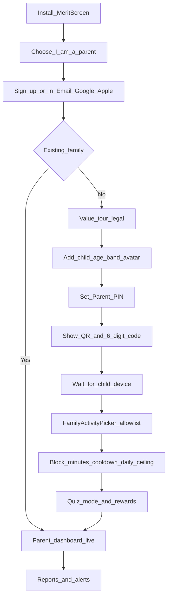
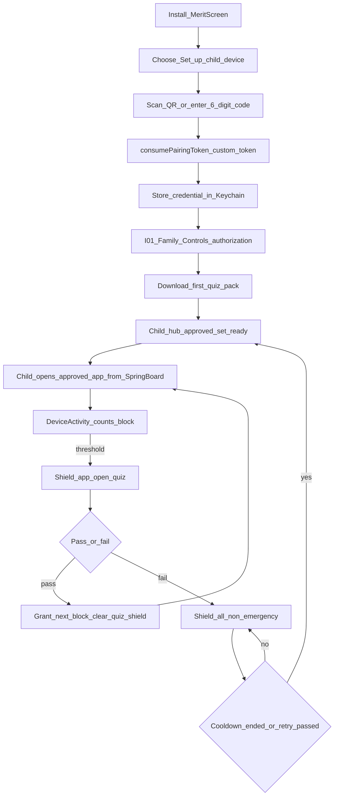
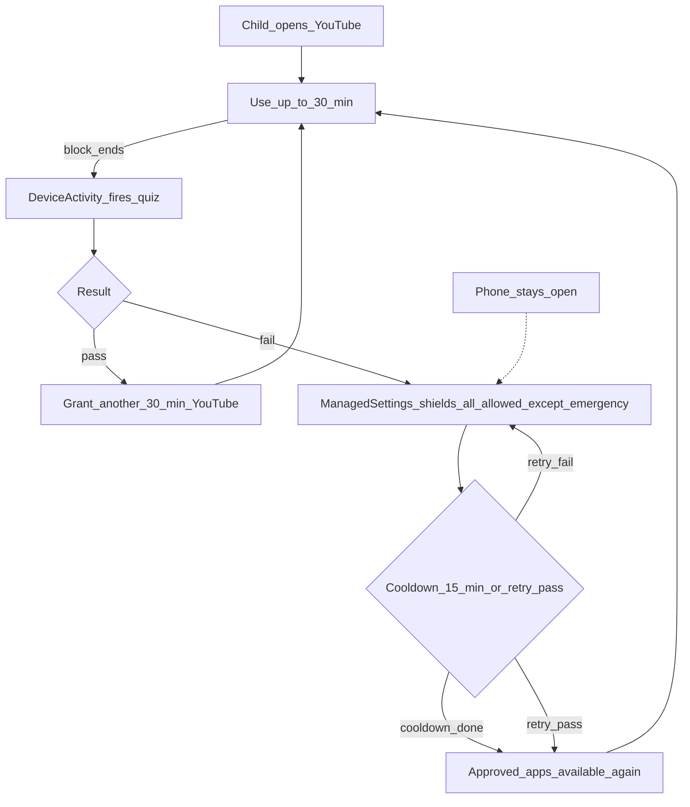
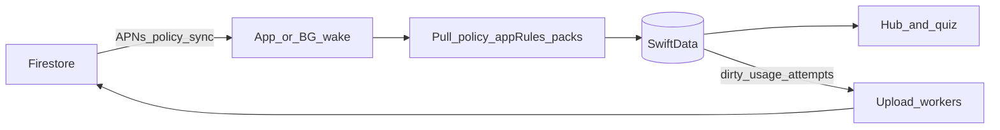

# 13 — iOS native production plan

This document is the **build-ready iOS production guide**. Android is the current client in this repo. iOS is a **second native app** that shares the same Firebase project and the same policy JSON.

Read with: [01](01-product-overview.md), [02](02-onboarding-authentication.md), [03](03-data-model-and-flow.md), [05](05-architecture-performance.md), [07](07-app-blocks-and-fail-lock.md).

**Product rule (locked):** Same session engine as Android — app blocks, quiz gate, **device-wide fail lock** (all non-emergency apps), unlock via cooldown **or** a passed retry. Fail lock is never per-app-only. See [07](07-app-blocks-and-fail-lock.md).

Where [04](04-screens-and-features.md) I02 previously suggested no mid-lock retry, **this doc and [07] win**: Retry during cooldown is required.

---

## 1. Why iOS differs from Android

Apple does not allow a third-party Home app. MeritScreen on iOS is a **controlled environment**, not a launcher.

| Concern | Android | iOS |
| --- | --- | --- |
| Shell | MeritScreen **is** default Home (`ROLE_HOME`) | SpringBoard stays; apps are **shielded** |
| App list | `PackageManager` package names + icons | Opaque `ApplicationToken` / `FamilyActivitySelection` via `FamilyActivityPicker` |
| Block timer | Launcher-owned timer + Usage Stats cross-check | `DeviceActivity` monitor extension thresholds |
| Fail lock | Disable Home icons + bring quiz Activity forward | `ManagedSettingsStore` shields the full allowed set except emergency |
| Background sync | WorkManager + FCM data messages | BGTasks / app wake + APNs (FCM → APNs) |
| Local DB | Room | SwiftData or SQLite |
| Secrets | Android Keystore | Keychain |
| Child “home” UI | Full launcher grid (C05) | MeritScreen hub + SpringBoard with shields |

Same Firebase family, policy, usage, quizAttempts, and skillState. A parent on iPhone can manage an Android child device and the reverse.

---

## 2. What is possible in production

| Capability | How |
| --- | --- |
| Parent dashboard (P11–P20) | SwiftUI on the parent’s iPhone; writes the same Firestore policy |
| Child pairing (no child account) | QR / 6-digit code → Cloud Function → custom token scoped to `childId` / `deviceId` |
| Allowlist | `FamilyControls` `FamilyActivityPicker`; persist selection tokens + parent-visible labels |
| Per-app block minutes | `DeviceActivity` schedule / event for that selection; quiz when threshold fires |
| Quiz (adaptive + explainers) | SwiftUI; questions from local store only (mirror Android bank / pack JSON) |
| Pass → another block | Clear shield for that app’s next block; record grant locally + restart monitor |
| Fail → device-wide stop | Shield **entire** allowed set except emergency tokens (Phone, etc.) |
| Unlock | Cooldown ends **or** child passes Retry quiz ([07](07-app-blocks-and-fail-lock.md)) |
| Offline child path | Policy, timers, shield deadlines, quiz pack in SwiftData/SQLite |
| Mixed-platform family | One Firestore project; platform field on `devices/{deviceId}` |
| Parent alerts / policy wake | APNs via Firebase Cloud Messaging |
| Rewards / stickers / reports | Same cloud fields; parent UI SwiftUI; child Sticker Book local-first |

---

## 3. What is not possible (document, do not fake)

| Limitation | Implication |
| --- | --- |
| No custom Home / no hiding SpringBoard | Child still sees the system Home. Control is shields + MeritScreen hub, not a fake launcher |
| Opaque Family Controls tokens | Parent picker is Apple’s picker, not a custom grid of every bundle id. Inventory sync ≠ Android PackageManager upload |
| No Accessibility / hidden APIs / MDM traps for consumer v1 | App Store kids path; document gaps instead of faking Device Owner–style locks |
| Extension-driven timing | Persist shield / cooldown deadlines so reboot does not clear a fail lock early |
| Family Controls **distribution entitlement** | Required from Apple before App Store distribution; development builds use Apple’s developer entitlement flow |
| Cannot fully block Settings / uninstall without MDM | Parent PIN + revoke device + alerts; same honesty as Android consumer model |
| No GPS, contacts, SMS, photos, child email | Product invariant on both platforms |

If iOS cannot enforce a control, say so in parent UI and reports — never pretend SpringBoard is replaced.

---

## 4. Native stack and Xcode shape

### Targets

| Target | Role |
| --- | --- |
| **MeritScreen** (main) | SwiftUI parent + child graphs, pairing, quiz, PIN, session store, Firebase |
| **DeviceActivityMonitor** extension | Threshold / interval callbacks; write local flag / apply shield; keep thin |
| **ShieldConfiguration** extension | Calm shield copy (countdown / “Take quiz”); no shame |
| **ShieldAction** extension | Primary button opens main app quiz (retry or block-end quiz) |
| **DeviceActivityReport** (optional) | Local usage visuals if useful; parent dashboard still uses Firestore usage so Android/iOS reports match |

### Recommended stack

| Layer | Choice |
| --- | --- |
| UI | SwiftUI for every MeritScreen screen |
| State | `@Observable` models / stores |
| Local DB | SwiftData or SQLite (policy, app rules, session, quiz pack, skill_state, usage dirty flags) |
| Secrets | Keychain (pairing credential, never log tokens) |
| Auth | Firebase Auth (parent); child custom token after `consumePairingToken` |
| Backend | Same Firebase: Firestore, Functions, Messaging, Crashlytics |
| Session rules | Swift `SessionEngine` mirroring Android transitions — **shared policy JSON, not shared code** |
| Push | APNs via FCM; data-only `policy_sync` / `device_revoked` on child |

### Architecture (child hot path)

```
SwiftUI (hub / quiz / fail lock)
  → View models / @Observable stores
  → SessionEngine + AdaptiveQuizEngine (pure Swift)
  → Local repositories (SwiftData / SQLite only)

Sync layer (background, not hub path):
  APNs wake → pull Firestore → write local DB
  Dirty usage / quizAttempts → upload
```

**Rule:** Child hub and quiz rendering must not call Firestore, AI, or live network. Same invariant as Android Home.

### Family Controls mapping

| Product concept | Apple API |
| --- | --- |
| Authorize Screen Time | `AuthorizationCenter` / Family Controls authorization (I01) |
| Pick allowed apps | `FamilyActivityPicker` → `FamilyActivitySelection` |
| Apply / clear shields | `ManagedSettingsStore` |
| Block minutes elapsed | `DeviceActivityCenter` + Monitor extension |
| Shield UI | `ShieldConfigurationDataSource` |
| Open quiz from shield | `ShieldActionDelegate` → deep link / open URL into main app |
| Emergency stay open | Exclude Phone (and parent-marked emergency) tokens from shield set |

---

## 5. Production system context



---

## 6. Parent production flow

Parent uses **their own iPhone**. Child never creates an account.



### Parent steps (production)

1. Install MeritScreen; choose **Parent**.
2. Sign in with Email OTP, Google, or **Sign in with Apple** (App Store requirement when other third-party logins exist).
3. Create family (first run) or open existing dashboard.
4. Add child profile: display name, age band (3–6 / 7–9 / 10–12), language, avatar preset.
5. Set Parent PIN (hashed; synced for on-child-device recovery).
6. Pairing screen: short-lived QR + 6-digit code from `createPairingToken`.
7. After child confirms: pick allowed apps with **`FamilyActivityPicker`**, set block minutes, fail cooldown, optional daily ceiling, quiz mode, rewards.
8. Dashboard shows usage, quiz outcomes, device online / lock state. Policy writes go to Firestore; child pulls on push or schedule.

Cross-platform: parent iPhone can pair an **Android** child. Allowlist UI then uses the Android inventory listener (package + label), not FamilyActivityPicker — picker is only for **iOS child devices**.

---

## 7. Child production flow

Parent physically has the child’s iPhone for setup.



### Child steps (production)

1. Install MeritScreen; choose **Set up child device**.
2. Scan parent QR or type 6-digit code → `consumePairingToken` → custom token → Keychain.
3. **I01:** Authorize Family Controls / Screen Time (parent-managed child Apple ID or this device).
4. Download first quiz pack into local store (built-in bank if download fails).
5. Child hub shows remaining time / stickers / parent PIN entry. SpringBoard still exists; non-allowed and shielded apps show Apple shields.
6. Opening an allowed app starts / continues that app’s block via DeviceActivity.
7. At block end: monitor applies interim shield; Shield Action opens SwiftUI quiz (C07b–C11).
8. Pass → clear quiz shield, start next block of that app, apply rewards if configured.
9. Fail → shield **full** allowed set except emergency; fail-lock UI with countdown + **Retry quiz**.

---

## 8. Fail lock, cooldown, and retry (canonical example)

Parent sets **YouTube = 30 minutes per block**, **cooldown on fail = 15 minutes**.



| Clock | What the child can do |
| --- | --- |
| 0:00 | Opens YouTube. Block = 30. Monitor running. |
| 0:30 | Quiz. Pass → another 30. |
| 1:00 | Quiz. Fail → **all** non-emergency apps shielded. |
| 1:00–1:15 | Only Phone (and other emergency). Retry quiz allowed; failed retry keeps shield and **restarts** cooldown. |
| 1:15 | Cooldown ends or retry already passed. Approved set unlocks. Next quiz at end of next block. |

Unlock paths (either one ends the lock) — same as [07](07-app-blocks-and-fail-lock.md):

1. **Cooldown ends** (persisted deadline survives reboot).
2. **Retry passed** (Shield Action → SwiftUI quiz → clear full shield).

Closing the quiz, pressing Home, or force-quitting MeritScreen does **not** unlock.

---

## 9. Sync model (parity with Android Phase 7)

Firebase is the remote source of truth. Child UI never holds a live Firestore listener on the hub/quiz path.



| Data | Direction | Notes |
| --- | --- | --- |
| `policy/current`, `appRules` | Parent → Firestore → push → child pull → local | Child never writes policy |
| `devices/{deviceId}` | Heartbeat + revoke | `platform: ios`; token is APNs/FCM |
| `usageDays` | Child → cloud | Idempotent per-day totals |
| `quizAttempts` | Child → cloud | Append-only; deterministic ids |
| `skillState` | Child → cloud | Full-map replace / merge as on Android |
| `quizPacks` | Functions → child pull | AI off the hot path |

Periodic fallback pulls cover dropped pushes (same design intent as Android WorkManager schedules).

---

## 10. Screen map (iOS)

Shared product screens from [04](04-screens-and-features.md). Shell differs.

| ID | Screen | iOS notes |
| --- | --- | --- |
| S00–S02 | Splash, role, legal | SwiftUI |
| P02–P20 | Parent auth through account | SwiftUI; same jobs as Android parent graph |
| C01 | Child pairing | Camera QR or keypad |
| I01 | Screen Time authorization | Required before shields work |
| Hub | Child hub | Not a launcher grid of every icon; status, time left, stickers, PIN. Apps live on SpringBoard |
| C07b–C11 | Quiz interrupt / teach / result | Opened from Shield Action or app |
| C12 | Fail lock | Full-screen in MeritScreen + ManagedSettings on allowed set |
| I02 | System shield | Apple shield UI; calm copy + countdown |
| I03 | Shield → quiz | Opens retry or block-end quiz; pass clears **every** fail shield |
| C14–C15 | Parent PIN / on-device menu | Unpair, refresh policy; cannot “switch launcher” — N/A on iOS |

---

## 11. Privacy and store compliance

- No GPS, contacts, SMS, photos, microphone for recognition, or child email ([03](03-data-model-and-flow.md)).
- App Store **Kids** category + Screen Time / Family Controls entitlements.
- Sign in with Apple when offering other third-party login.
- Never log PIN, pairing codes, tokens, or emails.
- COPPA-style parental consent on first parent run (S02).

---

## 12. Build phases (iOS-only roadmap)

The full end-to-end phase plan (UX parity with Android, SwiftUI Apple design system, Appearance Light/Dark/System, Firebase, done criteria) lives in **[14 — iOS build phases](14-ios-build-phases.md)** (phases **i0–i12**, aligned with [DEVELOPMENT_PLAN.md](../DEVELOPMENT_PLAN.md)).

Summary:

| Phase | Deliverable |
| --- | --- |
| **i0** | Product lock, Apple/Firebase checklist, empty workspace |
| **i1** | Foundation + semantic design system + Appearance setting |
| **i2–i3** | Onboarding draft, auth, pairing |
| **i4–i5** | Parent dashboard parity; child session/quiz/fail UI (local-first) |
| **i6** | Family Controls / DeviceActivity / ManagedSettings enforcement |
| **i7–i8** | APNs sync, reports, optional stickers/AI packs |
| **i9–i12** | Security, performance, test matrix, App Store |

Android repo work is **not** required for these phases except shared Firebase rules/Functions already present. Prefer extending Functions only when iOS needs an extra field (e.g. storing opaque selection metadata), not rewriting Android modules.

---

## 13. Testing priorities (iOS)

1. Session / fail-lock transitions (device-wide shield; emergency excluded).
2. Pairing authz (custom token scoped to `childId`; rules deny other families).
3. Cooldown deadline survives process kill and reboot.
4. Retry pass clears full shield; retry fail keeps shield and restarts cooldown.
5. Hub/quiz path has zero Firestore/AI calls (instrumented tests or architecture lint).
6. Parent policy write → push → child local apply within acceptable latency; offline fall back.

---

## 14. Done criteria for iOS v1

- Parent on iPhone can create family, pair child iPhone, set allowlist/blocks/cooldown, see reports.
- Child iPhone enforces block → quiz → pass grant / fail lock without network after policy is cached.
- Fail always shields all non-emergency apps; unlock only via cooldown or passed retry.
- Same Firestore schema as Android; mixed-platform family works.
- Limitations (SpringBoard visible, entitlement, opaque tokens) documented in product UI where parents would otherwise expect Android launcher behavior.
