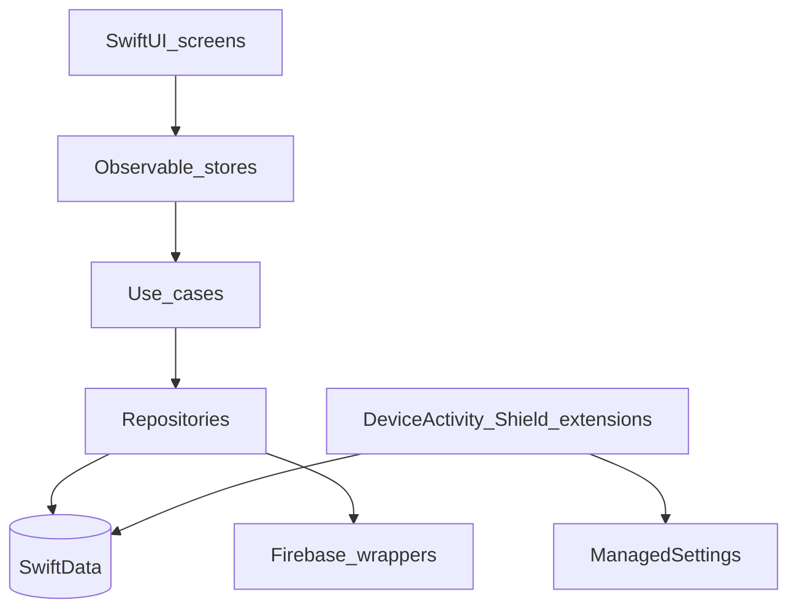
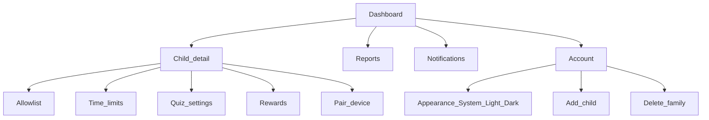
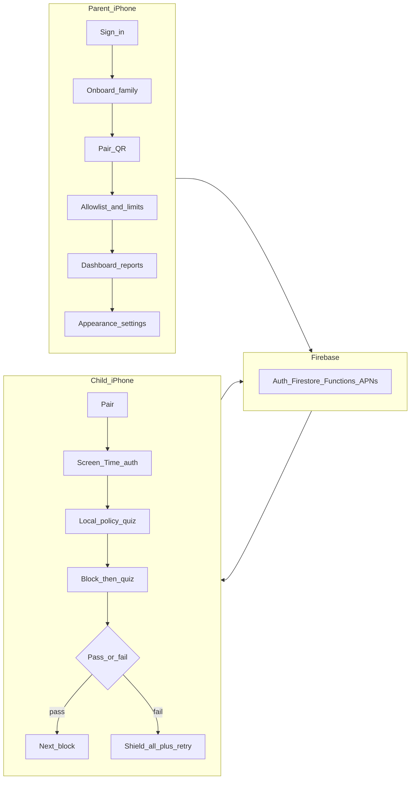

# 14 — iOS build phases (end-to-end)

This is the **phase-by-phase plan to ship a full native iOS MeritScreen app** that mirrors the **Android product flow and UX**, uses **SwiftUI + Apple system colors**, supports **Light / Dark / System appearance** (editable in Settings), and talks to the **same Firebase project** as Android.

Companion docs:

- Platform truth & Family Controls limits: [13 — iOS native production](13-ios-native-production.md)
- Android roadmap (mirror this order): [DEVELOPMENT_PLAN.md](../DEVELOPMENT_PLAN.md)
- **Rule:** A phase is done only when UI, domain logic, Firebase authz, loading / error / empty + retry, offline where required, tests, and docs are in place — same bar as Android.

---


## Product goals for iOS


| Goal                   | Meaning                                                                                                                                                   |
| ---------------------- | --------------------------------------------------------------------------------------------------------------------------------------------------------- |
| Same flow as Android   | Role select → parent onboarding / child pairing → dashboard or child hub → allowlist & limits → block → quiz → pass grant / fail lock → reports / account |
| Native SwiftUI UX      | HIG layouts: `NavigationStack`, `List` / `Form`, SF Symbols, Dynamic Type, large child tap targets                                                        |
| Apple color system     | Semantic colors (`Color.primary`, `.secondary`, `.accentColor`, system backgrounds / fills / grouped backgrounds) — **no hard-coded hex in screens**      |
| Appearance control     | Settings: **System / Light / Dark**; persists locally; applies app-wide including parent + child graphs                                                   |
| Firebase               | Same project, policy JSON, pairing Functions, Firestore rules, FCM→APNs                                                                                   |
| Local-first child path | Hub + quiz read SwiftData/SQLite only — no Firestore / AI on the hot path                                                                                 |
| Honest platform limits | No fake launcher; SpringBoard stays; document what Family Controls cannot do                                                                              |


### UX parity matrix (Android screen → iOS)


| Android                   | iOS                                        | Notes                                                                        |
| ------------------------- | ------------------------------------------ | ---------------------------------------------------------------------------- |
| S00–S02                   | Same                                       | Splash, role select, legal                                                   |
| P02–P20                   | Same jobs                                  | SwiftUI Forms / Navigation; Sign in with Apple required                      |
| P08 / C01                 | Same                                       | QR + 6-digit; Keychain for child credential                                  |
| C02 launcher setup        | **I01** Screen Time auth + setup checklist | Replaces “Set as Home”                                                       |
| C05 Home grid             | **Child hub** + SpringBoard                | Hub shows time left, stickers, PIN; apps open from SpringBoard under shields |
| C07b–C12 quiz / fail      | Same states                                | Triggered via DeviceActivity + Shield Action                                 |
| C14–C15 PIN / parent menu | Same                                       | Unpair, refresh; no “switch launcher”                                        |
| Appearance (Account)      | **Settings → Appearance**                  | System / Light / Dark (ship in release, not debug-only)                      |


---


## Design system (ship in Phase i1, use everywhere)


### Principles

1. **SwiftUI-first** — no UIKit screens unless an API forces it (e.g. some Camera / QR helpers).
2. **Apple semantic colors only** in feature screens — map through a thin `MeritColor` / `Theme` layer so Appearance overrides stay one place.
3. **Light and Dark** must both be first-class; verify every screen in both.
4. **Appearance setting** — `System` (follow `UITraitCollection`), `Light`, `Dark`. Stored in AppStorage / SwiftData prefs. Parent Account + Child parent-menu both can open it; child path behind Parent PIN.
5. **Typography** — SF Pro via SwiftUI styles (`.largeTitle` … `.caption`); child quiz uses larger readable styles; Dynamic Type on.
6. **Components** — shared `LoadingView`, `ErrorView` (user-facing message + Retry), `EmptyView`, `PinPad`, primary/secondary buttons. Every screen uses `UiState`-style loading / success / empty / error.
7. **Motion** — short, purposeful (navigation, quiz feedback); no heavy animation on shield / fail-lock path.
8. **Accessibility** — VoiceOver labels, Reduce Motion respect, contrast via system colors.
9. **Performance** — lazy lists, no main-thread Firebase on hub/quiz, no image decode per frame, extensions stay thin.


### Semantic color tokens (examples)


| Token               | SwiftUI / UIKit semantic                                     |
| ------------------- | ------------------------------------------------------------ |
| Canvas              | `Color(.systemBackground)` / grouped                         |
| Secondary canvas    | `Color(.secondarySystemBackground)`                          |
| Label               | `Color.primary` / `.secondary`                               |
| Accent (CTAs)       | `Color.accentColor` (asset AccentColor, light+dark variants) |
| Destructive         | `Color.red` (system)                                         |
| Success / calm pass | system green (or accent) — never shame red on fail lock      |
| Separators          | `Color(.separator)`                                          |


Accent asset: define **Light** and **Dark** in Assets.xcassets. Do not bake Material-style purple/teal hex into views.

### Appearance settings UI

```
Settings / Account
  Appearance
    ○ System
    ○ Light
    ○ Dark
```

Apply via `.preferredColorScheme(...)` on the root scene when not System. Persist immediately; no restart required.

---


## Architecture snapshot

```
ios/
  MeritScreen/                    # Main SwiftUI app
  MeritScreenDeviceActivity/      # Monitor extension
  MeritScreenShieldConfig/        # ShieldConfiguration
  MeritScreenShieldAction/        # ShieldAction
  Packages/ (or folders)
    CoreCommon/                   # AppConfig, UiState, AppError, session role
    CoreUI/                       # Theme, components, AppearanceStore
    CoreData/                     # SwiftData models + repositories
    CoreFirebase/                 # Auth, Firestore wrappers, Messaging
    CoreSecurity/                 # Keychain, PIN hash
    FeaturesOnboarding/
    FeaturesAuth/
    FeaturesParent/
    FeaturesChild/
    FeaturesScreenTime/           # FamilyControls, ManagedSettings bridges
```




Shared backend: existing Firebase project, pairing callables, policy schema, rules. iOS adds `platform: ios` on devices and opaque allowlist token metadata where needed — **do not fork policy semantics**.

---


## Phase list (execute in order)


| Phase   | Name                                            | Mirrors Android             |
| ------- | ----------------------------------------------- | --------------------------- |
| **i0**  | Product lock & repo bootstrap                   | Phase 0                     |
| **i1**  | Project foundation + design system              | Phase 1                     |
| **i2**  | Welcome & onboarding                            | Phase 2                     |
| **i3**  | Authentication & pairing                        | Phase 3                     |
| **i4**  | Parent system (dashboard → account)             | Phase 4                     |
| **i5**  | Child system (hub, session, quiz, fail lock UI) | Phase 5                     |
| **i6**  | Screen Time / Family Controls enforcement       | Phase 6 (launcher analogue) |
| **i7**  | Real-time sync (APNs + BGTasks)                 | Phase 7                     |
| **i8**  | Usage, reports, analytics                       | Phase 8                     |
| **i9**  | Security hardening                              | Phase 9                     |
| **i10** | Performance & polish                            | Phase 10                    |
| **i11** | Testing matrix                                  | Phase 11                    |
| **i12** | App Store production release                    | Phase 12                    |


Stickers / nursery / AI packs: pull from Android Phases + docs 08/09/12 **after** i5–i7 core path is solid (fold into i8 or a thin **i8b**).

---


## Phase i0 — Product lock & bootstrap

**Status target:** planning complete before code.

- Confirm invariants from [13](13-ios-native-production.md) and [07](07-app-blocks-and-fail-lock.md): fail = all non-emergency; retry during cooldown **on**.
- Apple Developer: App ID, Family Controls capability request timeline, Sign in with Apple, Push, App Groups (app ↔ extensions).
- Firebase Console: register iOS app (`GoogleService-Info.plist`), enable Apple provider, APNs key.
- Decide minimum iOS version (recommend **iOS 17+** for SwiftData / Observation).
- Folder layout + SwiftLint / formatting; no Feature code yet.

**Done when:** checklist signed off; empty Xcode workspace compiles; Firebase iOS app exists.

---


## Phase i1 — Project foundation + design system

Mirror Android Phase 1.

### Deliverables

- Xcode multi-target project (app + placeholder extension targets).
- **CoreUI:** semantic color theme, typography, spacing, `Loading` / `Error` / `Empty`, button styles.
- **AppearanceStore:** System / Light / Dark; wired to root `WindowGroup`.
- Navigation shell + `DeviceRole` gate: `Unassigned` | `Parent` | `Child` (same cold-start idea as Android `RoleGate`).
- SwiftData container stub + Keychain helper + logging sanitizer (never PIN / tokens / email).
- Firebase iOS SDK: Auth, Firestore, Functions, Messaging, Crashlytics (behind protocols).
- `AppConfig` tunables in one place (child cap, quiz defaults, sync intervals) — mirror `:core:common`.


### UX

- Splash (S00) uses system background + accent; instant, no network wait.
- Preview canvas: Light + Dark for every CoreUI component.


### Done when

- App launches to role placeholder.
- Appearance toggle works in a Settings stub.
- Unit test: Appearance persistence; theme resolves light/dark.

---


## Phase i2 — Welcome & onboarding

Mirror Android Phase 2 (draft-before-auth).

### Screens (same flow as Android)

1. **S01** Role select — “Get Started as Parent” / “Set Up Child Device”.
2. **S02** Legal & kids privacy — explicit parental consent checkbox.
3. **P05–P07** draft wizard: family name (optional), add child (name, age band, language, avatar), Parent PIN confirm.
4. Draft stored **locally** until auth commits (same design decision as Android).


### UX

- Native `Form` / stepped wizard; progress indicator; large primary CTA.
- Age band picker: segmented or list — calm, not gamified clutter.
- PIN: secure fields + confirm; errors use system red, copy stays calm.


### Done when

- Full wizard completable offline; draft survives kill.
- Validation tests (blank name, child cap, PIN length/mismatch).
- Light + Dark verified on all onboarding screens.

---


## Phase i3 — Authentication & pairing

Mirror Android Phase 3.

### Parent auth

- Email OTP (existing Functions) **or** email/password if already in project — match live backend.
- Google Sign-In (if offered) + **Sign in with Apple** (required when other third-party logins exist).
- Session: Firebase Auth + local `ParentSession`; cold start reconciles role like Android `AppViewModel`.
- Sign-out clears parent session / draft / role — **does not** unpair children.
- Forgot password / OTP resend with rate-limit honest errors.


### Pairing

- Parent **P08/P09:** `createPairingToken` → QR + 6-digit + expiry + refresh; wait until device appears.
- Child **C01:** scan QR (AVFoundation) or keypad → `consumePairingToken` → custom token → Keychain.
- Device doc: `platform: ios`, model, app version.


### UX

- Auth screens: native text fields, SF Symbol trailing actions, keyboard avoidance.
- Pairing: large code, high-contrast QR, countdown to expiry.


### Done when

- Parent can sign up, commit onboarding draft to Firestore, open empty dashboard shell.
- Child can pair on a second device / simulator pair flow with Functions emulator or staging.
- Auth + pairing unit tests; no secrets in logs.

---


## Phase i4 — Parent system

Mirror Android Phase 4 — **same navigation graph**.




### Deliverables

- Live children observer (debounced) + one-shot card fields (minutes, devices, allow count) — honest zeros until child sync.
- Policy writes via parent control store → `policy/current` + `appRules`; fail lock scope always `all_non_emergency`.
- Allowlist UI: for **iOS children** use `FamilyActivityPicker` (Phase i6 wires enforcement); until then save labels + selection stubs / manual entries with empty state.
- For **Android children** managed from iPhone: show synced inventory (package + label) like Android parent — same Firestore inventory docs.
- Account: email, PIN reset, add child, appearance, sign-out, delete family callable.
- Notifications prefs local first (delivery in i7/i8).


### UX

- Dashboard: `NavigationStack` + child cards (`List` or lazy stack) — one job per screen.
- Settings rows use `Form` inset grouped style (Apple Settings look).
- Empty / loading / error on every destination.


### Done when

- Parent can add child, edit time limits / quiz / rewards, reset PIN, delete family.
- Appearance change from Account applies globally.
- ViewModel tests for policy mapper + validation; UI previews Light/Dark.

---


## Phase i5 — Child system (local engine + UI)

Mirror Android Phase 5 — **logic first; enforcement APIs in i6**.

### Deliverables

- SwiftData: policy, app rules, session state, quiz bank, skill state, usage dirty flags.
- **SessionEngine** (pure Swift): `idle → in_block → quiz_due → granted | shielded` — identical transitions to Android.
- **AdaptiveQuizEngine** + builtin quiz JSON (port `quiz_bank_builtin.json`).
- Child hub: remaining time, approved-app status, parent lock entry, fail-lock full screen (C12).
- Quiz flow C07b–C11: intro → question → teach (C09b) → pass / fail; offline; no network on path.
- Daily ceiling awareness (C13).
- Parent PIN (C14) + on-device menu (C15): refresh rules, unpair, **Appearance**, open Screen Time setup if needed.
- Policy pull coordinator writing **only** into SwiftData (hub reads local only).


### UX

- Child: large type, calm fail copy (“Let’s rest, or try the quiz again”), no shame.
- Ages 3–6: big choices; optional speech later (i8b / nursery).
- Hub is not a fake SpringBoard — clear “Open apps from Home Screen; MeritScreen keeps the rules.”


### Done when

- Session + quiz unit tests green (pass grant, fail shield state, retry restart cooldown).
- Hub/quiz instrumented: zero Firestore calls.
- Light + Dark + Dynamic Type on quiz and fail lock.

---


## Phase i6 — Screen Time enforcement (launcher analogue)

Mirror Android Phase 6 — this is what makes iOS **real** in production.

### Deliverables

- **I01** authorization flow (`AuthorizationCenter`).
- App Group shared store for selection + shield deadlines (app ↔ extensions).
- `FamilyActivityPicker` on parent allowlist for iOS child; persist `FamilyActivitySelection`.
- **DeviceActivityMonitor:** threshold at block minutes → set quiz-due flag + interim shield.
- **ManagedSettingsStore:** on fail, shield **full allowed set** except emergency tokens.
- **ShieldConfiguration:** countdown / “Take quiz” calm copy.
- **ShieldAction:** open main app quiz (URL / deep link); pass clears fail shields; retry fail keeps shield + restarts cooldown.
- Persist cooldown deadline across reboot.
- Setup checklist on child hub (auth missing, selection empty) — replaces C02/C03.
- Device heartbeat + revoke (BGTask / periodic) reading `revoked` — same kill-switch idea as Android.
- Honest UI: cannot hide SpringBoard; cannot fully block Settings/uninstall without MDM.


### Done when

- DeviceActivity threshold opens quiz on a physical device.
- Fail shields all allowed apps except Phone; retry pass unlocks.
- Entitlements documented for Debug vs Distribution request status.

---


## Phase i7 — Real-time synchronization

Mirror Android Phase 7.

### Deliverables

- FCM → APNs: register token on `devices/{deviceId}`.
- Data-only handlers: `policy_sync`, `device_revoked`, `pin_sync`, `family_deleted` (same contracts as [11](11-firebase-push-notifications.md)).
- Push-triggered pull into SwiftData; **no** continuous child Firestore listeners on hub.
- Periodic BGTasks fallback (policy ~6h, usage ~2h, heartbeat ~30m) — best-effort like WorkManager.
- Upload dirty usage / quizAttempts / skillState (idempotent).
- Network reconnect → one expedited pull.
- Parent policy write still triggers existing Cloud Functions multicast (tokens include iOS).


### Done when

- Airplane mode: hub works on last policy; reconnect syncs.
- Revoke unpairs child promptly (push + heartbeat fallback).
- Sync coordinator unit tests; hub still local-only.

---


## Phase i8 — Usage, reports, analytics

Mirror Android Phase 8 (+ stickers if ready).

### Deliverables

- Parent **P17** reports: 7/30-day usage, per-app rollup, quiz pass rate, topic levels, weak concepts — same aggregation semantics as Android `ReportsAggregator` (port logic to Swift).
- Charts: Swift Charts (system) — no third-party chart SDK.
- Dashboard teasers: last quiz + practice hint.
- Child-safe analytics allowlist; Crashlytics role tags.
- Optional **i8b:** stickers ([12](12-sticker-rewards.md)), nursery media ([09](09-nursery-early-learner-curriculum.md)), AI pack consume from Functions ([08](08-ai-personalized-learning-and-lockout.md)) — cache-first, never on hub paint path.


### UX

- Reports: range chips, empty states, retry; Light/Dark charts readable.
- Sticker book: calm celebration, not noisy.


### Done when

- Parent sees real minutes after child uploads.
- Aggregator unit tests; assemble + UI smoke.

---


## Phase i9 — Security hardening

Mirror Android Phase 9.

### Deliverables

- Confirm Firestore / Storage rules work with iOS custom tokens (claims `childId` / `deviceId` / `familyId`).
- App Check (DeviceCheck / App Attest) wired; enforce only after console ready.
- PIN lockout persistence (Keychain); parent PIN reset → `pin_sync` → child hash refresh.
- Family delete: child wipes local DB (keep builtin bank) + clears pairing.
- Log sanitizer audit on all print/logger paths.
- Keychain accessibility for pairing credential appropriate for background extensions.


### Done when

- Revoked device cannot write usage.
- PIN lockout survives restart.
- Security checklist signed (see [SECURITY.md](../SECURITY.md)).

---


## Phase i10 — Performance & polish

Mirror Android Phase 10.

### Deliverables

- Hub first frame before sync start (defer BG work).
- Throttle session persists; batch usage minutes.
- Lazy stacks / stable identity for lists; image/icon cache if any.
- Extension memory budget: monitor/shield do minimal work; quiz only in main app.
- Reduce Motion paths; launch time sanity on mid-tier devices.
- Instruments: Time Profiler + Allocations on hub + quiz.


### Done when

- No main-thread disk/network on hub tick.
- Fail-lock and quiz remain snappy under Low Power Mode.

---


## Phase i11 — Testing matrix

Mirror Android Phase 11.


| Layer          | Focus                                                                                |
| -------------- | ------------------------------------------------------------------------------------ |
| Unit           | SessionEngine, AdaptiveQuizEngine, policy mapper, sync coordinators, AppearanceStore |
| Integration    | Pairing against Functions emulator; Firestore rules emulator                         |
| UI             | Parent dashboard, child hub, quiz, fail lock — Light + Dark                          |
| Device         | Physical iPhone: Family Controls auth, shields, threshold, APNs                      |
| Cross-platform | iOS parent + Android child; Android parent + iOS child                               |
| A11y           | VoiceOver on role select, PIN, quiz choices                                          |


Highest priority: **session / fail-lock** and **authz**, same as Android.

---


## Phase i12 — App Store production release

Mirror Android Phase 12.

### Deliverables

- Family Controls **distribution** entitlement approved.
- Kids category / age rating / privacy nutrition labels matching [03](03-data-model-and-flow.md).
- Sign in with Apple live; Push production APNs key.
- TestFlight external; Crashlytics dSYMs.
- App Store screenshots: Light + Dark; parent + child flows.
- Privacy policy URL; COPPA parental gate verified.
- Final QA: appearance setting, offline quiz, fail lock unlock paths, revoke, delete family.


### Out of v1 (both platforms)

Live GPS, full web filter / DNS VPN, child social, ads, storing child photos/contacts, on-device LLM, fake custom Home.

---


## End-to-end production flow (target after i12)




---


## Definition of done (whole iOS app)

1. Parent and child flows match Android **jobs** and screen IDs where applicable.
2. SwiftUI + Apple semantic colors; Appearance System/Light/Dark editable and reliable.
3. Child hub/quiz offline-capable; Firebase only via sync layer.
4. Family Controls enforces blocks and device-wide fail lock to the maximum Apple allows; gaps documented in UI.
5. Same Firebase family works mixed Android/iOS.
6. Professional quality: loading/error/empty, sanitized logs, tests on session/authz, Light+Dark QA, App Store–ready entitlements.

---


## Suggested build order week sketch


| Wave | Phases | Outcome                                    |
| ---- | ------ | ------------------------------------------ |
| 1    | i0–i1  | Compiling app + design system + Appearance |
| 2    | i2–i3  | Onboarding + Firebase auth + pairing       |
| 3    | i4     | Full parent dashboard parity               |
| 4    | i5     | Local child session + quiz + fail UI       |
| 5    | i6     | Real shields + thresholds on device        |
| 6    | i7–i8  | Sync + reports (+ stickers optional)       |
| 7    | i9–i12 | Harden, polish, TestFlight, Store          |


Start coding at **i1** only after i0 Apple/Firebase checklist is clear — Family Controls entitlement lead time often gates i6/i12.