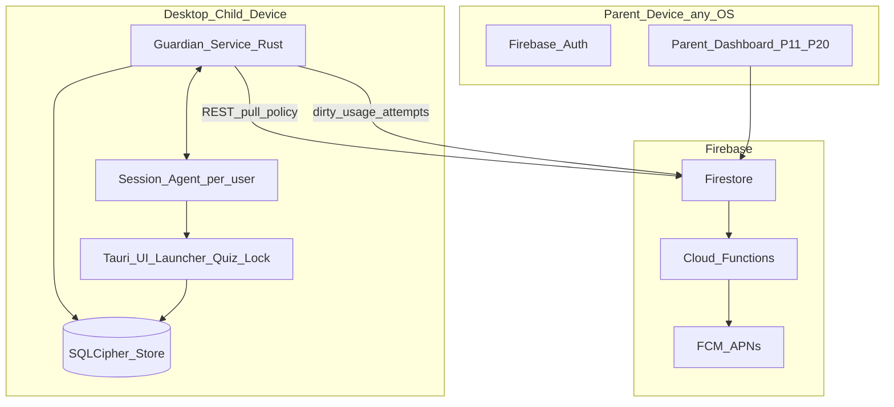
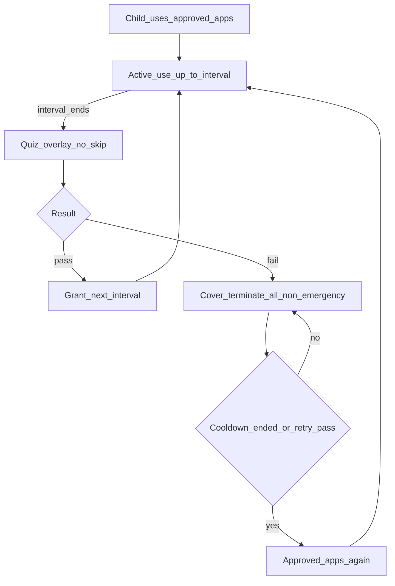

# 15 — Desktop native production plan (Windows, macOS, Linux)

This document is the **build-ready desktop production guide**. Android (Kotlin launcher) and iOS (SwiftUI + Family Controls) are the mobile clients in this repo. Desktop is a **third native client family** that shares the same Firebase project and the same policy JSON.

Read with: [01](01-product-overview.md), [02](02-onboarding-authentication.md), [03](03-data-model-and-flow.md), [04](04-screens-and-features.md), [05](05-architecture-performance.md), [07](07-app-blocks-and-fail-lock.md), [13](13-ios-native-production.md). Build phases: [16](16-desktop-build-phases.md).

**Product rule (locked):** Same session engine as Android and iOS — app blocks (or device-interval quiz), quiz gate, **device-wide fail lock** (all non-emergency apps), unlock via cooldown **or** a passed retry. Fail lock is never per-app-only. See [07](07-app-blocks-and-fail-lock.md).

**Stack (locked):** Rust core + native per-OS guardian services + one shared **Tauri 2** UI. Rollout is **Windows and macOS first**; Linux is a later **beta** tier because Wayland limits kiosk control.

---

## 1. Scope and roles

Desktop can be a **parent device**, a **child device**, or both on separate OS accounts. The same binary detects role (S01), matching Android and iOS.

| Person | Desktop role | How they enter |
| --- | --- | --- |
| **Parent** | Normal app (dashboard P11–P20) | Email OTP / Google / Sign in with Apple (macOS) via Firebase Auth |
| **Child** | Launcher-like shell + always-on guardian | No password. Parent pairs with QR or 6-digit code → custom token |

### Mixed-platform ecosystem (required)

One Firestore family. Any combination must work:

| Parent device | Child device | Notes |
| --- | --- | --- |
| Android phone | Windows / macOS / Linux PC | Parent allowlist uses desktop inventory (`appId` scheme below) |
| iPhone | Windows / macOS PC | Same |
| Windows / macOS parent app | Android / iOS child | Parent allowlist uses phone inventory / FamilyActivityPicker as today |
| Desktop parent | Desktop child | Same binary, different role / OS account |

Same Firebase project (`managing-screen-time`). Same `policy/current`, `appRules`, `devices`, `usageDays`, `quizAttempts`, `skillState`, `quizPacks`. Clients share **policy JSON and transitions, not code** — same rule as Android ↔ iOS ([05](05-architecture-performance.md)).

---

## 2. Why desktop differs from phones

| Concern | Android | iOS | Desktop |
| --- | --- | --- | --- |
| Shell | MeritScreen **is** default Home | SpringBoard stays; apps shielded | MeritScreen **launcher window** + optional shell takeover (Windows Strict / Linux kiosk). No full Home replacement on consumer macOS |
| App list | `PackageManager` | Opaque Family Controls tokens | Per-OS inventory: Win shortcuts/Start, macOS `/Applications` + LS, Linux `.desktop` files |
| Block timer | Launcher-owned + Usage Stats | `DeviceActivity` extension | Guardian monotonic clock + foreground-app tracking |
| Fail lock | Disable Home icons + quiz Activity | `ManagedSettings` shields | Overlay lock + terminate/cover non-emergency apps |
| Background | WorkManager + FCM | BGTasks + APNs | **Guardian service** always resident; UI ephemeral |
| Local DB | Room | SwiftData / SQLite | SQLCipher (SQLite) behind Rust |
| Secrets | Android Keystore | Keychain | DPAPI / Keychain / Secret Service |
| Push wake | FCM data | FCM → APNs | Polling + reconnect first; native push later (APNs on macOS) |

---

## 3. What is possible in production

| Capability | How |
| --- | --- |
| Parent dashboard (P02–P20) | Tauri UI; writes the same Firestore policy via Rust Firebase client |
| Child pairing (no child account) | QR / 6-digit → `consumePairingToken` → custom token scoped to `childId` / `deviceId` |
| Allowlist | Child uploads installed apps; parent picks; Guardian gates launch / foreground |
| Per-app block minutes | Active-use clock while that app is foreground and session unlocked |
| Device-interval quiz (desktop default) | Every N minutes of active use (default **15**), quiz interrupts — no skip |
| Quiz (adaptive + explainers) | Tauri quiz; questions from local SQLCipher only |
| Pass → another block / interval | Clear overlay; grant next block locally |
| Fail → device-wide stop | Overlay + terminate/cover **all** non-emergency apps until cooldown or retry pass |
| Unlock | Cooldown ends **or** child passes Retry quiz ([07](07-app-blocks-and-fail-lock.md)) |
| Offline child path | Policy, timers, shield deadlines, quiz pack in SQLCipher |
| Mixed-platform family | One Firestore project; `platform` on `devices/{deviceId}` |
| Always background | Guardian Windows Service / macOS LaunchDaemon / Linux systemd |
| Always foreground (when needed) | Session Agent + topmost quiz / fail-lock overlay; no skip button |

---

## 4. What is not possible (document, do not fake)

| Limitation | Implication |
| --- | --- |
| Child logged in as **admin / root** | Can kill services, change shell, uninstall. **Enforceable model = standard (non-admin) child OS account.** If admin detected → set `tamperFlags`, alert parent — do not claim unbreakable lockdown |
| Consumer macOS cannot replace Finder / Dock as a third-party Home | Launcher is a full-screen MeritScreen window + app gating (L1+L3). No fake “we replaced macOS” |
| Wayland kiosk / overlay grab is compositor-dependent | Linux v1 beta: prefer X11 session or a dedicated kiosk compositor; Wayland = best-effort (verify in **d0**) |
| No Accessibility / kernel drivers / rootkits for consumer v1 | Documented kiosk + window + process APIs only. No keyloggers, no screen capture of other apps, no input hooks beyond idle detection |
| Cannot fully block Settings / uninstall without MDM / enterprise | Parent PIN + revoke device + tamper alerts; same honesty as Android consumer model |
| No official Firebase desktop SDK | REST + callable HTTPS behind Rust traits; App Check has no desktop attestation provider yet |
| Clock change / VM rollback | Monotonic clocks + fail-closed on large wall-clock rollback; parent alert on `tamperFlags` |
| No GPS, contacts, SMS, photos, child email, keystroke log, webcam | Product invariant on all platforms |

If the OS cannot enforce a control, say so in parent UI and reports — never pretend the PC is a Device-Owner phone.

**Verify in d0 (spikes — signed off 2026-10-05):**

Full notes: [desktop/docs/spikes/](../desktop/docs/spikes/). Product lock: [17 — Desktop d0 product lock](17-desktop-d0-product-lock.md).

| Spike | Result | Locked implication |
| --- | --- | --- |
| Windows custom shell (`Shell=` / Assigned Access) on Win 10/11 Home vs Pro; SmartScreen path | **PASS (API)** — Pro+ can Strict; Home limited | Always L1+L3; Strict (L2) opt-in; lab confirm on Win VM |
| macOS shielding-level window + kiosk `NSApplication.PresentationOptions` under notarized hardened runtime; Family Controls on Mac | **PASS (API)** — shielding/kiosk viable; **no** consumer Family Controls for Mac apps | macOS = L1+L3 only; never fake Home replace |
| Linux X11 grab vs Wayland layer-shell | **CONDITIONAL** — X11 ok for beta; Wayland compositor-dependent | Linux stays **d11 beta**; honest degraded tier |
| Idle + foreground APIs without Accessibility | **PASS** — Win `GetLastInputInfo` / macOS `CGEventSource…` + `NSWorkspace` / Linux X11 idle | Prefer these APIs; disclose Input Monitoring only if required |

---

## 5. Tech stack decision

### Chosen stack

| Layer | Choice | Why |
| --- | --- | --- |
| Core language | **Rust** (edition 2021/2024) | One language for Windows Service, macOS daemon, Linux systemd; tiny always-on RSS; no GC pauses |
| UI | **Tauri 2** (shared) | One UI codebase for parent + child screens; WebView is spawned on demand — not always resident |
| Local DB | **SQLCipher** | Encrypted offline store; mirrors Room / SwiftData role |
| IPC | Named pipe (Win) / Unix socket + peer credentials (macOS/Linux) | Guardian ↔ Agent ↔ UI |
| Auth / backend | Firebase REST + HTTPS callables | Same project as mobile; no unofficial desktop SDK dependency |
| Session / quiz engines | Pure Rust ports | Shared **JSON conformance vectors** with Kotlin + Swift — not shared binaries |
| Packaging | MSI/MSIX, notarized `.pkg`, `.deb`/`.rpm` | Native installers with service registration |
| Updates | Signed Ed25519 manifest | Rollback-safe, staged rollout |

### Alternatives considered and rejected

| Option | Why not for v1 |
| --- | --- |
| Fully native UI per OS (SwiftUI / WinUI 3 / GTK4) | ~3× UI work; higher drift risk vs Android screen map. Native **agents** still required either way |
| Kotlin Multiplatform / Compose Desktop (JVM) | Closest to Android source, but JVM idle memory is a poor fit for an **always-on** guardian on student laptops |
| Electron / Neutralino as the always-on process | Heavy Chromium resident; fights the lightweight launcher promise |
| Separate “parent only” Electron + native child | Two products to maintain; Firebase parity harder |

**Rule:** Native code owns windows, kiosk, services, keychain, process control, timers. Tauri only **renders** screens and sends typed commands over IPC. The UI never talks to Firebase or SQLCipher directly.

---

## 6. Process model (background + foreground)

This is how “always in background and foreground” works without a giant always-on UI.

| Process | Lifetime | Owns |
| --- | --- | --- |
| **Guardian** | System-level, starts at boot | SQLCipher, policy cache, `SessionEngine`, sync schedulers, enforcement decisions, revoke handling |
| **Session Agent** | Per logged-in child user session | Foreground-app tracking, idle detection, watchdog, spawn/raise UI |
| **UI host (Tauri)** | Ephemeral / pre-warmed | Launcher (C05), quiz overlay, fail lock (C12), PIN (C14), parent graph |

### OS registration

| OS | Guardian | Agent start |
| --- | --- | --- |
| **Windows** | Windows Service (LocalSystem or dedicated service account) | Service starts agent in user session via `WTSQueryUserToken` + `CreateProcessAsUser` |
| **macOS** | `SMAppService` LaunchDaemon (or LaunchAgent + elevated helper where required) | Agent as LaunchAgent for the child user; Guardian coordinates |
| **Linux** | systemd **system** unit | systemd **user** unit or pam_exec / display-manager hook for session |

### IPC contract

- Versioned message schema (e.g. `cmd: quiz_due | raise_lock | launch_app | pin_ok`).
- Authenticated channel: peer UID/PID checks; optional HMAC with key in OS secret store.
- UI crash must **not** clear `quiz_due` / `shielded` — Guardian state is source of truth. Agent respawns UI; persisted phase re-shows the quiz (**fail closed, no skip**).

### Watchdog

1. Guardian monitors Agent heartbeat.
2. Agent monitors UI when phase requires overlay.
3. If Agent is killed, Guardian respawns it.
4. If Guardian is stopped unexpectedly → `tamperFlags.serviceStopped`, parent alert on next sync, last local policy stays in force (restrictions do not loosen).

---

## 7. Child experience as a launcher (three layers)

Pick the **strongest layer the OS allows**. Layers stack; L3 always runs.

| Layer | What the child sees | Windows | macOS | Linux |
| --- | --- | --- | --- | --- |
| **L1 — MeritScreen launcher** | Full-screen approved-app grid (desktop C05), time left, parent-PIN lock | Default | Default | Default |
| **L2 — Shell takeover** | OS shell replaced / kiosk session | Opt-in **Strict mode**: custom shell for child account (`Shell=` / Assigned Access style — verify in d0) | **Not available** on consumer macOS — do not fake | Dedicated kiosk session in login manager (beta) |
| **L3 — App gating** | Non-allowed apps cannot stay in foreground | Process / window watch → terminate or cover | Same | Same |

### Child Home (desktop C05) layout — keep it tiny

1. Grid of approved app icons only (about 8–20). During fail lock this grid is replaced by the lock screen.
2. No stock Start/Dock/desktop icons as the primary UX when L1 is active (Strict mode strengthens this on Windows/Linux).
3. Small parent-lock control (opens PIN).
4. Remaining time for the **app / interval** they are in — not a confusing single bar unless a daily ceiling is also on.

### Emergency / protected apps

Never terminate: OS emergency dialer equivalents (rare on desktop), parent-marked emergency apps, and a short allowlist of protected system processes (login UI, accessibility, MeritScreen Guardian/Agent/UI). Phone-style “dialer” on desktop is usually **N/A** — parent can mark chat/video call apps as emergency.

---

## 8. The 15-minute quiz without skip

`AppConfig.DEFAULT_BLOCK_MINUTES` on Android is already **15**. Desktop supports the same product modes plus an additive device-wide interval mode.

### Quiz trigger modes (desktop)

| Mode | When the quiz appears | Pass | Fail |
| --- | --- | --- | --- |
| **App block** | When that app’s `blockMinutes` of active use end | Another block of that app | Shield **all** non-emergency apps |
| **Device interval** (desktop recommended) | Every `quizIntervalMinutes` of **device** active use (default **15**) | New interval starts | Same device-wide fail lock |
| **Every session** | Before a new unlocked session | Session allowed | Same fail lock |
| **Daily ceiling** | When today’s total hits the cap | Extra minutes up to parent cap | Same fail lock |

App block / device interval and daily ceiling **can both be on**. The tighter rule wins ([07](07-app-blocks-and-fail-lock.md)).

### Active-use clock

Count time only while **all** of:

1. Session phase is not `shielded`.
2. Input idle time is below threshold (e.g. 2–3 minutes — tunable in desktop `AppConfig`).
3. A non-protected, non-emergency app is foreground (for app-block mode: that specific app).

### Time integrity

| Clock | Use |
| --- | --- |
| Windows `QueryUnbiasedInterruptTime` | Block / interval elapsed |
| macOS `mach_continuous_time` | Same |
| Linux `CLOCK_BOOTTIME` | Same |
| Server time on sync | Reconcile; detect large wall-clock jumps |

Cooldown and `quiz_due` deadlines are **persisted** in SQLCipher so reboot does not clear a fail lock early. On large clock rollback → fail closed (keep shield / re-show quiz) + `tamperFlags.clockRollback`.

### Overlay mechanics (no skip)

| OS | Quiz / fail-lock window |
| --- | --- |
| Windows | Topmost fullscreen on a dedicated desktop object where possible; Alt+Tab / Win key filtered while overlay owns the session (best-effort; document gaps) |
| macOS | Shielding-level `NSWindow` + kiosk `NSApplication.PresentationOptions` (hide Dock/menu, disable force-quit affordances where allowed) |
| Linux | X11 grab for v1 beta; Wayland via layer-shell or kiosk compositor (best-effort) |

**UX rules:**

- No Close, Skip, or Minimize on quiz interrupt / fail lock.
- Closing the window or killing UI → Agent respawns UI; Guardian still in `quiz_due` / `shielded`.
- Teaching pause after a wrong answer (30s locked explainer, [08](08-ai-personalized-learning-and-lockout.md)) is local content — no network.
- Ages 3–6 visual/audio mode ([06](06-adaptive-quiz-and-explanations.md), [09](09-nursery-early-learner-curriculum.md)) reused as pack content, not redesigned for desktop.

### Canonical timeline (device interval = 15, cooldown = 15)

Parent sets **device interval 15 minutes**, **cooldown on fail = 15 minutes**.

| Clock | What the child can do |
| --- | --- |
| 0:00 | Uses approved apps. Active-use clock running. |
| 0:15 | Quiz overlay. No skip. Pass → another 15 minutes. |
| 0:30 | Quiz. Fail → **all** non-emergency apps covered / terminated. Only emergency + MeritScreen. |
| 0:30–0:45 | Fail lock + Retry. Failed retry restarts cooldown. |
| 0:45 | Cooldown ended or retry already passed. Approved apps available again. |

---

## 9. Additive schema and Functions changes (proposed, backward compatible)

Do **not** fork policy semantics. Extend fields; old clients ignore unknown keys.

### Policy (`policy/current`)

| Field | Example | Notes |
| --- | --- | --- |
| `quizMode` | `device_interval` | New storage key. Android `QuizMode.fromStorage("unknown")` already falls back to `APP_BLOCK` — safe for older apps until they learn the enum |
| `quizIntervalMinutes` | `15` | Used when mode is `device_interval`; coerce via desktop `AppConfig` (min/max like block minutes) |
| Existing fields | `failLockScope: all_non_emergency`, ceilings, rewards, AI, nursery… | Unchanged |

### Devices (`devices/{deviceId}`)

| Field | Values / notes |
| --- | --- |
| `platform` | `android` \| `ios` \| **`windows`** \| **`macos`** \| **`linux`** |
| `agentVersion` | Guardian semver |
| `osBuild` | OS build string |
| `guardianState` | `running` \| `stopped` \| `degraded` |
| `tamperFlags` | map/array: `serviceStopped`, `clockRollback`, `adminAccount`, `binaryMismatch`, … |
| `enforcementTier` | `L1` \| `L1_L3` \| `L1_L2_L3` (Strict) |
| Existing | `lastSeenAt`, `revoked`, `fcmToken` (or desktop push token later), `model`, `batteryPercent`, `osVersion`, `appVersion`, `launcherDefault` (map to “launcher active” on desktop) |

### `consumePairingToken` ([functions/src/index.ts](../functions/src/index.ts))

Today `platform` collapses to `ios` or `android`. **Change:** accept `windows` | `macos` | `linux` and persist as-is.

**Follow-up (security hygiene):** the Function currently logs the pairing `code`. Product rule is never log pairing codes — remove/redact in the same Functions change that adds platforms.

### Firestore rules

Extend `childDeviceUpdateKeysOnly()` allowlist with the new device fields above so child heartbeats can write them without clearing `revoked`.

### Installed apps / allowlist identity

Stable cross-OS `appId`:

| Platform | Scheme | Example |
| --- | --- | --- |
| Windows | `win:` + normalized path or AppUserModelID | `win:Microsoft.WindowsCalculator_8wekyb3d8bbwe!App` |
| macOS | `mac:` + bundle id | `mac:com.apple.Safari` |
| Linux | `linux:` + desktop-file id | `linux:org.mozilla.firefox.desktop` |

Upload `appId`, `label`, optional `iconHash` / size-budgeted thumbnail (same cost discipline as Android inventory). Parent Allowlist observes inventory on a **screen-scoped** listener — never on the child hot path.

---

## 10. Firebase on desktop (no official SDK)

All network lives in Guardian (or a tiny sync worker process it owns). UI and SessionEngine never call Firebase.

| Concern | Approach |
| --- | --- |
| Child auth | REST `signInWithCustomToken` after pairing; refresh ID token; store refresh material in OS secret store |
| Parent auth | Existing `sendEmailOtp` / `verifyEmailOtp`; Google OAuth **loopback + PKCE**; Sign in with Apple on macOS |
| Firestore | REST `get` / `runQuery` / `commit` under existing rules + custom claims |
| Callables | HTTPS `onCall` protocol (same as mobile) |
| Cost model | Field-masked policy version check on schedule + wake/reconnect; **no** continuous listeners on child |
| Push | Phase later: APNs on macOS; Windows/Linux stay on poll (~policy 6h, usage 2h, heartbeat 30m — mirror Android WorkManager cadences) |
| App Check | No desktop attestation provider. Mitigate with rate limits, device-bound tokens, revoke, and a **custom attestation provider** later. Document risk in SECURITY.md when shipping |

**Rule:** Child launcher and quiz rendering must not call Firestore, AI, or live network. Same invariant as Android Home and iOS hub.

### Sync direction (parity with Phase 7)

| Data | Direction | Notes |
| --- | --- | --- |
| `policy/current`, `appRules` | Parent → FS → pull → SQLCipher | Child never writes policy |
| `devices/{deviceId}` | Heartbeat + revoke | New platform values |
| `usageDays` | Child → cloud | Absolute per-day overwrites (idempotent) |
| `quizAttempts` | Child → cloud | Append-only; deterministic ids |
| `skillState` | Child → cloud | Full-map replace / merge as on Android |
| `quizPacks` | Functions → child pull | AI off the hot path |

Offline: last synced policy stays in force. Dirty usage/attempts/skill wait for next successful sync — nothing lost, only delayed.

---

## 11. Data and security

| Store | What | Why |
| --- | --- | --- |
| SQLCipher | Policy, app rules, session, quiz pack, skill_state, usage dirty flags | Instant launcher, offline quiz |
| DPAPI / Keychain / Secret Service | DB key, pairing credential, refresh token | Device security |
| Crash reporter | Crashes, non-PII | Stability |

### Parent PIN

Same product rules as [02](02-onboarding-authentication.md): 4–6 digits (match live `AppConfig`), PBKDF2 hash, lockout after max attempts, calm copy. Forgot PIN = parent resets on their device; new hash syncs.

### Logging

Never log PIN, tokens, emails, or pairing codes (`LogSanitizer` parity). Redact in Guardian, Agent, UI, and Cloud Functions.

### Tamper detection (detect + alert, not magic firewall)

| Signal | Action |
| --- | --- |
| Guardian service stopped / disabled | Respawn if possible; `tamperFlags`; parent alert |
| Binary signature / hash mismatch | Refuse start or degraded mode; alert |
| Child account elevated to admin | Alert; document reduced enforcement |
| Clock rollback | Fail closed on timers; alert |
| Device revoked | Clear pairing; return to C01 (rules already block writes) |

### Privacy

No GPS, contacts, SMS, photos, microphone for recognition, child email, keystroke logging, or capturing other apps’ screen content. Idle detection uses OS idle APIs only.

---

## 12. Parent app on desktop (parity)

Screen-for-screen jobs match [04](04-screens-and-features.md). Every screen: **loading**, **error** (user-facing `AppError`), **empty + retry** where it applies.

| ID | Screen | Desktop notes |
| --- | --- | --- |
| S00–S02 | Splash, role, legal | Tauri; no network wait on splash |
| P02–P04 | Sign up / in / forgot | Email OTP; Google; Apple on macOS |
| P05–P07 | Family, add child, PIN | Draft-before-auth optional (match Android) |
| P08–P09 | Pairing + wait | QR + 6-digit; watch devices |
| P11–P12 | Dashboard / child detail | Debounced children observer; honest zeros |
| P13 | Allowlist | Inventory from **that child’s platform** (`appId` scheme) |
| P14–P16 | Time / quiz / rewards | Include `device_interval` + interval minutes for desktop children |
| P17–P20 | Reports / notifications / account / delete | Same Firestore aggregation semantics |

Cross-platform: a Windows parent managing an Android child uses package inventory; managing an iOS child uses whatever labels/tokens the iOS device synced — same as mobile parents today.

---

## 13. Child screens (desktop)

| ID | Screen | Desktop notes |
| --- | --- | --- |
| C01 | Pairing | Camera QR or keypad |
| C02 | Launcher / Strict setup | Checklist: standard account, permissions, optional Strict shell (Win/Linux) |
| C03 | Permissions | Accessibility / input monitoring **only if required and disclosed** for idle/foreground — prefer documented APIs; no hidden hooks |
| C04 | Downloading quizzes | First pack; skip → built-in bank |
| C05 | Child Home | Approved grid only |
| C07b–C11 | Quiz interrupt / teach / result | Topmost overlay; no skip |
| C09c | 30s teaching lock | Per [08](08-ai-personalized-learning-and-lockout.md) |
| C12 | Fail lock | Full-screen + L3 gating |
| C13 | Daily ceiling | If enabled |
| C14–C15 | Parent PIN / on-device menu | Unpair, refresh policy, exit Strict (PIN), Appearance |

---

## 14. Installer, update, distribution

| OS | Installer | Notes |
| --- | --- | --- |
| Windows | Signed **MSI/MSIX** | Installs Service + Agent + UI; SmartScreen reputation plan (EV cert / install volume) |
| macOS | Developer ID + **notarized** `.pkg` | Hardened runtime; daemon via `SMAppService` |
| Linux | **`.deb` / `.rpm`** + signed apt/dnf repo | systemd units; beta channel first |

### Updater

- Signed manifest (Ed25519); binary hashes; **rollback protection**.
- Staged rollout + health-gated rollback (crash rate / guardian-alive metric).
- Guardian can update itself carefully (staged service swap); never leave child without a running guardian mid-update without fail-closed policy.

### Uninstall

- Gate with Parent PIN where the OS installer UX allows (custom Windows ARP / macOS uninstall helper we ship).
- Otherwise detect removal / service absence → parent alert (`launcherDefault` / `guardianState` / `tamperFlags.uninstallAttempt`).
- Require **standard (non-admin) child OS account** so the child cannot remove the system Guardian without an admin password.
- Do not claim silent uninstall block without MDM. Locked detail: [17 §4](17-desktop-d0-product-lock.md).

---

## 15. Performance budget (child)

Treat as product requirements — same spirit as Android Home budgets ([05](05-architecture-performance.md)).

| Metric | Target |
| --- | --- |
| Guardian RSS | Under ~**25 MB** steady |
| Guardian CPU | Under ~**0.5%** average when idle; event-driven; **1 Hz tick only while child session active** |
| Quiz first paint | Under ~**250 ms** (UI pre-warmed ~30–60s before due) |
| Launcher cold start | Under ~**800 ms** on mid-range laptop |
| Network on launcher / quiz paint | **Zero** |
| Installer download size | Keep lean; quiz media on demand |
| Laptop battery | No wake locks spinning fans; sync constrained to power/network policies |

Tactics: no Chromium resident when UI is down; icon LRU; SQLCipher prepared statements; throttle usage flushes (~45s steady-state, flush immediately on phase change); R8/minify N/A — use LTO / size-opt Rust profiles instead.

---

## 16. Design system

- Tokens in a shared UI theme (map from `:core:ui` intent: light warm paper / dark night teal — **do not hard-code one-off hex in feature screens**).
- Appearance: **System / Light / Dark** (persist locally; Account + child parent-menu behind PIN).
- Typography: expressive but readable; large child tap targets; PIN/OTP in monospace.
- Motion: short and purposeful; no heavy animation on fail-lock path.

---

## 17. Observability and privacy / store compliance

- Crash reporting with child-safe event allowlist; no PII in breadcrumbs.
- COPPA / GDPR-K: parental consent (S02), minimal data, delete family callable.
- OS privacy nutrition labels / disclosures: no screen capture of other apps, no keylogging.
- Retention matches [03](03-data-model-and-flow.md) (usage ~90 days, etc.).
- Microsoft Store / Mac App Store / Flathub may impose sandbox limits that **weaken L2/L3** — document SKU matrix: **direct download (full enforcement)** vs **store (reduced)** if needed. Prefer direct signed installers for child Strict mode.

---

## 18. Testing priorities

1. Session / fail-lock transitions (device-wide; emergency excluded) — **JSON golden vectors** shared with Kotlin + Swift engines.
2. Pairing authz (custom token scoped to `childId`; rules deny other families); new `platform` values.
3. Cooldown / `quiz_due` survives process kill and reboot.
4. Retry pass clears full lock; retry fail keeps lock and restarts cooldown.
5. Quiz overlay: no skip; UI kill respawns; Guardian phase unchanged.
6. Clock rollback / service stop tamper paths.
7. Launcher/quiz path has **zero** Firestore/AI calls (architecture lint / IPC allowlist).
8. Parent policy write → child local apply (poll latency acceptable); offline fall back.
9. VM matrix: Windows 10/11, macOS 13–15, Ubuntu/Fedora X11 + Wayland (Wayland = known gaps).
10. Performance harness against §15 budgets.

---

## 19. Build phases

The full end-to-end phase plan lives in **[16 — Desktop build phases](16-desktop-build-phases.md)** (phases **d0–d12**). Summary:

| Phase | Deliverable |
| --- | --- |
| **d0** | ✅ Product lock, OS matrix, signing accounts, schema proposal, d0 spikes, empty Rust workspace + CI — see [17](17-desktop-d0-product-lock.md) |
| **d1** | ✅ Rust workspace, SQLCipher, Firebase REST client, design tokens, role-gate Tauri shell |
| **d2** | ✅ Session + adaptive quiz engines + conformance vectors |
| **d3** | Windows Guardian / Agent / installer skeleton |
| **d4** | macOS Guardian / Agent / notarized installer |
| **d5** | Parent app parity (auth → dashboard → policy) |
| **d6** | Child pairing, launcher, quiz overlay, fail lock, PIN, teaching lock |
| **d7** | Inventory, L3 gating, idle/clock integrity, tamper flags |
| **d8** | Sync schedulers, revoke, delete-family handling |
| **d9** | Security review, signed updater, uninstall protection |
| **d10** | Perf/battery, a11y, localization |
| **d11** | Linux beta (systemd, X11, Wayland best-effort) |
| **d12** | Test matrix, pilot, staged rollout (Win/Mac; Linux deferred) |

Android/iOS repo work is **not** required except additive Functions/rules/schema already called out in §9.

---

## 20. Done criteria for desktop v1 (Windows + macOS)

- Parent on desktop (or phone) can create family, pair a Windows or Mac child, set allowlist/blocks/interval/cooldown, see reports.
- Child PC enforces interval/block → quiz (no skip) → pass grant / fail lock without network after policy is cached.
- Fail always stops all non-emergency apps; unlock only via cooldown or passed retry.
- Guardian stays alive across reboot; UI is not required for enforcement state.
- Same Firestore schema as mobile; mixed-platform family works.
- Limitations (admin child, macOS no shell replace, no App Check desktop, Wayland) documented in product UI where parents would otherwise expect phone-level lockdown.
- Linux may ship as **beta** with best-effort enforcement after d11 — not a blocker for Windows/macOS v1.
