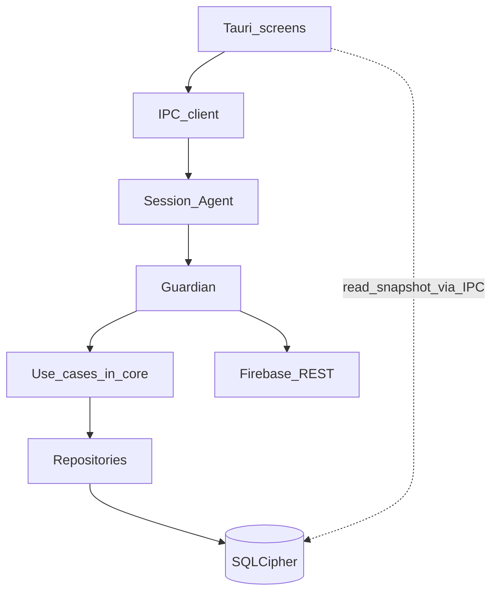
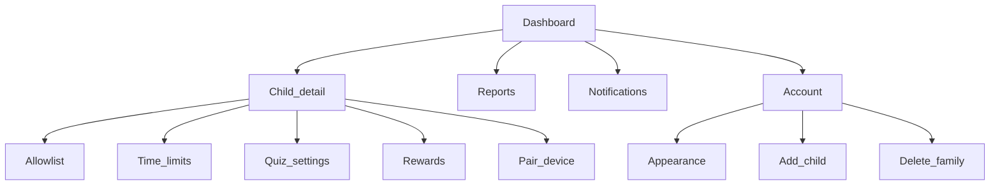

# 16 — Desktop build phases (end-to-end)

This is the **phase-by-phase plan to ship MeritScreen on Windows, macOS, and Linux** that mirrors the **Android product flow and UX**, uses a **Rust core + native guardians + shared Tauri 2 UI**, and talks to the **same Firebase project** as Android and iOS.

Companion docs:

- Platform truth, process model, schema, limits: [15 — Desktop native production](15-desktop-native-production.md)
- Enforcement rule: [07 — App blocks and fail lock](07-app-blocks-and-fail-lock.md)
- Android roadmap (mirror this order): [DEVELOPMENT_PLAN.md](../DEVELOPMENT_PLAN.md)
- iOS pattern (same phase discipline): [14 — iOS build phases](14-ios-build-phases.md)

**Rule:** A phase is done only when UI, domain logic, Firebase authz, loading / error / empty + retry, offline where required, tests, and docs are in place — same bar as Android.

**Rollout (locked):** Windows + macOS full enforcement first. **Linux = beta** in **d11** (Wayland limits). Do not block Win/Mac v1 on Linux parity.

---

## Product goals for desktop

| Goal | Meaning |
| --- | --- |
| Same flow as Android | Role select → parent onboarding / child pairing → dashboard or launcher → allowlist & limits → block/interval → quiz (no skip) → pass grant / fail lock → reports / account |
| Lightweight always-on | Small Guardian resident; Tauri UI ephemeral / pre-warmed |
| Native enforcement | Services, windows, process control in Rust per OS — UI only renders |
| Firebase | Same project, policy JSON, pairing Functions, Firestore rules |
| Local-first child path | Launcher + quiz read SQLCipher only — no Firestore / AI on the hot path |
| Honest platform limits | Standard child account; no fake unbreakable admin lockdown; document macOS/Wayland gaps |
| Fail lock | Always **all non-emergency** apps; unlock via cooldown **or** passed retry |

### UX parity matrix (Android screen → desktop)

| Android | Desktop | Notes |
| --- | --- | --- |
| S00–S02 | Same | Splash, role select, legal |
| P02–P20 | Same jobs | Tauri Forms / navigation; Sign in with Apple on macOS when Google offered |
| P08 / C01 | Same | QR + 6-digit; OS secret store for child credential |
| C02 launcher setup | Checklist + optional Strict shell (Win/Linux) | macOS: L1+L3 only |
| C05 Home grid | Full-screen approved-app launcher | Not the stock desktop |
| C07b–C12 quiz / fail | Same states | Topmost overlay; Guardian owns phase |
| C14–C15 PIN / parent menu | Same | Unpair, refresh; exit Strict behind PIN |
| Appearance (Account) | System / Light / Dark | Ship in release |

---

## Design system (ship in Phase d1, use everywhere)

1. **Tauri UI + shared tokens** — map light/dark schemes from `:core:ui` intent; no one-off hex in feature screens.
2. **Appearance** — System / Light / Dark; persist locally; apply app-wide.
3. **Components** — `Loading`, `Error` (user-facing + Retry), `Empty`, `PinPad`, primary/secondary buttons. Every screen uses `UiState`-style states.
4. **Child UX** — large targets, calm fail copy, no shame.
5. **Motion** — short; none heavy on fail-lock path.
6. **Accessibility** — keyboard, screen readers, Reduce Motion where applicable.
7. **Performance** — icon LRU; no main-thread network on launcher/quiz; pre-warm quiz UI before due.

---

## Architecture snapshot

```
desktop/
  crates/
    meritscreen-core/          # AppConfig, UiState, AppError, SessionEngine, AdaptiveQuizEngine
    meritscreen-db/            # SQLCipher repositories
    meritscreen-firebase/      # REST Auth/Firestore/Functions traits (no UI dependency)
    meritscreen-security/      # PIN PBKDF2, secret store wrappers, LogSanitizer
    meritscreen-ipc/           # Versioned IPC protocol
    meritscreen-guardian/      # Service binary
    meritscreen-agent/         # Per-user session agent
  apps/
    meritscreen-ui/            # Tauri 2 host (parent + child graphs)
  packaging/
    windows/                   # MSI/MSIX, service installer
    macos/                     # pkg, SMAppService, notarization
    linux/                     # deb/rpm, systemd units (d11)
  vectors/
    session/                   # JSON golden files shared with Android/iOS semantics
    quiz/
```



Shared backend: existing Firebase project, pairing callables, policy schema, rules. Desktop adds `platform: windows|macos|linux` and additive policy fields — **do not fork policy semantics**.

---

## Phase list (execute in order)

| Phase | Name | Mirrors |
| --- | --- | --- |
| **d0** | Product lock, spikes, schema proposal | Phase 0 / i0 |
| **d1** | Workspace foundation + design tokens + DB + Firebase client | Phase 1 / i1 |
| **d2** | Session + adaptive quiz engines + vectors | Phase 5 logic |
| **d3** | Windows Guardian / Agent / installer skeleton | Phase 6 Win |
| **d4** | macOS Guardian / Agent / notarized installer | Phase 6 Mac |
| **d5** | Parent system (auth → dashboard → policy) | Phase 3–4 |
| **d6** | Child UI (pairing, launcher, quiz, fail lock, PIN) | Phase 5 UI |
| **d7** | Enforcement hardening (inventory, L3, idle, tamper) | Phase 6 |
| **d8** | Sync (schedulers, revoke, delete-family) | Phase 7 |
| **d9** | Security, updater, uninstall protection | Phase 9 |
| **d10** | Performance, a11y, localization | Phase 10 |
| **d11** | Linux beta | — |
| **d12** | Test matrix, pilot, staged rollout | Phase 11–12 |

Stickers / nursery / AI packs: consume existing packs and docs [08](08-ai-personalized-learning-and-lockout.md) / [09](09-nursery-early-learner-curriculum.md) / [12](12-sticker-rewards.md) after d6–d8 core path is solid (fold into d8b or d10).

---

## Phase d0 — Product lock & bootstrap

**Status:** ✅ **Signed off 2026-10-05** — see [17 — Desktop d0 product lock](17-desktop-d0-product-lock.md).

### Deliverables

- Confirm invariants from [15](15-desktop-native-production.md) and [07](07-app-blocks-and-fail-lock.md): fail = all non-emergency; retry during cooldown **on**; no skip on quiz overlay. → **Locked in [17](17-desktop-d0-product-lock.md) §1**
- OS support matrix: Win 10/11, macOS 13–current, Linux (Ubuntu LTS / Fedora) X11 vs Wayland. → **[17](17-desktop-d0-product-lock.md) §2**
- Signing accounts: Windows code signing (EV preferred), Apple Developer ID + notarization, Linux package signing keys. → **Ops checklist in [17](17-desktop-d0-product-lock.md) §5**
- Firebase: desktop OAuth clients tracked; App Check gap documented in SECURITY.md + [17](17-desktop-d0-product-lock.md) §6.
- **Schema proposal** (additive): `quizMode=device_interval`, `quizIntervalMinutes`, platform enum expansion, device heartbeat fields, `childDeviceUpdateKeysOnly` allowlist, `consumePairingToken` platforms; redact pairing code from Function logs. → **[17](17-desktop-d0-product-lock.md) §7** + draft PR
- **Background across reboot** + **honest uninstall protection** locked in [17](17-desktop-d0-product-lock.md) §3–§4 (implement d3/d4/d9).
- **Spikes (verify-in-d0):** recorded pass/fail in [15](15-desktop-native-production.md) and [desktop/docs/spikes/](../desktop/docs/spikes/).
  1. Windows custom shell / Assigned Access → PASS (API); Strict opt-in
  2. macOS shielding + kiosk → PASS (API); L1+L3 only
  3. Linux X11 vs Wayland → CONDITIONAL; beta d11
  4. Idle + foreground without Accessibility → PASS

### Backend dependency

- Draft PR description: [desktop/docs/backend-pr-draft.md](../desktop/docs/backend-pr-draft.md) — **land in d5/d6**.

### Done when

- Checklist signed off → **[17](17-desktop-d0-product-lock.md)**
- Spike notes in [15](15-desktop-native-production.md) → **done**
- Empty Rust workspace compiles on Win + Mac CI → **`desktop/` + `.github/workflows/desktop-ci.yml`**

### Risks

- Store sandbox SKUs weaken L2/L3 — **decided: direct download** as primary child channel.

---

## Phase d1 — Project foundation

**Status:** ✅ **Complete 2026-10-05**

Mirror Android Phase 1 / iOS i1.

### Deliverables

- Cargo workspace: `core`, `db`, `firebase`, `security`, `ipc`, stub `guardian` / `agent` / Tauri 2 app. → **`desktop/`**
- SQLCipher schema v1: policy, app_rules, session_state, quiz_items, skill_state, usage_dirty, sync_state, device_runtime, prefs. → **`meritscreen-db`**
- Secret store wrappers (Keychain / DPAPI; file fallback for tests / Linux stub). → **`meritscreen-security`**
- Firebase REST client behind traits: Auth custom token + refresh, Firestore get/commit, callable invoke (+ mocks). → **`meritscreen-firebase`**
- `AppConfig` tunables in **one place** — **`meritscreen-core::app_config`**
- Design tokens + Appearance store in UI shell (System / Light / Dark). → **`meritscreen-ui`**
- `LogSanitizer` + tracing without PII.
- Role gate shell: `Unassigned` | `Parent` | `Child`.

### Done when

- App launches to role placeholder on Win + Mac. → **`cargo run -p meritscreen-ui`**
- Unit tests: Appearance persistence; DB open with key; Firebase client mocks. → **green**
- CI: `cargo test` + UI typecheck. → **`.github/workflows/desktop-ci.yml`**

### Risks

- SQLCipher licensing/distribution — **decided: Community Edition** via `bundled-sqlcipher-vendored-openssl` ([desktop/docs/sqlcipher.md](../desktop/docs/sqlcipher.md)).

---

## Phase d2 — Session + adaptive quiz engines

**Status:** ✅ **Complete 2026-10-05**

### Deliverables

- Pure Rust `SessionEngine`: `idle → in_block → quiz_due → granted | shielded` — identical transitions to Kotlin/Swift. → **`meritscreen-core::session`**
- Support `app_block` and `device_interval` (+ daily ceiling composition). → **done** (`start_device_interval`, app-switch keeps accrual)
- Pure Rust `AdaptiveQuizEngine` + builtin quiz bank JSON (port from Android assets). → **`meritscreen-core::quiz`** + `assets/quiz_bank_builtin.json`
- **JSON golden vectors** under `desktop/vectors/` — pass grant, fail shield, retry restart cooldown, ceiling win, interval tick, cooldown expiry. Runner: `vectors::tests::all_session_vectors_pass`. Android/iOS should eventually share these files ([vectors/README.md](../desktop/vectors/README.md)).
- Persistence of phase + cooldown deadline across process restart (DB only). → **`meritscreen-db::{load_session,save_session}`**

### Backend dependency

- None (local only).

### Done when

- All vector tests green. → **yes**
- No Firebase types in engine crates. → **yes** (`meritscreen-core` has zero Firebase deps)

### Risks

- Drift from Kotlin if vectors are not the shared source of truth — treat vectors as contractual.

---

## Phase d3 — Windows Guardian / Agent / installer skeleton

**Status:** ✅ **Complete 2026-10-05** (lab VM reboot checklist still recommended before pilot)

### Deliverables

- Windows Service binary (Guardian): start at boot, open DB, heartbeat loop stub. → **`meritscreen-guardian`** (`--service` / `--install-service`, AutoStart)
- Session Agent: start in user session (`WTSQueryUserToken` / `CreateProcessAsUser`), IPC to Guardian. → **`meritscreen-agent`** + `agent_spawn`
- Watchdog: kill Agent → Guardian respawns; kill UI when phase requires overlay → Agent respawns (stub UI ok). → **`runtime` watchdog + agent UI poll**
- MSI/MSIX skeleton installing Service + files; code-sign in CI (cert from secrets). → **`packaging/windows/`** (WiX + PowerShell; signing secrets TBD)
- Basic topmost fullscreen window proof from Agent (can be Win32 before Tauri quiz). → **`overlay::show_overlay_proof`**
- Named-pipe / Unix-socket IPC + Ping/Pong integration test. → **`meritscreen-ipc`** + `tests/ipc_ping.rs`

### Backend dependency

- None required.

### Done when

- Fresh Win 10/11 VM: install → reboot → Guardian running → Agent in user session → IPC ping. → **scripts + CI console smoke; full VM reboot = lab checklist**
- Service stop sets local tamper flag (even if not yet synced). → **`mark_tamper_service_stopped` + unit test**

### Risks

- Session 0 isolation pitfalls; antivirus false positives on service — plan SmartScreen reputation.

---

## Phase d4 — macOS Guardian / Agent / notarized installer

**Status:** ✅ **Complete 2026-10-05** (notarization requires Apple Developer ID secrets; full reboot lab checklist recommended)

### Deliverables

- LaunchDaemon / `SMAppService` Guardian. → **`macos_service`** (`--daemon` / `--install-daemon` / `--install-user`); SMAppService bundle layout + register stub for `.app` host
- LaunchAgent Session Agent for child user. → **`com.meritscreen.agent.plist`** + `--launch-agent`
- IPC via Unix socket + peer credential checks. → **`/tmp/meritscreen.guardian.v1.sock`** + `LOCAL_PEERCRED` authorize
- Notarized `.pkg` with hardened runtime; staple in CI. → **`packaging/macos/{build-pkg,notarize}.sh`** + entitlements (secrets outside repo)
- Shielding-level window proof (from d0 spike). → **`overlay::macos_impl`** (`NSWindow` level 25 + presentation options)

### Backend dependency

- None required.

### Done when

- Fresh macOS VM/device: install → reboot → Guardian + Agent alive → IPC ping. → **lab scripts + CI console smoke; reboot = lab checklist**
- Gatekeeper-clean launch. → **notarize.sh path; requires signing secrets**

### Risks

- Notarization entitlement surprises; SMAppService registration UX on first launch.

---

## Phase d5 — Parent system

**Status:** ✅ **Complete 2026-10-05** (demo ParentSession by default; wire REST backends via `ParentSession::with_backends` for staging)

Mirror Android Phases 3–4.



### Deliverables

- Parent auth: Email OTP (`sendEmailOtp` / `verifyEmailOtp`), Google loopback+PKCE, Sign in with Apple (macOS). → **`meritscreen-parent`** + UI auth screens (demo OTP `424242`; Google/Apple stubs until ops client ids)
- Onboarding S01–S02, P05–P07 draft-before-auth (optional parity), commit family/child/PIN. → **onboard screen + `commit_onboarding`**
- Pairing P08/P09: `createPairingToken`, QR + 6-digit, wait for device. → **pairing screen + offer DTO** (simulate paired for desktop)
- Dashboard P11–P12: debounced children observe + one-shot card fields; honest zeros. → **dashboard `UiState`**
- Policy screens P13–P16: write `policy/current` + `appRules`; fail lock always `all_non_emergency`; expose **device interval** when child platform is desktop. → **policy screen + invariant**
- Account P19, delete family P20, notifications prefs local. → **account screen**
- Every screen: loading / error / empty / retry. → **yes**

### Backend dependency

- **Land** Functions/rules changes from d0: platform enum on `consumePairingToken`; extended device update allowlist; stop logging pairing codes. → **landed**
- Parent can already manage Android/iOS children; desktop inventory may still be empty until d7.

### Done when

- Parent can sign up, add child, pair (against emulator/staging), edit limits/quiz/rewards, reset PIN, delete family. → **demo path green; staging = inject REST clients**
- Appearance applies globally. → **yes**
- ViewModel/store tests; no secrets in logs. → **`meritscreen-parent` + PIN hash tests**

### Risks

- OAuth redirect UX on desktop; token storage mistakes — security review checklist for d9.

---

## Phase d6 — Child UI (local engine + overlays)

**Status:** ✅ **Complete 2026-10-05** (`meritscreen-child` + Tauri child commands + overlays; Guardian pack download / phase persistence deepen in d7–d8)

Mirror Android Phase 5 UI; engines already exist from d2.

### Deliverables

- C01 pairing → custom token → secret store → role Child. → **done** (demo: any 6-digit code → `CHILD_REFRESH` in secret store; production swaps token exchange)
- C02/C03 setup checklist (standard account recommended; permissions). → **done**
- C04 first quiz pack download (Guardian) + builtin fallback. → **builtin fallback done**; Guardian pack fetch in d8
- C05 launcher grid from local allowlist + icons cache. → **done** (demo allowlist; icon cache with inventory in d7)
- C07b–C11 quiz overlay: **no Close/Skip**; IPC raises window; teach step + C09c 30s lock content from local pack. → **done** (local engine + overlay UI)
- C12 fail lock full screen; C13 ceiling; C14–C15 PIN + parent menu (refresh, unpair, Appearance). → **done**
- UI reads **snapshots via IPC / local DB only** — architecture lint: ban Firebase crates from UI package. → **done** (`architecture_lint` tests)

### Backend dependency

- Pairing Functions with desktop platforms (from d5).
- Pack download paths same as mobile.

### Done when

- Paired child on Win + Mac: launcher shows, forced quiz at interval in **local simulated clock** test, fail lock UI, PIN unpair. → **done** (`cargo test -p meritscreen-child`)
- Instrumented: zero Firestore calls from UI process. → **done** (no `meritscreen-firebase` / `meritscreen-db` deps on UI or child crates)
- Kill UI during `quiz_due` → respawn still in quiz (Guardian phase). → **deferred to d7/d8** (phase owned by Guardian)

### Risks

- WebView focus steal races — prefer native overlay shell for quiz if Tauri cannot hold topmost reliably (fallback path documented). → see [desktop/docs/spikes/webview-overlay-focus.md](../desktop/docs/spikes/webview-overlay-focus.md)

---

## Phase d7 — Enforcement hardening

**Status:** ✅ **Complete 2026-10-05** (`meritscreen-enforcement` + Guardian L3/IPC v2 + inventory cache; Firestore upload schedulers deepen in d8; Windows Strict opt-in remains SKU-gated stub)

### Deliverables

- Installed-app inventory scan + upload (`appId` schemes from [15](15-desktop-native-production.md)); icon hash; debounced rescan on install/uninstall. → **local scan + SQLCipher cache + hash**; `DeviceSyncClient` trait for upload (d8 cadence)
- L3 process/window gating: non-allowed → terminate or cover; never touch protected/emergency set. → **done** (`decide_gate` + Agent apply)
- Active-use clock + idle threshold; monotonic clocks; clock-rollback fail-closed. → **done**
- Optional Windows **Strict mode** (L2) behind parent setting + setup wizard — only if d0 spike passed. → **SKU probe + honest unavailable copy**; shell apply wizard later
- `tamperFlags` / `guardianState` / `enforcementTier` on device heartbeat fields. → **local device_runtime JSON merge** (rules already allow)
- Honest parent copy when enforcement is degraded (admin account, Strict unavailable). → **done** (desktop parent child detail)

### Backend dependency

- Rules allowlist for new device fields (if not already in d5). → **done in d5**
- Parent Allowlist UI consumes desktop inventory for desktop children. → **demo inventory on pair**; live sync in d8

### Done when

- Opening a non-allowed app cannot stay usable during unlocked session (Win + Mac). → **gate loop**
- Fail lock prevents non-emergency apps until cooldown/retry. → **terminate/cover while shielded**
- Inventory appears on parent P13 within sync window. → **demo + local cache; cloud upload d8**

### Risks

- Over-aggressive terminate of system processes — maintain explicit protected allowlist; test major browsers/games/IDEs. → `PROTECTED_PROCESS_NAMES` / emergency rules

---

## Phase d8 — Real-time synchronization

**Status:** ✅ **Complete 2026-10-05** (Guardian poll schedulers + `ChildRemoteClient` mocks/REST; desktop push deferred)

Mirror Android Phase 7.

### Deliverables

- Schedulers in Guardian: policy pull (~6h + on reconnect + on manual refresh), usage upload (~2h + after quiz), heartbeat (~30m), pack refresh when low. → **done** (`guardian/src/sync.rs`)
- Push-triggered pull when available (macOS APNs via FCM later); until then poll is primary on desktop. → **poll primary**
- Handlers for revoke / pin sync / family deleted semantics (pull device doc + family wipe signals). → **done**
- Idempotent uploads: usage absolute overwrite; quizAttempts existence check; skillState full replace. → **done** (skill replace API ready; usage/quiz exercised in tests)
- Network reconnect → one expedited policy pull. → **done**
- Parent policy write still uses existing Cloud Functions for mobile push; desktop converges on next poll/pull. → **unchanged**

### Backend dependency

- Existing `onPolicyChanged` / `onDeviceRevoked` etc. unchanged for mobile; optional later: desktop push tokens.
- `deleteFamily` / revoke already server-enforced.

### Done when

- Airplane mode: launcher works on last policy; reconnect syncs. → **offline skips cloud; last SQLCipher policy kept**
- Revoke unpairs on next heartbeat/pull. → **tested**
- Sync unit tests with mocked Firebase; UI still local-only. → **done**

### Risks

- Poll latency vs phone push — set parent expectation (“up to N minutes on desktop unless online refresh”). → parent copy: use **Refresh** / `PolicyRefresh` IPC when online

---

## Phase d9 — Security hardening

**Status:** ✅ **Complete 2026-10-05** (updater CDN/signing key ops remain backend/ops; App Check spike non-blocking)

### Deliverables

- Threat model doc section in SECURITY.md (desktop): admin child, service stop, DB key theft, IPC spoofing. → **done** (`SECURITY.md` desktop threat table)
- IPC auth hardening (peer credentials + HMAC). → **HMAC-SHA256 frames + Unix UID / Windows path peer checks**; spoof MAC unit test fails closed
- Signed updater with Ed25519 manifest + rollback protection; staged channels. → **`meritscreen-updater` + [desktop/docs/updater.md](../desktop/docs/updater.md)**
- Uninstall / disable detection → parent alert; PIN-gated uninstall where OS allows. → **`--uninstall-with-pin` / `--mark-uninstall-attempt` + packaging helpers**
- Pairing/OTP log audit (Functions + clients). → **Functions already omit codes; clients log `code_len` only; `sanitize_for_log` tightened**
- App Check: document residual risk; rate limits; plan custom attestation spike (non-blocking). → **[desktop/docs/app-check-attestation-spike.md](../desktop/docs/app-check-attestation-spike.md)**

### Backend dependency

- Updater CDN / Storage bucket + signing key ops. → **ops TODO** (crate ready for dry-run verify)
- Confirm Functions no longer log pairing codes. → **confirmed** (`consumePairingToken` logs length only; mint/OTP never log plaintext codes)

### Done when

- Security checklist signed; updater dry-run on Win + Mac; IPC spoof test fails closed. → **checklist in SECURITY.md; `cargo test -p meritscreen-updater` + ipc spoof tests**

### Risks

- Broken updater bricks guardian — require health-gated rollout + manual recovery doc. → **documented in updater.md**

---

## Phase d10 — Performance, a11y, localization

**Status:** ✅ **Complete 2026-10-05** (stickers / nursery / AI packs remain optional cache-first follow-ups)

### Deliverables

- Meet budgets in [15](15-desktop-native-production.md) §15 (RSS, CPU, quiz paint, cold start). → **RSS gate + event-driven idle poll; pre-warm path**
- Pre-warm quiz UI before due; event-driven Guardian; flush intervals ~45s. → **`QUIZ_PREWARM_SECONDS`, Agent `--prewarm`, `USAGE_FLUSH` / `SESSION_PERSIST` wired**
- Accessibility pass: keyboard quiz, screen reader labels, contrast. → **dialog ARIA, 1–9 keys, `:focus-visible`, token contrast**
- Localization pipeline for parent + child strings (reuse Android string keys where practical). → **UI + core `en.json` + [desktop/docs/localization.md](../desktop/docs/localization.md)**
- Optional **d8b/d10:** stickers, nursery media playback, AI pack consume — cache-first only. → **deferred** (does not block d10)

### Done when

- Perf harness CI gate on Guardian RSS/CPU smoke. → **`--perf-smoke` in desktop-ci.yml**
- a11y smoke on launcher + quiz + fail lock. → **`npm run a11y-smoke` in CI**

### Risks

- WebView memory if UI left resident — enforce quit-when-idle except pre-warm window. → **Agent quits UI when not required; pre-warm capped**

---

## Phase d11 — Linux beta

**Status:** ⏸ **Deferred** (Win/Mac GA via d12 first; revisit after pilot)

### Deliverables

- systemd system unit (Guardian) + user/session agent hook.
- `.deb` and `.rpm` packages; signed repo **beta** channel.
- X11 enforcement path (grab + L3).
- Wayland: best-effort kiosk/layer-shell; document gaps in parent UI (`enforcementTier` degraded).
- CI on Ubuntu LTS + one Fedora.

### Backend dependency

- `platform: linux` already in Functions/rules from d5.

### Done when

- Install on Ubuntu X11: pair, interval quiz, fail lock works.
- Wayland: documented known gaps; no false “fully locked” claims.

### Risks

- Distro fragmentation — limit supported distros explicitly.

---

## Phase d12 — Test matrix, pilot, staged rollout

**Status:** ✅ **Complete 2026-10-05** (Win/Mac GA path; **Linux deferred** to d11 / post-GA. Pilot exit + GA sign-off are ops gates using the checklists below.)

### Deliverables

- Full matrix: Win 10/11, macOS 13–15, Ubuntu/Fedora (X11 + Wayland), mixed-family (Android parent ↔ desktop child and reverse). → **[test-matrix.md](../desktop/docs/test-matrix.md)** (Linux marked deferred); mixed-family checklist included
- Conformance vectors still green; kill-agent / reboot-mid-cooldown / clock-rollback cases automated where possible. → **`cargo test -p meritscreen-guardian --test resilience`** + existing vectors/clock/session tests
- Closed pilot families; crash-free and support playbook. → **[pilot-playbook.md](../desktop/docs/pilot-playbook.md)**
- Staged updater rings (internal → pilot → % rollout). → **`RolloutPolicy` / `device_in_rollout` + `rolloutPercent` on manifest** ([updater.md](../desktop/docs/updater.md))
- Store/policy readiness: privacy policy updated for desktop; nutrition labels; direct-download primary. → **[store-readiness.md](../desktop/docs/store-readiness.md)** + **[ga-checklist.md](../desktop/docs/ga-checklist.md)**

### Done when

- Pilot exit criteria met; Windows + macOS GA checklist signed; Linux remains beta unless criteria exceeded. → **checklists ready; sign-off is an ops action**
- Docs 15/16 updated with any residual limitations discovered in pilot. → **matrix documents residual limitations; amend after live pilot**

### Risks

- Support load from Strict mode / AV false positives — ship clear setup guide and parent “device health” panel. → **support playbook + parent child-detail enforcement/tamper (“device health”)**

---

## Cross-cutting backend checklist (land once, reuse)

| Change | Needed by | Notes |
| --- | --- | --- |
| `consumePairingToken` platforms `windows\|macos\|linux` | d5/d6 | Stop collapsing to android |
| Redact pairing code from Function logs | d5 | Product invariant |
| `childDeviceUpdateKeysOnly` new fields | d7/d8 | agentVersion, osBuild, guardianState, tamperFlags, enforcementTier |
| `quizMode=device_interval` + `quizIntervalMinutes` | d5 parent UI / d2 engine | Older mobile clients fall back to `app_block` via `fromStorage` |
| Desktop OAuth clients / Apple | d5 | Console config |
| Updater bucket + signing | d9 | Ops |

Do **not** rewrite Android modules for desktop. Prefer extending Functions/rules only.

---

## Testing priorities (every phase)

1. Session / fail-lock vectors.
2. Authz / pairing scope.
3. Offline child path.
4. No network on launcher/quiz paint.
5. Watchdog respawn preserves `quiz_due` / `shielded`.
6. Never log secrets.

---

## Done criteria for desktop GA (Windows + macOS)

- Parent (any OS) can manage a Windows/Mac child end-to-end with the same policy semantics as phones.
- Child PC: interval/block → non-skippable quiz → pass grant / device-wide fail lock; works offline on cached policy.
- Guardian survives reboot; enforcement does not depend on UI staying open.
- Mixed-platform families work on one Firebase project.
- Limitations documented in-product (admin accounts, macOS no shell replace, App Check gap, Linux beta).
- Perf budgets met; updater signed; pairing/OTP hygiene clean.
